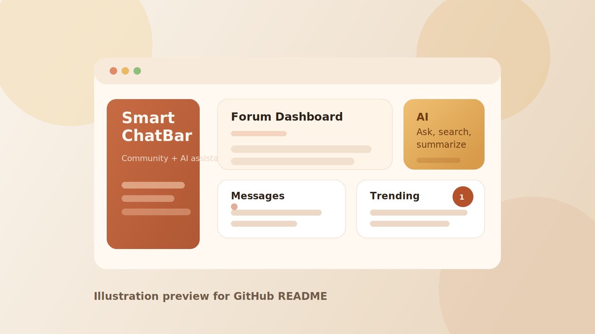

# SmartChatBar

SmartChatBar 是一个基于牛客社区思路实现的全栈社区项目，包含 Java 后端、Vue 前端，以及独立的 Python AI 服务。

## 项目示意图

> 下图为仓库展示用示意图，用于说明产品方向与界面风格，不是项目真实运行截图。



## 项目简介

这个仓库主要包含三部分：

- `backend`：基于 Spring Boot 3 和 MyBatis-Plus 的社区后端
- `frontend`：基于 Vue 3、Vite、Element Plus 的前端界面
- `python-ai-service`：基于 FastAPI 和 LangChain 的 AI 助手服务

目前项目已经覆盖社区站点的核心能力，包括：

- 用户注册、登录、登出
- 发帖、评论、回复
- 点赞、关注、通知、私信
- WebSocket 实时消息
- 热榜、搜索、UV 统计
- 敏感词过滤与管理员操作
- RabbitMQ 与 Elasticsearch 集成
- AI 助手页面与独立 AI 服务

## 技术栈

### 后端

- Java 21
- Spring Boot 3
- Spring Security
- MyBatis-Plus
- MySQL
- Redis
- RabbitMQ
- Elasticsearch

### 前端

- Vue 3
- Vite
- Element Plus
- Pinia
- Vue Router

### AI 服务

- Python 3.12
- FastAPI
- LangChain
- DeepSeek API

## 目录结构

```text
.
|-- backend
|-- docs
|   `-- images
|-- frontend
|-- python-ai-service
|-- docker-compose.middleware.yml
`-- niuke.md
```

## 环境要求

- JDK 21
- Maven 3.9+
- Node.js 18+
- Python 3.12+
- MySQL 8
- Redis
- RabbitMQ
- Elasticsearch 8.x

## 快速开始

### 1. 启动中间件

项目根目录提供了中间件编排文件：

```bash
docker compose -f docker-compose.middleware.yml up -d
```

默认会启动：

- MySQL
- Redis
- RabbitMQ
- Elasticsearch

### 2. 启动后端

```bash
cd backend
mvn spring-boot:run
```

### 3. 启动前端

```bash
cd frontend
npm install
npm run dev
```

### 4. 启动 AI 服务

```bash
cd python-ai-service
python -m venv .venv
.venv\Scripts\python -m pip install -r requirements.txt
.venv\Scripts\python -m uvicorn app.main:app --host 0.0.0.0 --port 8000
```

## 配置说明

### 后端配置

后端主配置文件：`backend/src/main/resources/application.yml`

你需要根据自己的环境替换这些占位值：

- `YOUR_VM_IP`
- `your_email@example.com`
- `your_mail_auth_code`
- `replace-with-your-jwt-secret-key-at-least-32-bytes`

### AI 服务配置

复制 `python-ai-service/.env.example` 为 `python-ai-service/.env`，然后填写真实参数。

重点变量包括：

- `JAVA_API_BASE_URL`
- `DEEPSEEK_API_KEY`
- `DEEPSEEK_BASE_URL`
- `DEEPSEEK_MODEL`

## 数据库初始化

初始化 SQL 位于 `backend/src/main/resources/schema.sql`。

创建数据库后执行该脚本即可。

## 当前状态

项目当前适合继续做本地联调和功能完善：

- 后端可编译
- 前端可构建
- AI 服务依赖结构已就绪
- 真正运行仍需要补齐本地环境参数与中间件连接信息

## 仓库整理

仓库已经做过这些清理：

- 忽略 `node_modules`、`.venv`、`dist`、`__pycache__` 等本地产物
- 不提交本地 `.env` 文件
- 已移除 Python 字节码缓存文件

## 注意事项

- 当前配置文件里仍然有占位符和示例值
- 不建议直接把当前配置用于生产环境
- 如果中间件运行在虚拟机中，配置里要使用虚拟机 IP，而不是 `localhost`
- AI 服务需要填写真实 `DEEPSEEK_API_KEY`

## License

当前还没有添加开源许可证。如果你准备公开开源，建议补充 `MIT` 或 `Apache-2.0`。