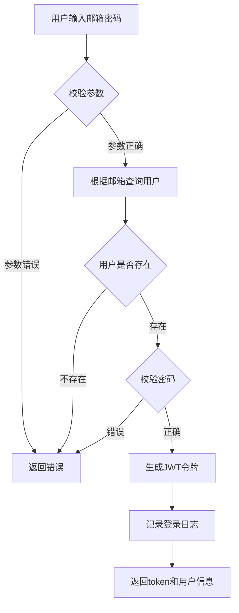

# 牛客社区

# 开发首页


首页分页显示帖子，每页十个


查询帖子时同时查询用户名并返回前端展示，同时以便后续redis缓存

封装了page类，提供了页面查询对象的各种参数，ELE UI自动控制页码大小

# 开发注册页面

### 发送邮箱


```java
spring:
  mail:
    host: smtp.qq.com # 邮件服务器地址 (例如: smtp.163.com)
    port: 587         # 端口 (常用587或465)
    username: 你的邮箱@example.com
    password: 你的授权码
    properties:
      mail:
        smtp:
          auth: true
          starttls:
            enable: true
    default-encoding: UTF-8
```


### 注册页面


**直接注册**模式：用户填邮箱→收验证码→输验证码→注册成功→直接登录。

## 一、最终简化版代码（无激活，纯注册）

### 1. 数据库表（极简版）

```sql
-- 用户表（只要最基本的字段）
CREATE TABLE `user` (
  `id` bigint(20) NOT NULL AUTO_INCREMENT,
  `email` varchar(100) NOT NULL COMMENT '邮箱',
  `password` varchar(255) NOT NULL COMMENT '加密密码',
  `nickname` varchar(50) DEFAULT NULL COMMENT '昵称',
  `create_time` datetime DEFAULT CURRENT_TIMESTAMP,
  PRIMARY KEY (`id`),
  UNIQUE KEY `uk_email` (`email`)  -- 邮箱唯一
) ENGINE=InnoDB DEFAULT CHARSET=utf8mb4;
```

### 2. 实体类

```java
@Data
@TableName("user")
public class User {
    @TableId(type = IdType.AUTO)
    private Long id;
    private String email;
    private String password;
    private String nickname;
    private LocalDateTime createTime;
    private Integer receivedLikeCount;
}
```

### 3. Mapper 接口（MyBatis-Plus）

```java
@Mapper
public interface UserMapper extends BaseMapper<User> {
    // 继承 BaseMapper 就有基本的 CRUD 方法：
    // insert、selectById、selectOne、selectList、updateById、deleteById
    // 不需要额外写任何方法
}
```

### 4. Service 层（核心业务）

```java
@Service
@Slf4j
@Transactional(rollbackFor = Exception.class)
public class RegisterService {

    @Autowired
    private UserMapper userMapper;

    @Autowired
    private JavaMailSender mailSender;

    @Autowired
    private StringRedisTemplate redisTemplate;

    @Value("${spring.mail.username}")
    private String from;

    /**
     * 1. 发送验证码
     */
    public void sendCode(String email) {
        log.info("发送验证码：{}", email);

        // 1.1 校验邮箱格式
        if (!isValidEmail(email)) {
            throw new BusinessException("邮箱格式不正确");
        }

        // 1.2 检查邮箱是否已注册（直接用 MP 的 selectCount）
        Long count = userMapper.selectCount(Wrappers.<User>lambdaQuery()
                .eq(User::getEmail, email));
        if (count > 0) {
            throw new BusinessException("该邮箱已注册");
        }

        // 1.3 防刷校验（60秒内不能重复发）
        String limitKey = "SEND_LIMIT:" + email;
        if (Boolean.TRUE.equals(redisTemplate.hasKey(limitKey))) {
            throw new BusinessException("发送太频繁，请稍后再试");
        }

        // 1.4 生成6位验证码
        String code = String.format("%06d", new Random().nextInt(999999));

        // 1.5 存 Redis（5分钟有效）
        String codeKey = "REG_CODE:" + email;
        redisTemplate.opsForValue().set(codeKey, code, 5, TimeUnit.MINUTES);

        // 1.6 发送邮件
        try {
            SimpleMailMessage message = new SimpleMailMessage();
            message.setFrom(from);
            message.setTo(email);
            message.setSubject("注册验证码");
            message.setText("您的验证码是：" + code + "，5分钟内有效。");
            mailSender.send(message);

            // 1.7 设置发送频率限制
            redisTemplate.opsForValue().set(limitKey, "1", 1, TimeUnit.MINUTES);

            log.info("验证码发送成功：{} -> {}", email, code);
        } catch (Exception e) {
            log.error("邮件发送失败", e);
            throw new BusinessException("验证码发送失败");
        }
    }

    /**
     * 2. 注册
     */
    public User register(RegisterRequest request) {
        log.info("用户注册：{}", request.getEmail());

        // 2.1 校验验证码
        String codeKey = "REG_CODE:" + request.getEmail();
        String cachedCode = redisTemplate.opsForValue().get(codeKey);

        if (StringUtils.isEmpty(cachedCode)) {
            throw new BusinessException("验证码已过期");
        }
        if (!cachedCode.equals(request.getCode())) {
            throw new BusinessException("验证码错误");
        }

        // 2.2 再次检查邮箱是否被注册（防止并发）
        Long count = userMapper.selectCount(Wrappers.<User>lambdaQuery()
                .eq(User::getEmail, request.getEmail()));
        if (count > 0) {
            throw new BusinessException("该邮箱已被注册");
        }

        // 2.3 创建用户
        User user = new User();
        user.setEmail(request.getEmail());
        user.setPassword(BCrypt.hashpw(request.getPassword(), BCrypt.gensalt()));
        user.setNickname(request.getNickname());
        user.setCreateTime(LocalDateTime.now());

        // 2.4 保存到数据库（MP的insert方法）
        userMapper.insert(user);

        // 2.5 删除已使用的验证码
        redisTemplate.delete(codeKey);

        log.info("注册成功，用户ID：{}", user.getId());

        // 返回前清空密码
        user.setPassword(null);
        return user;
    }

    /**
     * 3. 校验邮箱格式
     */
    private boolean isValidEmail(String email) {
        String regex = "^[A-Za-z0-9+_.-]+@(.+)$";
        return Pattern.matches(regex, email);
    }
}
```

### 5. 请求和响应类

```java
// 注册请求
@Data
public class RegisterRequest {
    @NotBlank(message = "邮箱不能为空")
    @Email(message = "邮箱格式不正确")
    private String email;

    @NotBlank(message = "密码不能为空")
    @Size(min = 6, message = "密码至少6位")
    private String password;

    @NotBlank(message = "验证码不能为空")
    private String code;

    private String nickname;  // 可选
}

// 统一响应
@Data
@AllArgsConstructor
public class Result {
    private boolean success;
    private String message;
    private Object data;

    public static Result success(String message) {
        return new Result(true, message, null);
    }

    public static Result success(String message, Object data) {
        return new Result(true, message, data);
    }

    public static Result error(String message) {
        return new Result(false, message, null);
    }
}
```

### 6. Controller 层

```java
@RestController
@RequestMapping("/api/auth")
@Slf4j
public class AuthController {

    @Autowired
    private RegisterService registerService;

    /**
     * 发送验证码
     */
    @PostMapping("/code")
    public Result sendCode(@RequestParam String email) {
        registerService.sendCode(email);
        return Result.success("验证码发送成功");
    }

    /**
     * 注册
     */
    @PostMapping("/register")
    public Result register(@RequestBody @Valid RegisterRequest request) {
        User user = registerService.register(request);
        return Result.success("注册成功", user);
    }
}
```

### 7. 异常处理

```java
// 业务异常
public class BusinessException extends RuntimeException {
    public BusinessException(String message) {
        super(message);
    }
}

// 全局异常处理
@RestControllerAdvice
public class GlobalExceptionHandler {

    @ExceptionHandler(BusinessException.class)
    public Result handleBusinessException(BusinessException e) {
        return Result.error(e.getMessage());
    }

    @ExceptionHandler(MethodArgumentNotValidException.class)
    public Result handleValidationException(MethodArgumentNotValidException e) {
        String message = e.getBindingResult().getAllErrors().get(0).getDefaultMessage();
        return Result.error(message);
    }

    @ExceptionHandler(Exception.class)
    public Result handleException(Exception e) {
        e.printStackTrace();
        return Result.error("系统繁忙，请稍后重试");
    }
}
```

### 8. 配置

```yaml
# application.yml
spring:
  mail:
    host: smtp.qq.com
    port: 587
    username: your-email@qq.com
    password: your-auth-code  # 授权码
  redis:
    host: localhost
    port: 6379

# MyBatis-Plus 配置
mybatis-plus:
  configuration:
    log-impl: org.apache.ibatis.logging.stdout.StdOutImpl  # 打印 SQL
  global-config:
    db-config:
      id-type: auto
```

## 二、业务流程总结

| 步骤 | 操作       | 后端逻辑                         |
| -- | -------- | ---------------------------- |
| ①  | 输入邮箱     | 格式校验 + 查重                    |
| ②  | 点击发送验证码  | 防刷校验 + 生成验证码 + 存 Redis + 发邮件 |
| ③  | 输入验证码和密码 | 验证码校验 + 再次查重                 |
| ④  | 点击注册     | 加密密码 + 保存用户 + 返回成功           |

## 三、MP 在这个代码里的体现

```java
// 1. 查数量（代替 JPA 的 existsByEmail）
Long count = userMapper.selectCount(Wrappers.<User>lambdaQuery()
        .eq(User::getEmail, email));

// 2. 插入数据
userMapper.insert(user);

// 3. 条件构造器 Wrappers 是 MP 的特色
```

这就是最简版的邮箱注册，**没有激活、没有状态、没有多余字段**，拿到就能用。

## 四、业务关键点总结

### 1. 业务边界

* ✅ 我们实现的是**应用内注册**，不是注册邮箱账号

* ✅ 邮箱只是**用户的身份标识**

* ✅ 验证码用于**证明邮箱是你的**

### 2. 安全防护

* **防刷机制**：同一邮箱1分钟内只能发1次验证码

* **验证码过期**：5分钟有效期

* **密码加密**：BCrypt加密，不可逆

* **二次校验**：注册前再次检查邮箱是否被注册（防并发）

### 4. 异常处理

* **业务异常**：自定义BusinessException，返回友好提示

* **参数校验**：@Valid + 全局异常处理

* **系统异常**：统一拦截，记录日志，返回统一格式

# 开发登录页面

明白了，在注册功能的基础上，我给你加上**登录功能**。登录是注册的配套功能，核心逻辑是：**根据邮箱查询用户 → 校验密码 → 生成令牌 → 返回给前端**。

## 一、登录功能完整实现

### 1. 登录请求/响应 DTO

```java
// LoginRequest.java - 登录请求
@Data
public class LoginRequest {
    @NotBlank(message = "邮箱不能为空")
    @Email(message = "邮箱格式不正确")
    private String email;

    @NotBlank(message = "密码不能为空")
    private String password;
}

// LoginResponse.java - 登录响应
@Data
@AllArgsConstructor
public class LoginResponse {
    private Long userId;           // 用户ID
    private String email;          // 邮箱
    private String nickname;       // 昵称
    private String token;          // JWT令牌
    private Long expireTime;       // 过期时间戳
}
```

### 2. JWT工具类（用于生成，解析令牌）

```java
@Component
public class JwtTool {
    private final JWTSigner jwtSigner;

    public JwtTool() {
        // 直接使用字符串密钥，不需要 KeyPair
        this.jwtSigner = JWTSignerUtil.createSigner("hs256", "your-secret-key".getBytes());
    }
 

    /**
     * 创建 access-token
     *
     * @param userDTO 用户信息
     * @return access-token
     */
    public String createToken(Long userId, Duration ttl) {
        // 1.生成jws
        return JWT.create()
                .setPayload("user", userId)
                .setExpiresAt(new Date(System.currentTimeMillis() + ttl.toMillis()))
                .setSigner(jwtSigner)
                .sign();
    }

    /**
     * 解析token
     *
     * @param token token
     * @return 解析刷新token得到的用户信息
     */
    public Long parseToken(String token) {
        // 1.校验token是否为空
        if (token == null) {
            throw new UnauthorizedException("未登录");
        }
        // 2.校验并解析jwt
        JWT jwt;
        try {
            jwt = JWT.of(token).setSigner(jwtSigner);
        } catch (Exception e) {
            throw new UnauthorizedException("无效的token", e);
        }
        // 2.校验jwt是否有效
        if (!jwt.verify()) {
            // 验证失败
            throw new UnauthorizedException("无效的token");
        }
        // 3.校验是否过期
        try {
            JWTValidator.of(jwt).validateDate();
        } catch (ValidateException e) {
            throw new UnauthorizedException("token已经过期");
        }
        // 4.数据格式校验
        Object userPayload = jwt.getPayload("user");
        if (userPayload == null) {
            // 数据为空
            throw new UnauthorizedException("无效的token");
        }

        // 5.数据解析
        try {
           return Long.valueOf(userPayload.toString());
        } catch (RuntimeException e) {
            // 数据格式有误
            throw new UnauthorizedException("无效的token");
        }
    }
}
```

### 3. 登录 Service 方法

在之前的 `RegisterService` 中添加登录方法，或者新建一个 `LoginService`：

```java
@Service
@Slf4j
public class LoginService {

    @Autowired
    private UserMapper userMapper;

    @Autowired
    private JwtUtils jwtUtils;

    /**
     * 登录
     */
    public LoginResponse login(LoginRequest request) {
        log.info("用户登录：{}", request.getEmail());

        // 1. 根据邮箱查询用户
        User user = userMapper.selectOne(Wrappers.<User>lambdaQuery()
                .eq(User::getEmail, request.getEmail()));

        // 2. 检查用户是否存在
        if (user == null) {
            throw new BusinessException("用户不存在");
        }

        // 3. 校验密码
        if (!BCrypt.checkpw(request.getPassword(), user.getPassword())) {
            throw new BusinessException("密码错误");
        }

        // 4. 生成JWT令牌
        String token = jwtUtils.generateToken(user.getId(), user.getEmail());

        // 5. 返回登录结果
        return new LoginResponse(
            user.getId(),
            user.getEmail(),
            user.getNickname(),
            token,
            System.currentTimeMillis() + 86400000  // 24小时后过期
        );
    }

    /**
     * 退出登录（可选）
     * 如果是JWT无状态，前端删除token即可
     * 如果需要服务端控制，可以将token加入黑名单
     */
    public void logout(String token) {
        // 可以将token加入Redis黑名单
        log.info("用户退出登录");
    }
}
```

### 4. 登录 Controller

```java
@RestController
@RequestMapping("/api/auth")
@Slf4j
public class AuthController {

    @Autowired
    private RegisterService registerService;

    @Autowired
    private LoginService loginService;

    // ... 之前的注册接口 ...

    /**
     * 登录
     */
    @PostMapping("/login")
    public Result login(@RequestBody @Valid LoginRequest request) {
        LoginResponse response = loginService.login(request);
        return Result.success("登录成功", response);
    }

    /**
     * 退出登录
     */
    @PostMapping("/logout")
    public Result logout(@RequestHeader("Authorization") String token) {
        // 实际项目中可能需要从 "Bearer " 中提取token
        loginService.logout(token.replace("Bearer ", ""));
        return Result.success("退出成功");
    }
}
```

### 5. 登录密码加密说明

注册时保存密码用的是：

```java
// 注册时
user.setPassword(BCrypt.hashpw(request.getPassword(), BCrypt.gensalt()));
```

登录时校验密码用的是：

```java
// 登录时
BCrypt.checkpw(request.getPassword(), user.getPassword())
```

BCrypt 的特点：

* 每次加密结果都不一样（即使密码相同）

* 自带盐值，防彩虹表攻击

* checkpw 方法能正确比对

### 6. 完整的用户表

```sql
CREATE TABLE `user` (
  `id` bigint(20) NOT NULL AUTO_INCREMENT,
  `email` varchar(100) NOT NULL COMMENT '邮箱',
  `password` varchar(255) NOT NULL COMMENT '加密密码',
  `nickname` varchar(50) DEFAULT NULL COMMENT '昵称',
  `avatar` varchar(500) DEFAULT NULL COMMENT '头像地址',
  `last_login_time` datetime DEFAULT NULL COMMENT '最后登录时间',
  `last_login_ip` varchar(50) DEFAULT NULL COMMENT '最后登录IP',
  `create_time` datetime DEFAULT CURRENT_TIMESTAMP,
  `update_time` datetime DEFAULT CURRENT_TIMESTAMP ON UPDATE CURRENT_TIMESTAMP,
  PRIMARY KEY (`id`),
  UNIQUE KEY `uk_email` (`email`)
) ENGINE=InnoDB DEFAULT CHARSET=utf8mb4;
```

### 7. 将用户ID存入ThreadLocal

```java
public class UserContext {
    private static final ThreadLocal<Long> tl = new ThreadLocal<>();

    /**
     * 保存当前登录用户信息到ThreadLocal
     * @param userId 用户id
     */
    public static void setUser(Long userId) {
        tl.set(userId);
    }

    /**
     * 获取当前登录用户信息
     * @return 用户id
     */
    public static Long getUser() {
        return tl.get();
    }

    /**
     * 移除当前登录用户信息
     */
    public static void removeUser(){
        tl.remove();
    }
}

```

配合拦截器解析token：

```java
@RequiredArgsConstructor
public class LoginInterceptor implements HandlerInterceptor {

    private final JwtTool jwtTool;

    @Override
    public boolean preHandle(HttpServletRequest request, HttpServletResponse response, Object handler) throws Exception {
        // 1.获取请求头中的 token
        String token = request.getHeader("authorization");
        // 2.校验token
        Long userId = jwtTool.parseToken(token);
        // 3.存入上下文
        UserContext.setUser(userId);
        // 4.放行
        return true;
    }

    @Override
    public void afterCompletion(HttpServletRequest request, HttpServletResponse response, Object handler, Exception ex) throws Exception {
        // 清理用户
        UserContext.removeUser();
    }
}

```

光有拦截器还不够，需要告诉 Spring 哪些请求需要被拦截：

```java
@Configuration
public class WebMvcConfig implements WebMvcConfigurer {

    @Autowired
    private LoginInterceptor loginInterceptor;

    @Override
    public void addInterceptors(InterceptorRegistry registry) {
        registry.addInterceptor(loginInterceptor)
                .addPathPatterns("/**")              // 拦截所有请求
                .excludePathPatterns(                 // 放行的请求（不需要登录）
                    "/api/auth/login",                 // 登录接口
                    "/api/auth/register",              // 注册接口
                    "/api/captcha/**",                 // 验证码相关
                    "/api/auth/code",                  // 发送验证码
                    "/error"                            // 错误页面
                );
    }
}
```

### 8. 编写获取验证码的接口

在你的Controller里（比如 `AuthController`），添加一个新的接口来生成并返回图形验证码。

java

```java
import com.wf.captcha.SpecCaptcha;
import com.wf.captcha.base.Captcha;
import org.springframework.web.bind.annotation.GetMapping;
import org.springframework.web.bind.annotation.RequestMapping;
import org.springframework.web.bind.annotation.RestController;

import java.util.HashMap;
import java.util.Map;
import java.util.UUID;
import java.util.concurrent.TimeUnit;

@RestController
@RequestMapping("/api/captcha")
public class CaptchaController {

    // 假设你已经注入了 StringRedisTemplate
    @Autowired
    private StringRedisTemplate redisTemplate;

    @GetMapping("/image")
    public Result getImageCaptcha() {
        // 1. 生成验证码对象
        // 参数：宽、高、位数。SpecCaptcha 是 easy-captcha 提供的多种风格之一（数字字母组合）
        SpecCaptcha captcha = new SpecCaptcha(130, 48, 4);

        // 2. 设置字符集，去掉容易混淆的 0o1i 等，提高用户体验
        captcha.setCharType(Captcha.TYPE_DEFAULT); // 或者用 TYPE_NUM_AND_UPPER

        // 3. 获取验证码文本内容（例如 "A3B7"），这个需要存起来用于校验
        String verCode = captcha.text().toLowerCase(); // 转小写保存，方便忽略大小写校验

        // 4. 生成一个唯一标识符，作为这个验证码的key
        String captchaKey = UUID.randomUUID().toString();

        // 5. 将验证码文本存入Redis，设置5分钟有效期
        redisTemplate.opsForValue().set(CAPTCHA_KEY_PREFIX + captchaKey,
                                         verCode,
                                         5,
                                         TimeUnit.MINUTES);

        // 6. 准备返回给前端的数据：图片的Base64字符串 和 对应的key
        Map<String, String> result = new HashMap<>();
        result.put("captchaKey", captchaKey);
        result.put("captchaImage", captcha.toBase64()); // toBase64() 直接生成 data:image/png;base64,xxx 格式

        return Result.success("获取成功", result);
    }
}

// 别忘了定义常量
public static final String CAPTCHA_KEY_PREFIX = "CAPTCHA:";
```

### 3. 修改登录接口，加入验证码校验

现在你的 `LoginRequest` 需要增加两个字段来接收用户输入：

java

```
@Data
public class LoginRequest {
    @NotBlank(message = "邮箱不能为空")
    @Email(message = "邮箱格式不正确")
    private String email;

    @NotBlank(message = "密码不能为空")
    private String password;

    // 新增：前端传回的验证码唯一标识
    @NotBlank(message = "验证码标识不能为空")
    private String captchaKey;

    // 新增：用户输入的图片验证码
    @NotBlank(message = "验证码不能为空")
    private String captchaCode;
}
```

然后在你的登录Service（比如 `LoginService`）中，在校验用户名密码**之前**，先校验验证码：

java

```
@Service
public class LoginService {

    @Autowired
    private StringRedisTemplate redisTemplate;
    @Autowired
    private UserMapper userMapper;
    @Autowired
    private JwtUtils jwtUtils;

    public LoginResponse login(LoginRequest request) {
        // 1. 从Redis获取正确的验证码
        String cacheKey = CaptchaController.CAPTCHA_KEY_PREFIX + request.getCaptchaKey();
        String correctCode = redisTemplate.opsForValue().get(cacheKey);

        // 2. 验证码校验
        if (correctCode == null) {
            throw new BusinessException("验证码已过期，请刷新后重试");
        }
        // 忽略大小写进行比对
        if (!correctCode.equalsIgnoreCase(request.getCaptchaCode())) {
            throw new BusinessException("验证码错误");
        }

        // 3. 验证码校验通过后，立即从Redis中删除，防止重复使用
        redisTemplate.delete(cacheKey);
         // 4. 原有的用户名密码校验逻辑...
        // 根据邮箱查询用户、校验密码、生成token...
        // ......
    }
}
```

### 8. 添加依赖（pom.xml）

```xml
<!-- JWT支持 -->
<dependency>
    <groupId>io.jsonwebtoken</groupId>
    <artifactId>jjwt</artifactId>
    <version>0.9.1</version>
</dependency>

<!-- BCrypt加密（Spring Security自带，但可以单独用） -->
<dependency>
    <groupId>org.springframework.security</groupId>
    <artifactId>spring-security-crypto</artifactId>
</dependency>
<!-- 图形验证码 -->
<dependency>
    <groupId>com.github.whvcse</groupId>
    <artifactId>easy-captcha</artifactId>
    <version>1.6.2</version>
</dependency>
```

### 9. 配置文件补充

```yaml
# JWT配置
jwt:
  tokenTTL: 30m
```

## 二、登录业务流程



## 三、前端调用示例

```jsx
// 登录
axios.post('/api/auth/login', {
    email: 'test@example.com',
    password: '123456'
}).then(res => {
    const { token, userId, nickname } = res.data.data;
    // 保存token到localStorage
    localStorage.setItem('token', token);
    // 后续请求带上token
    axios.defaults.headers.common['Authorization'] = 'Bearer ' + token;
});

// 获取用户信息
axios.get('/api/user/info').then(res => {
    console.log('当前用户：', res.data.data);
});
```

## 四、总结

| 功能 | 核心代码                                      | 说明          |
| -- | ----------------------------------------- | ----------- |
| 注册 | `userMapper.insert(user)`                 | 保存加密后的密码    |
| 登录 | `userMapper.selectOne` + `BCrypt.checkpw` | 查用户 + 验密码   |
| 令牌 | `jwtUtils.generateToken()`                | 生成JWT，无状态   |
| 鉴权 | 拦截器解析token                                | 将userId放入请求 |

这样就完成了**注册 + 登录**的完整闭环。

# 开发账号信息修改功能

## 修改昵称

```java
@PostMapping("/update/nickname")
public Result updateNickname(@RequestBody @Valid UpdateNicknameRequest request,
                              @RequestAttribute("userId") Long userId) {
    User user = new User();
    user.setId(userId);
    user.setNickname(request.getNickname());
    
    userMapper.updateById(user);
    
    return
```

## 修改密码

### 实体类

```java
@Data
public class UpdatePasswordRequest {
    @NotBlank(message = "原密码不能为空")
    private String oldPassword;

    @NotBlank(message = "新密码不能为空")
    @Size(min = 6, max = 20, message = "密码长度在6-20位之间")
    private String newPassword;

    @NotBlank(message = "确认密码不能为空")
    private String confirmPassword;
}
```

### Service

```java
public void updatePassword(UpdatePasswordRequest request, Long userId) {
    // 1. 校验新密码和确认密码是否一致
    if (!request.getNewPassword().equals(request.getConfirmPassword())) {
        throw new BusinessException("两次输入的密码不一致");
    }

    // 2. 查询用户
    User user = userMapper.selectById(userId);
    if (user == null) {
        throw new BusinessException("用户不存在");
    }

    // 3. 校验原密码
    if (!BCrypt.checkpw(request.getOldPassword(), user.getPassword())) {
        throw new BusinessException("原密码错误");
    }

    // 4. 更新密码
    User updateUser = new User();
    updateUser.setId(userId);
    updateUser.setPassword(BCrypt.hashpw(request.getNewPassword(), BCrypt.gensalt()));

    userMapper.updateById(updateUser);
}
```

### Controller

```java
@PostMapping("/update/password")
public Result updatePassword(@RequestBody @Valid UpdatePasswordRequest request,
                              @RequestAttribute("userId") Long userId) {
    passwordService.updatePassword(request, userId);
    return Result.success("密码修改成功");
}
```

## 修改邮箱

### 1. 发送新邮箱验证码

```java
@PostMapping("/send-email-code")
public Result sendEmailCode(@RequestParam String newEmail,
                             @RequestAttribute("userId") Long userId) {
    // 1. 检查新邮箱是否已被其他账号使用
    Long count = userMapper.selectCount(Wrappers.<User>lambdaQuery()
            .eq(User::getEmail, newEmail));
    if (count > 0) {
        return Result.error("该邮箱已被注册");
    }

    // 2. 生成验证码
    String code = String.format("%06d", new Random().nextInt(999999));

    // 3. 存Redis（包含userId，防止别人乱改）
    String key = "CHANGE_EMAIL:" + userId + ":" + newEmail;
    redisTemplate.opsForValue().set(key, code, 5, TimeUnit.MINUTES);

    // 4. 发送邮件
    sendEmail(newEmail, "您的验证码是：" + code);

    return Result.success("验证码已发送");
}
```

### 2. 修改邮箱请求类

java

```java
@Data
public class UpdateEmailRequest {
    @NotBlank(message = "新邮箱不能为空")
    @Email(message = "邮箱格式不正确")
    private String newEmail;

    @NotBlank(message = "验证码不能为空")
    private String code;
}
```

### 3. 修改邮箱

java

```java
@PostMapping("/update/email")
public Result updateEmail(@RequestBody @Valid UpdateEmailRequest request,
                           @RequestAttribute("userId") Long userId) {

    // 1. 校验验证码
    String key = "CHANGE_EMAIL:" + userId + ":" + request.getNewEmail();
    String correctCode = redisTemplate.opsForValue().get(key);

    if (correctCode == null) {
        return Result.error("验证码已过期");
    }
    if (!correctCode.equals(request.getCode())) {
        return Result.error("验证码错误");
    }

    // 2. 再次检查新邮箱是否被占用
    Long count = userMapper.selectCount(Wrappers.<User>lambdaQuery()
            .eq(User::getEmail, request.getNewEmail()));
    if (count > 0) {
        return Result.error("该邮箱已被注册");
    }

    // 3. 更新邮箱
    User user = new User();
    user.setId(userId);
    user.setEmail(request.getNewEmail());
    userMapper.updateById(user);

    // 4. 删除验证码
    redisTemplate.delete(key);

    return Result.success("邮箱修改成功");
}
```

## 上传头像

配置

```yaml
  alioss:
    endpoint: ${sky.alioss.endpoint}
    accessKeyId: ${sky.alioss.accessKeyId}
    accessKeySecret: ${sky.alioss.accessKeySecret}
    bucketName: ${sky.alioss.bucketName}
```

实体类

```java
@Component
@ConfigurationProperties(prefix = "sky.alioss")
@Data
public class AliOssProperties {

    private String endpoint;
    private String accessKeyId;
    private String accessKeySecret;
    private String bucketName;

```

工具类

```java
@Component
@Data
@Slf4j
public class  AliOssUtil {
    @Autowired
    private AliOssProperties aliOssProperties;

    /**
     * 文件上传
     *
     * @param bytes
     * @param objectName
     * @return
     */
    public String upload(byte[] bytes, String objectName) {

        //获取原始文件名
        String originalFilename = objectName;
        //截取文件名后缀
        String suffix = originalFilename.substring(originalFilename.lastIndexOf("."));
        //生成随机文件名
        String fileName = UUID.randomUUID().toString() + suffix;

        String endpoint = aliOssProperties.getEndpoint();
         String accessKeyId = aliOssProperties.getAccessKeyId();
         String accessKeySecret = aliOssProperties.getAccessKeySecret();
         String bucketName = aliOssProperties.getBucketName();
         log.info("上传文件到阿里云，endpoint: accessKeyId: accessKeySecret: bucketName: {},{},{},{}", endpoint , accessKeyId, accessKeySecret, bucketName);

        // 创建OSSClient实例。
        OSS ossClient = new OSSClientBuilder().build(endpoint , accessKeyId, accessKeySecret);

        try {
            // 创建PutObject请求。
            ossClient.putObject(bucketName, fileName , new ByteArrayInputStream(bytes));
        } catch (OSSException oe) {
            System.out.println("Caught an OSSException, which means your request made it to OSS, "
                    + "but was rejected with an error response for some reason.");
            System.out.println("Error Message:" + oe.getErrorMessage());
            System.out.println("Error Code:" + oe.getErrorCode());
            System.out.println("Request ID:" + oe.getRequestId());
            System.out.println("Host ID:" + oe.getHostId());
        } catch (ClientException ce) {
            System.out.println("Caught an ClientException, which means the client encountered "
                    + "a serious internal problem while trying to communicate with OSS, "
                    + "such as not being able to access the network.");
            System.out.println("Error Message:" + ce.getMessage());
        } finally {
            if (ossClient != null) {
                ossClient.shutdown();
            }
        }

        //文件访问路径规则 https://BucketName.Endpoint/ObjectName
        StringBuilder stringBuilder = new StringBuilder("https://");
        stringBuilder
                .append(bucketName)
                .append(".")
                .append(endpoint)
                .append("/")
                .append(fileName);

        log.info("文件上传到:{}", stringBuilder.toString());

        return stringBuilder.toString();

    }
}
```

调用

```java
@Slf4j
@RequestMapping("/admin/common")
@RestController
public class CommonController {

        @Autowired
        private AliOssUtil aliOssUtil;
    /**
     * 文件上传
     * @return
     */
    @PostMapping("/upload")
    public Result<String> upload(MultipartFile  file){
        log.info("文件上传: {}" , file);
        try {
            String url = aliOssUtil.upload(file.getBytes(), file.getOriginalFilename());
            return Result.success(url);

        } catch (IOException e) {
            log.info("文件上传失败: {}", e);
        }
        return null;
    }
}
```

# 开发敏感词过滤功能

## DFA敏感词过滤完整代码实现

我用清晰的标注告诉你：**哪些是固定的通用代码**，**哪些是需要根据你项目变动的地方**。

## 一、整体结构

```
com.example.demo.sensitive/
├── config/
│   └── SensitiveConfig.java              # 【固定】配置类
├── dfa/
│   ├── DFAFilter.java                     # 【固定】DFA核心算法
│   ├── SensitiveWordInit.java              # 【固定】敏感词初始化
│   └── SensitiveWordService.java           # 【固定】对外服务
├── annotation/
│   └── SensitiveFilter.java                # 【固定】自定义注解
├── aspect/
│   └── SensitiveFilterAspect.java          # 【固定】AOP切面
├── controller/
│   └── SensitiveWordController.java        # 【变动】管理接口
└── mapper/
    └── SensitiveWordMapper.java            # 【变动】数据库操作
```

## 二、【固定】DFA核心算法

### 1. DFAFilter.java - 核心过滤器（完全固定，不用改）

```java
package com.example.demo.sensitive.dfa;

import org.springframework.stereotype.Component;
import java.util.*;

/**
 * 【固定】DFA敏感词过滤器核心算法
 * 这段代码在任何项目中都是通用的，不需要修改
 */
@Component
public class DFAFilter {

    /**
     * 敏感词树
     */
    private Map<Character, Map> sensitiveWordMap = null;

    /**
     * 设置敏感词树（由外部传入）
     */
    public void setSensitiveWordMap(Map<Character, Map> sensitiveWordMap) {
        this.sensitiveWordMap = sensitiveWordMap;
    }

    /**
     * 【核心方法】检查文本是否包含敏感词
     * @param text 待检查文本
     * @return true-包含敏感词 false-不包含
     */
    public boolean containsSensitiveWord(String text) {
        if (text == null || text.isEmpty() || sensitiveWordMap == null) {
            return false;
        }

        for (int i = 0; i < text.length(); i++) {
            int length = checkSensitiveWord(text, i);
            if (length > 0) {
                return true;
            }
        }
        return false;
    }

    /**
     * 【核心方法】获取所有敏感词
     * @param text 待检查文本
     * @return 敏感词列表
     */
    public List<String> getSensitiveWords(String text) {
        List<String> words = new ArrayList<>();
        if (text == null || text.isEmpty() || sensitiveWordMap == null) {
            return words;
        }

        for (int i = 0; i < text.length(); i++) {
            int length = checkSensitiveWord(text, i);
            if (length > 0) {
                words.add(text.substring(i, i + length));
                i += length - 1;
            }
        }
        return words;
    }

    /**
     * 【核心方法】替换敏感词
     * @param text 原文本
     * @param replaceChar 替换字符
     * @return 替换后的文本
     */
    public String replaceSensitiveWord(String text, char replaceChar) {
        if (text == null || text.isEmpty() || sensitiveWordMap == null) {
            return text;
        }

        StringBuilder result = new StringBuilder(text);
        for (int i = 0; i < result.length(); i++) {
            int length = checkSensitiveWord(result.toString(), i);
            if (length > 0) {
                for (int j = 0; j < length; j++) {
                    result.setCharAt(i + j, replaceChar);
                }
                i += length - 1;
            }
        }
        return result.toString();
    }

    /**
     * 【核心方法】从指定位置开始检查敏感词
     * @param text 文本
     * @param startIndex 开始位置
     * @return 敏感词长度（0表示不是敏感词）
     */
    private int checkSensitiveWord(String text, int startIndex) {
        Map<Character, Map> currentMap = sensitiveWordMap;
        int length = 0;
        boolean isEnd = false;

        for (int i = startIndex; i < text.length(); i++) {
            char c = text.charAt(i);
            Map<Character, Map> nextMap = currentMap.get(c);

            if (nextMap == null) {
                break;
            }

            length++;
            if (nextMap.containsKey("isEnd")) {
                isEnd = true;
                break;
            }
            currentMap = nextMap;
        }

        return isEnd ? length : 0;
    }
}
```

### 2. SensitiveWordInit.java - 敏感词初始化（固定）

```java
package com.example.demo.sensitive.dfa;

import org.springframework.stereotype.Component;
import java.util.*;

/**
 * 【固定】敏感词初始化器
 * 构建DFA所需的敏感词树
 */
@Component
public class SensitiveWordInit {

    /**
     * 【固定】构建敏感词树
     * @param words 敏感词列表（从数据库加载）
     * @return 敏感词树
     */
    public Map<Character, Map> buildSensitiveWordMap(List<String> words) {
        Map<Character, Map> sensitiveWordMap = new HashMap<>();

        for (String word : words) {
            if (word == null || word.trim().isEmpty()) {
                continue;
            }

            Map<Character, Map> currentMap = sensitiveWordMap;
            for (int i = 0; i < word.length(); i++) {
                char c = word.charAt(i);

                Map<Character, Map> nextMap = currentMap.get(c);
                if (nextMap == null) {
                    nextMap = new HashMap<>();
                    currentMap.put(c, nextMap);
                }
                currentMap = nextMap;

                if (i == word.length() - 1) {
                    currentMap.put("isEnd", new HashMap<>());
                }
            }
        }

        return sensitiveWordMap;
    }
}
```

### 3. SensitiveWordService.java - 对外服务（固定）

```java
package com.example.demo.sensitive.dfa;

import org.springframework.beans.factory.annotation.Autowired;
import org.springframework.stereotype.Service;
import javax.annotation.PostConstruct;
import java.util.List;

/**
 * 【固定】敏感词服务
 * 对外提供过滤接口
 */
@Service
public class SensitiveWordService {

    @Autowired
    private DFAFilter dfaFilter;

    @Autowired
    private SensitiveWordInit sensitiveWordInit;

    @Autowired
    private SensitiveWordMapper sensitiveWordMapper;  // 【变动】注入你的Mapper

    /**
     * 【变动】项目启动时从数据库加载敏感词
     */
    @PostConstruct
    public void init() {
        // 【变动】从数据库查询敏感词
        List<String> words = sensitiveWordMapper.selectAllWords();

        // 【固定】构建敏感词树
        Map<Character, Map> wordMap = sensitiveWordInit.buildSensitiveWordMap(words);

        // 【固定】设置到过滤器
        dfaFilter.setSensitiveWordMap(wordMap);
    }

    /**
     * 【固定】检查是否包含敏感词
     */
    public boolean containsSensitiveWord(String text) {
        return dfaFilter.containsSensitiveWord(text);
    }

    /**
     * 【固定】获取所有敏感词
     */
    public List<String> getSensitiveWords(String text) {
        return dfaFilter.getSensitiveWords(text);
    }

    /**
     * 【固定】替换敏感词
     */
    public String replaceSensitiveWord(String text, char replaceChar) {
        return dfaFilter.replaceSensitiveWord(text, replaceChar);
    }

    /**
     * 【变动】刷新敏感词库（增删改后调用）
     */
    public void refreshSensitiveWords() {
        init();
    }
}
```

## 三、【变动】数据库操作

### 1. SensitiveWordMapper.java - 数据库操作（变动）

```java
package com.example.demo.sensitive.mapper;

import com.baomidou.mybatisplus.core.mapper.BaseMapper;
import com.example.demo.sensitive.entity.SensitiveWord;
import org.apache.ibatis.annotations.Mapper;
import org.apache.ibatis.annotations.Select;
import java.util.List;

/**
 * 【变动】根据你的数据库结构调整
 */
@Mapper
public interface SensitiveWordMapper extends BaseMapper<SensitiveWord> {

    /**
     * 【变动】查询所有启用的敏感词
     * 根据你的表结构调整SQL
     */
    @Select("SELECT word FROM sensitive_word WHERE status = 1")
    List<String> selectAllWords();

    /**
     * 【变动】如果需要分页查询，自己加
     */
    // List<SensitiveWord> selectByPage(...);
}
```

### 2. SensitiveWord.java - 实体类（变动）

```java
package com.example.demo.sensitive.entity;

import com.baomidou.mybatisplus.annotation.*;
import lombok.Data;

/**
 * 【变动】根据你的表结构定义
 */
@Data
@TableName("sensitive_word")
public class SensitiveWord {

    @TableId(type = IdType.AUTO)
    private Long id;

    /**
     * 【变动】敏感词字段名
     */
    private String word;

    /**
     * 【变动】状态字段（1启用 0禁用）
     */
    private Integer status;

    @TableField(fill = FieldFill.INSERT)
    private java.time.LocalDateTime createTime;
}
```

### 3. 数据库表（变动）

```sql
-- 【变动】根据你的需要调整表结构
CREATE TABLE `sensitive_word` (
  `id` bigint(20) NOT NULL AUTO_INCREMENT,
  `word` varchar(100) NOT NULL COMMENT '敏感词',
  `status` tinyint(4) DEFAULT '1' COMMENT '状态 1-启用 0-禁用',
  `create_time` datetime DEFAULT CURRENT_TIMESTAMP,
  PRIMARY KEY (`id`),
  UNIQUE KEY `uk_word` (`word`)
) ENGINE=InnoDB DEFAULT CHARSET=utf8mb4 COMMENT='敏感词库';
```

## 四、【固定】AOP注解方式

### 1. SensitiveFilter.java - 自定义注解（固定）

```java
package com.example.demo.sensitive.annotation;

import java.lang.annotation.*;

/**
 * 【固定】敏感词过滤注解
 * 加在需要过滤的字段或参数上
 */
@Target({ElementType.FIELD, ElementType.PARAMETER})
@Retention(RetentionPolicy.RUNTIME)
@Documented
public @interface SensitiveFilter {

    /**
     * 替换字符，默认*
     */
    char replaceChar() default '*';

    /**
     * 是否抛出异常，默认false（替换）
     */
    boolean throwException() default false;

    /**
     * 异常提示信息
     */
    String message() default "内容包含敏感词";
}
```

### 2. SensitiveFilterAspect.java - AOP切面（固定）

```java
package com.example.demo.sensitive.aspect;

import com.example.demo.sensitive.dfa.SensitiveWordService;
import com.example.demo.sensitive.annotation.SensitiveFilter;
import com.example.demo.common.exception.BusinessException;
import lombok.extern.slf4j.Slf4j;
import org.aspectj.lang.ProceedingJoinPoint;
import org.aspectj.lang.annotation.Around;
import org.aspectj.lang.annotation.Aspect;
import org.aspectj.lang.reflect.MethodSignature;
import org.springframework.beans.factory.annotation.Autowired;
import org.springframework.stereotype.Component;

import java.lang.annotation.Annotation;
import java.lang.reflect.Field;
import java.lang.reflect.Method;
import java.lang.reflect.Parameter;

/**
 * 【固定】敏感词过滤切面
 * 自动处理带有 @SensitiveFilter 注解的参数和字段
 */
@Slf4j
@Aspect
@Component
public class SensitiveFilterAspect {

    @Autowired
    private SensitiveWordService sensitiveWordService;

    /**
     * 【固定】拦截所有带有 @SensitiveFilter 注解的方法
     */
    @Around("@annotation(com.example.demo.sensitive.annotation.SensitiveFilter)")
    public Object around(ProceedingJoinPoint joinPoint) throws Throwable {
        Object[] args = joinPoint.getArgs();
        MethodSignature signature = (MethodSignature) joinPoint.getSignature();
        Method method = signature.getMethod();

        // 1. 处理方法参数上的注解
        Annotation[][] parameterAnnotations = method.getParameterAnnotations();
        for (int i = 0; i < parameterAnnotations.length; i++) {
            for (Annotation annotation : parameterAnnotations[i]) {
                if (annotation instanceof SensitiveFilter) {
                    SensitiveFilter filter = (SensitiveFilter) annotation;
                    args[i] = filterParameter(args[i], filter);
                }
            }
        }

        // 2. 处理对象字段上的注解（递归）
        for (int i = 0; i < args.length; i++) {
            if (args[i] != null && !isSimpleType(args[i].getClass())) {
                filterObjectFields(args[i]);
            }
        }

        return joinPoint.proceed(args);
    }

    /**
     * 【固定】过滤单个参数
     */
    private Object filterParameter(Object arg, SensitiveFilter filter) {
        if (arg instanceof String) {
            String text = (String) arg;
            if (sensitiveWordService.containsSensitiveWord(text)) {
                if (filter.throwException()) {
                    throw new BusinessException(filter.message());
                } else {
                    return sensitiveWordService.replaceSensitiveWord(text, filter.replaceChar());
                }
            }
        }
        return arg;
    }

    /**
     * 【固定】过滤对象中的字符串字段
     */
    private void filterObjectFields(Object obj) {
        Field[] fields = obj.getClass().getDeclaredFields();

        for (Field field : fields) {
            if (field.isAnnotationPresent(SensitiveFilter.class)) {
                SensitiveFilter filter = field.getAnnotation(SensitiveFilter.class);
                field.setAccessible(true);

                try {
                    Object value = field.get(obj);
                    if (value instanceof String) {
                        String text = (String) value;
                        if (sensitiveWordService.containsSensitiveWord(text)) {
                            String filtered = sensitiveWordService.replaceSensitiveWord(
                                text, filter.replaceChar());
                            field.set(obj, filtered);
                        }
                    }
                } catch (IllegalAccessException e) {
                    log.error("过滤字段失败", e);
                }
            }
        }
    }

    /**
     * 【固定】判断是否为简单类型
     */
    private boolean isSimpleType(Class<?> clazz) {
        return clazz.isPrimitive() ||
               clazz == String.class ||
               clazz == Integer.class ||
               clazz == Long.class ||
               clazz == Boolean.class ||
               Number.class.isAssignableFrom(clazz);
    }
}
```

## 五、【变动】业务使用示例

### 1. 修改昵称时自动过滤（变动）

```java
// 【变动】在你的请求类上加注解
@Data
public class UpdateNicknameRequest {

    // 【变动】加这个注解，自动过滤敏感词
    @SensitiveFilter(replaceChar = '*', throwException = true, message = "昵称包含敏感词")
    @NotBlank(message = "昵称不能为空")
    private String nickname;
}

// 【变动】在你的Controller里
@PostMapping("/update/nickname")
public Result updateNickname(
        @RequestBody @Valid UpdateNicknameRequest request,  // 自动过滤
        @RequestAttribute("userId") Long userId) {

    // 【变动】这里拿到的已经是过滤后的昵称
    User user = new User();
    user.setId(userId);
    user.setNickname(request.getNickname());
    userMapper.updateById(user);

    return Result.success("修改成功");
}
```

### 2. 手动调用过滤（变动）

```java
// 【变动】如果需要手动调用
@Autowired
private SensitiveWordService sensitiveWordService;

public void someMethod(String text) {
    // 1. 检查是否包含敏感词
    if (sensitiveWordService.containsSensitiveWord(text)) {
        throw new BusinessException("内容包含敏感词");
    }

    // 2. 替换敏感词
    String safeText = sensitiveWordService.replaceSensitiveWord(text, '*');

    // 3. 获取所有敏感词
    List<String> words = sensitiveWordService.getSensitiveWords(text);
}
```

## 六、【变动】管理后台接口

```java
@RestController
@RequestMapping("/admin/sensitive")
public class SensitiveWordController {

    @Autowired
    private SensitiveWordMapper sensitiveWordMapper;

    @Autowired
    private SensitiveWordService sensitiveWordService;

    /**
     * 【变动】添加敏感词
     */
    @PostMapping("/add")
    public Result addWord(@RequestParam String word) {
        SensitiveWord entity = new SensitiveWord();
        entity.setWord(word);
        entity.setStatus(1);
        sensitiveWordMapper.insert(entity);

        // 刷新内存中的敏感词树
        sensitiveWordService.refreshSensitiveWords();

        return Result.success("添加成功");
    }

    /**
     * 【变动】删除敏感词
     */
    @DeleteMapping("/delete/{id}")
    public Result deleteWord(@PathVariable Long id) {
        sensitiveWordMapper.deleteById(id);

        // 刷新内存中的敏感词树
        sensitiveWordService.refreshSensitiveWords();

        return Result.success("删除成功");
    }
}
```

## 七、总结：哪些要改，哪些不用

| 文件                             | 类型        | 说明               |
| ------------------------------ | --------- | ---------------- |
| `DFAFilter.java`               | ✅ **固定**  | 核心算法，任何项目通用      |
| `SensitiveWordInit.java`       | ✅ **固定**  | 构建词树，通用          |
| `SensitiveWordService.java`    | ⚠️ **微调** | 主要固定，只有数据库查询部分变动 |
| `SensitiveFilter.java`         | ✅ **固定**  | 注解定义，通用          |
| `SensitiveFilterAspect.java`   | ✅ **固定**  | AOP切面，通用         |
| `SensitiveWordMapper.java`     | 🔄 **变动** | 根据你的表结构调整        |
| `SensitiveWord.java`           | 🔄 **变动** | 根据你的表结构调整        |
| `SensitiveWordController.java` | 🔄 **变动** | 根据你的业务需求调整       |
| SQL建表语句                        | 🔄 **变动** | 根据你的需要调整         |

**使用方法：**

1. 复制所有【固定】代码，一个字都不用改

2. 根据你的数据库表结构，修改【变动】部分的Mapper和Entity

3. 在需要过滤的字段上加 `@SensitiveFilter` 注解

# 使用AC自动机+预处理文本

## AC自动机配合预处理就能过滤符号

我直接给你一个**完整能跑**的、**能过滤符号**的AC自动机实现。这段代码可以直接替换你原来的DFA版本。

## 一、整体改动思路

| 改动点      | 原来的DFA   | 现在的AC自动机     | 效果         |
| -------- | -------- | ------------ | ---------- |
| **核心算法** | 基础Trie匹配 | AC自动机 + 失败指针 | 性能提升，永不回溯  |
| **符号处理** | 完全不处理    | 预处理删除符号      | 能过滤"共@产#党" |
| **匹配方式** | 匹配失败就回溯  | 顺着失败指针跳转     | 一次扫描完成     |

## 二、完整可运行的代码

### 1. 【新增】AC自动机节点类

```java
package com.example.demo.sensitive.ac;

import lombok.Data;
import java.util.HashMap;
import java.util.Map;

/**
 * AC自动机节点类
 */
@Data
public class ACTrieNode {

    /**
     * 子节点
     */
    private Map<Character, ACTrieNode> children = new HashMap<>();

    /**
     * 失败指针（AC自动机的核心）
     */
    private ACTrieNode fail;

    /**
     * 是否是敏感词结尾
     */
    private boolean isEnd;

    /**
     * 敏感词长度
     */
    private int wordLength;

    public ACTrieNode() {
        this.fail = null;
        this.isEnd = false;
        this.wordLength = 0;
    }
}
```

### 2. 【新增】AC自动机构建器（含符号预处理）

```java
package com.example.demo.sensitive.ac;

import org.springframework.stereotype.Component;
import java.util.*;

/**
 * AC自动机构建器
 * 功能：构建Trie树 + 构建失败指针
 */
@Component
public class ACTrieBuilder {

    /**
     * 根节点
     */
    private ACTrieNode root;

    /**
     * 需要忽略的符号
     */
    private static final Set<Character> IGNORE_CHARS = new HashSet<>();

    static {
        String symbols = " ~!@#$%^&*()_+-=[]{}|;:,.<>?/`·~！@#￥%……&*（）——+【】{}；：‘“”《》，。？、";
        for (char c : symbols.toCharArray()) {
            IGNORE_CHARS.add(c);
        }
    }

    /**
     * 构建AC自动机
     */
    public ACTrieNode buildACTrie(List<String> words) {
        root = new ACTrieNode();

        // 1. 先构建Trie树
        buildTrie(words);

        // 2. 再构建失败指针
        buildFailover();

        return root;
    }

    /**
     * 构建Trie树
     */
    private void buildTrie(List<String> words) {
        for (String word : words) {
            if (word == null || word.trim().isEmpty()) {
                continue;
            }

            ACTrieNode current = root;
            for (int i = 0; i < word.length(); i++) {
                char c = word.charAt(i);

                ACTrieNode child = current.getChildren().get(c);
                if (child == null) {
                    child = new ACTrieNode();
                    current.getChildren().put(c, child);
                }
                current = child;
            }

            // 标记为敏感词结尾
            current.setEnd(true);
            current.setWordLength(word.length());
        }
    }

    /**
     * 构建失败指针（BFS层序遍历）
     */
    private void buildFailover() {
        Queue<ACTrieNode> queue = new LinkedList<>();

        // 1. 第一层节点的失败指针指向root
        for (ACTrieNode child : root.getChildren().values()) {
            child.setFail(root);
            queue.offer(child);
        }

        // 2. BFS构建其他节点的失败指针
        while (!queue.isEmpty()) {
            ACTrieNode current = queue.poll();

            for (Map.Entry<Character, ACTrieNode> entry : current.getChildren().entrySet()) {
                char c = entry.getKey();
                ACTrieNode child = entry.getValue();

                // 构建失败指针
                ACTrieNode fail = current.getFail();
                while (fail != null && !fail.getChildren().containsKey(c)) {
                    fail = fail.getFail();
                }

                if (fail == null) {
                    child.setFail(root);
                } else {
                    child.setFail(fail.getChildren().get(c));

                    // 如果失败指针指向的节点是敏感词结尾，当前节点也继承
                    if (child.getFail().isEnd()) {
                        child.setEnd(true);
                        child.setWordLength(Math.max(
                            child.getWordLength(),
                            child.getFail().getWordLength()
                        ));
                    }
                }

                queue.offer(child);
            }
        }
    }

    /**
     * 【新增】预处理文本：删除所有特殊符号
     */
    public static String preprocess(String text) {
        if (text == null || text.isEmpty()) {
            return text;
        }

        StringBuilder sb = new StringBuilder();
        for (int i = 0; i < text.length(); i++) {
            char c = text.charAt(i);
            if (!IGNORE_CHARS.contains(c)) {
                sb.append(c);
            }
        }
        return sb.toString();
    }
}
```

### 3. 【新增】AC自动机过滤器

```java
package com.example.demo.sensitive.ac;

import org.springframework.stereotype.Component;
import java.util.*;

/**
 * AC自动机过滤器
 * 能过滤带符号的敏感词
 */
@Component
public class ACFilter {

    private ACTrieNode root;

    /**
     * 设置根节点
     */
    public void setRoot(ACTrieNode root) {
        this.root = root;
    }

    /**
     * 检查是否包含敏感词（自动处理符号）
     */
    public boolean containsSensitiveWord(String text) {
        if (text == null || text.isEmpty() || root == null) {
            return false;
        }

        // 1. 先预处理，删除符号
        String cleanText = ACTrieBuilder.preprocess(text);

        // 2. AC自动机匹配
        ACTrieNode current = root;

        for (int i = 0; i < cleanText.length(); i++) {
            char c = cleanText.charAt(i);

            // 失败指针跳转
            while (current != root && !current.getChildren().containsKey(c)) {
                current = current.getFail();
            }

            if (current.getChildren().containsKey(c)) {
                current = current.getChildren().get(c);
            }

            // 检查是否匹配到敏感词
            if (current.isEnd()) {
                return true;
            }
        }

        return false;
    }

    /**
     * 替换敏感词（保留原文格式）
     */
    public String replaceSensitiveWord(String text, char replaceChar) {
        if (text == null || text.isEmpty() || root == null) {
            return text;
        }

        // 1. 先预处理得到干净文本
        String cleanText = ACTrieBuilder.preprocess(text);

        // 2. 在干净文本中找出所有敏感词
        List<int[]> matches = findMatches(cleanText);

        if (matches.isEmpty()) {
            return text;
        }

        // 3. 在原文中定位并替换
        return replaceInOriginal(text, cleanText, matches, replaceChar);
    }

    /**
     * 在干净文本中找出所有敏感词的位置
     */
    private List<int[]> findMatches(String cleanText) {
        List<int[]> matches = new ArrayList<>();
        ACTrieNode current = root;

        for (int i = 0; i < cleanText.length(); i++) {
            char c = cleanText.charAt(i);

            while (current != root && !current.getChildren().containsKey(c)) {
                current = current.getFail();
            }

            if (current.getChildren().containsKey(c)) {
                current = current.getChildren().get(c);
            }

            // 检查所有可能的匹配
            ACTrieNode temp = current;
            while (temp != root) {
                if (temp.isEnd()) {
                    int start = i - temp.getWordLength() + 1;
                    if (start >= 0) {
                        matches.add(new int[]{start, temp.getWordLength()});
                    }
                }
                temp = temp.getFail();
            }
        }

        return matches;
    }

    /**
     * 在原文中定位并替换
     */
    private String replaceInOriginal(String original, String cleanText,
                                     List<int[]> matches, char replaceChar) {
        char[] result = original.toCharArray();
        boolean[] shouldReplace = new boolean[result.length];

        // 对每个匹配到的敏感词，在原文中定位
        for (int[] match : matches) {
            int cleanStart = match[0];
            int wordLength = match[1];
            int cleanEnd = cleanStart + wordLength - 1;

            // 在原文中找对应的位置
            int originalStart = findOriginalPosition(original, cleanText, cleanStart);
            int originalEnd = findOriginalPosition(original, cleanText, cleanEnd);

            if (originalStart >= 0 && originalEnd >= 0) {
                for (int j = originalStart; j <= originalEnd; j++) {
                    shouldReplace[j] = true;
                }
            }
        }

        // 执行替换
        for (int i = 0; i < result.length; i++) {
            if (shouldReplace[i]) {
                result[i] = replaceChar;
            }
        }

        return new String(result);
    }

    /**
     * 根据干净文本的位置，找到原文中的对应位置
     */
    private int findOriginalPosition(String original, String cleanText, int cleanPos) {
        int cleanIndex = 0;
        for (int i = 0; i < original.length(); i++) {
            if (!ACTrieBuilder.preprocess(String.valueOf(original.charAt(i))).isEmpty()) {
                if (cleanIndex == cleanPos) {
                    return i;
                }
                cleanIndex++;
            }
        }
        return -1;
    }
}
```

### 4. 【微调】SensitiveWordService.java

```java
package com.example.demo.sensitive.service;

import com.example.demo.sensitive.ac.ACFilter;
import com.example.demo.sensitive.ac.ACTrieBuilder;
import com.example.demo.sensitive.mapper.SensitiveWordMapper;
import org.springframework.beans.factory.annotation.Autowired;
import org.springframework.stereotype.Service;
import javax.annotation.PostConstruct;
import java.util.List;

/**
 * 敏感词服务
 */
@Service
public class SensitiveWordService {

    @Autowired
    private ACFilter acFilter;

    @Autowired
    private ACTrieBuilder acTrieBuilder;

    @Autowired
    private SensitiveWordMapper sensitiveWordMapper;

    @PostConstruct
    public void init() {
        // 1. 从数据库加载敏感词
        List<String> words = sensitiveWordMapper.selectAllWords();

        // 2. 构建AC自动机
        ACTrieNode root = acTrieBuilder.buildACTrie(words);

        // 3. 设置到过滤器
        acFilter.setRoot(root);
    }

    /**
     * 检查是否包含敏感词
     */
    public boolean containsSensitiveWord(String text) {
        return acFilter.containsSensitiveWord(text);
    }

    /**
     * 替换敏感词
     */
    public String replaceSensitiveWord(String text, char replaceChar) {
        return acFilter.replaceSensitiveWord(text, replaceChar);
    }

    /**
     * 刷新敏感词库
     */
    public void refreshSensitiveWords() {
        init();
    }
}
```

### 5. 【不变】AOP切面等可以继续使用

你的 `SensitiveFilterAspect`、`SensitiveFilter` 注解等**完全不用改**，可以直接复用。

## 三、测试效果

```java
@RestController
@RequestMapping("/test")
public class TestController {

    @Autowired
    private SensitiveWordService sensitiveWordService;

    @GetMapping("/test")
    public Result test() {
        String text1 = "共产党";
        String text2 = "共@产#党";
        String text3 = "共 产 党";
        String text4 = "共-产-党";

        System.out.println(text1 + " → " +
            sensitiveWordService.containsSensitiveWord(text1));  // true
        System.out.println(text2 + " → " +
            sensitiveWordService.containsSensitiveWord(text2));  // true ✅
        System.out.println(text3 + " → " +
            sensitiveWordService.containsSensitiveWord(text3));  // true ✅
        System.out.println(text4 + " → " +
            sensitiveWordService.replaceSensitiveWord(text4, '*'));  // "***"

        return Result.success("测试完成");
    }
}
```

## 四、总结改动

| 改动点                   | 说明              |
| --------------------- | --------------- |
| ✅ **新增ACTrieNode**    | AC自动机节点，带失败指针   |
| ✅ **新增ACTrieBuilder** | 构建Trie + 构建失败指针 |
| ✅ **新增ACFilter**      | AC自动机核心算法       |
| ✅ **新增预处理**           | 删除符号，能过滤"共@产#党" |
| ✅ **保留AOP**           | 原来的注解和切面完全不用改   |

**一句话**：把原来的 `DFAFilter` 和 `SensitiveWordInit` 换成新的AC自动机版本，其他代码全都不用动，就能过滤带符号的敏感词了！

# 开发发布帖子功能

## 重新改造发布帖子代码（三层架构规范版）

按照你的要求：

1. **只用三个类**：Entity、DTO、VO

2. **不在属性类中转换**：转换逻辑放在Service层

3. **不要前端代码**

## 一、项目结构

```
com.example.demo.post/
├── entity/
│   └── PostEntity.java              # 数据库实体
├── dto/
│   └── PostDTO.java                  # 接收参数 + 业务传输
├── vo/
│   └── PostVO.java                    # 返回给前端
├── controller/
│   └── PostController.java
├── service/
│   ├── PostService.java
│   └── impl/
│       └── PostServiceImpl.java
└── mapper/
    └── PostMapper.java
```

## 二、实体类（Entity）- 对应数据库

```java
package com.example.demo.post.entity;

import com.baomidou.mybatisplus.annotation.*;
import lombok.Data;
import java.time.LocalDateTime;

/**
 * 帖子实体 - 对应数据库表
 */
@Data
@TableName("post")
public class PostEntity {

    @TableId(type = IdType.AUTO)
    private Long id;

    private Long userId;

    private String title;

    private String content;

    private Integer status;  // 1-正常 0-删除

    private Integer viewCount;

    private Integer likeCount;

    private Integer commentCount;

    @TableField(fill = FieldFill.INSERT)
    private LocalDateTime createTime;

    @TableField(fill = FieldFill.INSERT_UPDATE)
    private LocalDateTime updateTime;
}
```

## 三、DTO（接收前端 + 业务传输）- 不带转换方法

```java
package com.example.demo.post.dto;

import lombok.Data;
import javax.validation.constraints.NotBlank;
import javax.validation.constraints.Size;
import java.time.LocalDateTime;

/**
 * 帖子DTO
 * 作用1：接收前端参数（带校验）
 * 作用2：Service之间传输
 */
@Data
public class PostDTO {

    // ========== 接收前端用的字段 ==========

    @NotBlank(message = "标题不能为空")
    @Size(min = 1, max = 100, message = "标题长度在1-100之间")
    private String title;

    @NotBlank(message = "内容不能为空")
    @Size(min = 1, max = 10000, message = "内容长度在1-10000之间")
    private String content;

    // ========== 业务传输用的字段 ==========

    private Long id;
    private Long userId;
    private Integer status;
    private Integer viewCount;
    private Integer likeCount;
    private Integer commentCount;
    private LocalDateTime createTime;
    private String userNickname;   // 关联的用户名
    private String userAvatar;      // 关联的用户头像
}
```

## 四、VO（返回给前端）- 不带转换方法

```java
package com.example.demo.post.vo;

import lombok.Data;

/**
 * 帖子VO - 专门返回给前端
 */
@Data
public class PostVO {

    private Long id;
    private String title;
    private String content;
    private String authorName;      // 作者名
    private String authorAvatar;     // 作者头像
    private String createTime;       // 格式化后的时间 yyyy-MM-dd HH:mm
    private Integer viewCount;
    private Integer likeCount;
    private Integer commentCount;
    private Boolean isLiked;         // 当前用户是否点赞
    private Boolean isAuthor;        // 当前用户是否是作者
    
}
```

## 五、Mapper层

```java
package com.example.demo.post.mapper;

import com.baomidou.mybatisplus.core.mapper.BaseMapper;
import com.example.demo.post.entity.PostEntity;
import org.apache.ibatis.annotations.Mapper;
import org.apache.ibatis.annotations.Param;
import org.apache.ibatis.annotations.Select;
import org.apache.ibatis.annotations.Update;
import java.util.List;
import java.util.Map;

@Mapper
public interface PostMapper extends BaseMapper<PostEntity> {
    
    /**
     * 【修改】分页查询帖子列表（关联用户表）
     * 返回 Map，可以包含任何字段
     */
    List<Map<String, Object>> selectPostListWithUser(
            @Param("offset") int offset,
            @Param("pageSize") int pageSize,
            @Param("userId") Long userId,
            @Param("keyword") String keyword);
    
    /**
     * 增加浏览次数
     */
    @Update("UPDATE post SET view_count = view_count + 1 WHERE id = #{id}")
    void incrementViewCount(@Param("id") Long id);
}
```

### Mapper XML

```xml
<?xml version="1.0" encoding="UTF-8"?>
<!DOCTYPE mapper PUBLIC "-//mybatis.org//DTD Mapper 3.0//EN" 
    "http://mybatis.org/dtd/mybatis-3-mapper.dtd">
<mapper namespace="com.example.demo.post.mapper.PostMapper">

    <!-- 【修改】直接用 resultType="map"，不需要 resultMap -->
    <select id="selectPostListWithUser" resultType="map">
        SELECT 
            p.id,
            p.user_id,
            p.title,
            p.content,
            p.status,
            p.view_count,
            p.like_count,
            p.comment_count,
            p.create_time,
            p.update_time,
            u.nickname as user_nickname,
            u.avatar as user_avatar
        FROM post p
        LEFT JOIN user u ON p.user_id = u.id
        WHERE p.status = 1
        <if test="userId != null">
            AND p.user_id = #{userId}
        </if>
        <if test="keyword != null and keyword != ''">
            AND (p.title LIKE CONCAT('%', #{keyword}, '%') 
                 OR p.content LIKE CONCAT('%', #{keyword}, '%'))
        </if>
        ORDER BY p.create_time DESC
        LIMIT #{offset}, #{pageSize}
    </select>
    
</mapper>
```

## 六、Service层（转换逻辑都在这里）

```java
package com.example.demo.post.service;

import com.example.demo.post.dto.PostDTO;
import com.example.demo.post.vo.PostVO;
import java.util.List;

public interface PostService {

    /**
     * 发布帖子
     */
    PostVO publishPost(PostDTO postDTO, Long userId);

    /**
     * 分页查询帖子列表
     */
    List<PostVO> getPostList(int page, int pageSize, Long userId, String keyword, Long currentUserId);

    /**
     * 查询帖子详情
     */
    PostVO getPostDetail(Long postId, Long currentUserId);

    /**
     * 删除帖子
     */
    void deletePost(Long postId, Long userId);
}
```

```java
package com.example.demo.post.service.impl;

import com.example.demo.common.exception.BusinessException;
import com.example.demo.post.dto.PostDTO;
import com.example.demo.post.entity.PostEntity;
import com.example.demo.post.mapper.PostMapper;
import com.example.demo.post.service.PostService;
import com.example.demo.post.vo.PostVO;
import com.example.demo.user.entity.UserEntity;
import com.example.demo.user.mapper.UserMapper;
import lombok.RequiredArgsConstructor;
import lombok.extern.slf4j.Slf4j;
import org.springframework.beans.BeanUtils;
import org.springframework.stereotype.Service;
import org.springframework.transaction.annotation.Transactional;

import java.time.LocalDateTime;
import java.time.format.DateTimeFormatter;
import java.util.List;
import java.util.Map;
import java.util.stream.Collectors;

@Slf4j
@Service
@RequiredArgsConstructor
public class PostServiceImpl implements PostService {

    private final PostMapper postMapper;
    private final UserMapper userMapper;
    
    private final LikeService likeService;

    @Override
    @Transactional
    public PostVO publishPost(PostDTO postDTO, Long userId) {
        log.info("发布帖子，用户ID：{}", userId);
        
        // 1. 检查用户是否存在
        UserEntity user = userMapper.selectById(userId);
        if (user == null) {
            throw new BusinessException("用户不存在");
        }
        
        // 2. DTO转Entity
        PostEntity entity = new PostEntity();
        BeanUtils.copyProperties(postDTO, entity);
        entity.setUserId(userId);
        entity.setStatus(1);
        entity.setViewCount(0);
        entity.setLikeCount(0);
        entity.setCommentCount(0);
        
        // 3. 保存
        postMapper.insert(entity);
        
        // 4. 构建DTO用于转换VO
        PostDTO resultDTO = new PostDTO();
        BeanUtils.copyProperties(entity, resultDTO);
        resultDTO.setUserNickname(user.getNickname());
        resultDTO.setUserAvatar(user.getAvatar());
        
        // 5. 转VO返回
        return convertToVO(resultDTO, userId);
    }

    @Override
    public List<PostVO> getPostList(int page, int pageSize, Long userId, String keyword, Long currentUserId) {
        int offset = (page - 1) * pageSize;
        
        // 1. 【修改】查询返回Map列表
        List<Map<String, Object>> results = postMapper.selectPostListWithUser(offset, pageSize, userId, keyword);
        
        
        // 2. 【修改】将每个Map转换为PostDTO
        List<PostDTO> dtoList = results.stream()
                .map(this::convertMapToDTO)
                .collect(Collectors.toList());
        
        // 3. DTO转VO
         List<PostVO> voList = dtoList.stream()
                .map(dto -> convertToVO(dto, currentUserId))
                .collect(Collectors.toList());
                
        // 4. ⭐⭐⭐ 填充点赞状态（关键！）⭐⭐⭐
        likeService.fillPostLikedStatus(voList, currentUserId);
        
        return voList;
    }

    @Override
    @Transactional
    public PostVO getPostDetail(Long postId, Long currentUserId) {
        // 1. 增加浏览次数
        postMapper.incrementViewCount(postId);
        
        // 2. 查询帖子
        PostEntity entity = postMapper.selectById(postId);
        if (entity == null || entity.getStatus() == 0) {
            throw new BusinessException("帖子不存在");
        }
        
        // 3. 查询用户
        UserEntity user = userMapper.selectById(entity.getUserId());
        
        // 4. Entity转DTO
        PostDTO dto = new PostDTO();
        BeanUtils.copyProperties(entity, dto);
        if (user != null) {
            dto.setUserNickname(user.getNickname());
            dto.setUserAvatar(user.getAvatar());
        }
        
        // 5. DTO转VO
        PostVO vo = convertToVO(dto, currentUserId);
        
         // 6. ⭐⭐⭐ 填充点赞状态（关键！）⭐⭐⭐
        likeService.fillPostLikedStatus(List.of(vo), currentUserId);
        
        return vo;
    }

    @Override
    @Transactional
    public void deletePost(Long postId, Long userId) {
        PostEntity entity = postMapper.selectById(postId);
        if (entity == null) {
            throw new BusinessException("帖子不存在");
        }
        
        // 只能删除自己的帖子
        if (!entity.getUserId().equals(userId)) {
            throw new BusinessException("无权删除他人帖子");
        }
        
        // 软删除
        entity.setStatus(0);
        postMapper.updateById(entity);
        
        log.info("删除帖子成功，帖子ID：{}，用户ID：{}", postId, userId);
    }
    
    /**
     * 【新增】将Map转换为PostDTO
     */
    private PostDTO convertMapToDTO(Map<String, Object> map) {
        if (map == null) return null;
        
        PostDTO dto = new PostDTO();
        
        // 从Map中取值并设置到DTO
        dto.setId(getLongFromMap(map, "id"));
        dto.setUserId(getLongFromMap(map, "user_id"));
        dto.setTitle(getStringFromMap(map, "title"));
        dto.setContent(getStringFromMap(map, "content"));
        dto.setStatus(getIntegerFromMap(map, "status"));
        dto.setViewCount(getIntegerFromMap(map, "view_count"));
        dto.setLikeCount(getIntegerFromMap(map, "like_count"));
        dto.setCommentCount(getIntegerFromMap(map, "comment_count"));
        dto.setCreateTime((LocalDateTime) map.get("create_time"));
        dto.setUserNickname(getStringFromMap(map, "user_nickname"));
        dto.setUserAvatar(getStringFromMap(map, "user_avatar"));
        
        return dto;
    }
    
    /**
     * 【新增】从Map安全获取Long值
     */
    private Long getLongFromMap(Map<String, Object> map, String key) {
        Object value = map.get(key);
        if (value == null) return null;
        if (value instanceof Number) {
            return ((Number) value).longValue();
        }
        return null;
    }
    
    /**
     * 【新增】从Map安全获取Integer值
     */
    private Integer getIntegerFromMap(Map<String, Object> map, String key) {
        Object value = map.get(key);
        if (value == null) return null;
        if (value instanceof Number) {
            return ((Number) value).intValue();
        }
        return null;
    }
    
    /**
     * 【新增】从Map安全获取String值
     */
    private String getStringFromMap(Map<String, Object> map, String key) {
        Object value = map.get(key);
        return value != null ? value.toString() : null;
    }
    
    /**
     * 【不变】DTO转VO
     */
    private PostVO convertToVO(PostDTO dto, Long currentUserId) {
        if (dto == null) {
            return null;
        }
        
        PostVO vo = new PostVO();
        BeanUtils.copyProperties(dto, vo);
        
        vo.setAuthorName(dto.getUserNickname());
        vo.setAuthorAvatar(dto.getUserAvatar());
        
        if (dto.getCreateTime() != null) {
            vo.setCreateTime(dto.getCreateTime()
                .format(DateTimeFormatter.ofPattern("yyyy-MM-dd HH:mm")));
        }
        
        // 实际应该查询点赞表
        vo.setIsLiked(false);
        vo.setIsAuthor(currentUserId != null && currentUserId.equals(dto.getUserId()));
        
        return vo;
    }
}
```

## 七、Controller层

```java
package com.example.demo.post.controller;

import com.example.demo.common.Result;
import com.example.demo.post.dto.PostDTO;
import com.example.demo.post.service.PostService;
import com.example.demo.post.vo.PostVO;
import lombok.RequiredArgsConstructor;
import org.springframework.web.bind.annotation.*;

import javax.validation.Valid;
import java.util.List;

@RestController
@RequestMapping("/api/post")
@RequiredArgsConstructor
public class PostController {

    private final PostService postService;

    /**
     * 发布帖子
     */
    @PostMapping("/publish")
    @SensitiveFilter
    public Result<PostVO> publishPost(
            @RequestBody @Valid PostDTO postDTO,
            @RequestAttribute(value = "userId", required = false) Long userId) {

        if (userId == null) {
            return Result.error("请先登录");
        }

        PostVO postVO = postService.publishPost(postDTO, userId);
        return Result.success("发布成功", postVO);
    }

    /**
     * 获取帖子列表
     */
    @GetMapping("/list")
    public Result<List<PostVO>> getPostList(
            @RequestParam(defaultValue = "1") int page,
            @RequestParam(defaultValue = "10") int pageSize,
            @RequestParam(required = false) Long userId,
            @RequestParam(required = false) String keyword,
            @RequestAttribute(value = "userId", required = false) Long currentUserId) {

        List<PostVO> list = postService.getPostList(page, pageSize, userId, keyword, currentUserId);
        return Result.success("查询成功", list);
    }

    /**
     * 获取帖子详情
     */
    @GetMapping("/detail/{id}")
    public Result<PostVO> getPostDetail(
            @PathVariable Long id,
            @RequestAttribute(value = "userId", required = false) Long currentUserId) {

        PostVO postVO = postService.getPostDetail(id, currentUserId);
        return Result.success("查询成功", postVO);
    }

    /**
     * 删除帖子
     */
    @DeleteMapping("/delete/{id}")
    public Result<Void> deletePost(
            @PathVariable Long id,
            @RequestAttribute(value = "userId", required = false) Long userId) {

        if (userId == null) {
            return Result.error("请先登录");
        }

        postService.deletePost(id, userId);
        return Result.success("删除成功");
    }
}
```

## 八、统一返回类

```java
package com.example.demo.common;

import lombok.Data;

@Data
public class Result<T> {
    private boolean success;
    private String message;
    private T data;
    private Long timestamp = System.currentTimeMillis();

    private Result(boolean success, String message, T data) {
        this.success = success;
        this.message = message;
        this.data = data;
    }

    public static <T> Result<T> success(String message, T data) {
        return new Result<>(true, message, data);
    }

    public static <T> Result<T> success(String message) {
        return new Result<>(true, message, null);
    }

    public static <T> Result<T> error(String message) {
        return new Result<>(false, message, null);
    }
}
```

## 九、各层职责总结

| 层              | 类                 | 职责                             |
| -------------- | ----------------- | ------------------------------ |
| **Entity**     | `PostEntity`      | 只对应数据库表结构，不带任何业务方法             |
| **DTO**        | `PostDTO`         | 1. 接收前端参数（带校验）2. Service之间传输数据 |
| **VO**         | `PostVO`          | 只返回给前端，按前端需求定制字段               |
| **Mapper**     | `PostMapper`      | 数据库操作                          |
| **Service**    | `PostServiceImpl` | **所有转换逻辑都在这里**：Entity←→DTO←→VO |
| **Controller** | `PostController`  | 只做路由和权限检查                      |

**核心**：转换逻辑全部集中在Service层，Entity、DTO、VO都是纯数据容器，不带任何转换方法。

# 开发评论功能

## 完整评论功能代码（含type字段 + 分级加载）

我把所有相关文件都给你，直接复制就能用：

## 一、数据库表

```sql
-- 评论表（含type字段）
CREATE TABLE `comment` (
  `id` bigint(20) NOT NULL AUTO_INCREMENT,
  `target_id` bigint(20) NOT NULL COMMENT '目标ID（根据type不同，可能是帖子ID/文章ID等）',
  `type` tinyint(4) DEFAULT '1' COMMENT '评论类型 1-帖子评论 2-文章评论 3-问答回答',
  `user_id` bigint(20) NOT NULL COMMENT '评论用户ID',
  `content` text NOT NULL COMMENT '评论内容',
  `parent_id` bigint(20) DEFAULT '0' COMMENT '父评论ID（0表示顶级评论）',
  `reply_to_user_id` bigint(20) DEFAULT NULL COMMENT '回复的目标用户ID',
  `like_count` int(11) DEFAULT '0' COMMENT '点赞数',
  `status` tinyint(4) DEFAULT '1' COMMENT '状态 1-正常 0-删除',
  `create_time` datetime DEFAULT CURRENT_TIMESTAMP,
  `update_time` datetime DEFAULT CURRENT_TIMESTAMP ON UPDATE CURRENT_TIMESTAMP,
  PRIMARY KEY (`id`),
  KEY `idx_target` (`target_id`, `type`),
  KEY `idx_user_id` (`user_id`),
  KEY `idx_parent_id` (`parent_id`),
  KEY `idx_type` (`type`)
) ENGINE=InnoDB DEFAULT CHARSET=utf8mb4 COMMENT='评论表';
```

## 二、实体类（Entity）

```java
package com.example.demo.comment.entity;

import com.baomidou.mybatisplus.annotation.*;
import lombok.Data;
import java.time.LocalDateTime;

/**
 * 评论实体 - 对应数据库表
 */
@Data
@TableName("comment")
public class CommentEntity {

    @TableId(type = IdType.AUTO)
    private Long id;

    private Long targetId;      // 目标ID（帖子ID/文章ID等）

    private Integer type;        // 评论类型 1-帖子评论 2-文章评论 3-问答回答

    private Long userId;

    private String content;

    private Long parentId;       // 父评论ID，0表示顶级评论

    private Long replyToUserId;  // 回复的目标用户ID

    private Integer likeCount;

    private Integer status;      // 1-正常 0-删除

    @TableField(fill = FieldFill.INSERT)
    private LocalDateTime createTime;

    @TableField(fill = FieldFill.INSERT_UPDATE)
    private LocalDateTime updateTime;
}
```

## 三、DTO（接收参数 + 业务传输）

```java
package com.example.demo.comment.dto;

import lombok.Data;
import javax.validation.constraints.NotBlank;
import javax.validation.constraints.NotNull;
import javax.validation.constraints.Size;
import java.time.LocalDateTime;
import java.util.List;

/**
 * 评论DTO
 */
@Data
public class CommentDTO {

    // ========== 接收前端用的字段 ==========

    @NotNull(message = "目标ID不能为空", groups = {Publish.class})
    private Long targetId;  // 帖子ID/文章ID等

    @NotNull(message = "评论类型不能为空", groups = {Publish.class})
    private Integer type;    // 1-帖子评论 2-文章评论

    @NotBlank(message = "评论内容不能为空", groups = {Publish.class})
    @Size(min = 1, max = 1000, message = "评论内容长度在1-1000之间", groups = {Publish.class})
    private String content;

    private Long parentId;       // 回复某个评论时传
    private Long replyToUserId;  // 回复某人时传

    // ========== 业务传输用的字段 ==========

    private Long id;
    private Long userId;
    private Integer likeCount;
    private Integer status;
    private LocalDateTime createTime;

    // 关联信息
    private String userNickname;     // 评论者昵称
    private String userAvatar;        // 评论者头像
    private String replyToNickname;   // 回复目标的昵称

    // 子评论列表（分级加载时用）
    private List<CommentDTO> replies;
    private boolean hasMoreReplies;   // 是否有更多子评论

    // 校验分组
    public interface Publish {}
}
```

## 四、VO（返回给前端）

```java
package com.example.demo.comment.vo;

import lombok.Data;
import java.util.List;

/**
 * 评论VO - 返回给前端
 */
@Data
public class CommentVO {

    private Long id;
    private Long targetId;
    private Integer type;
    private String content;
    private Long parentId;

    private String authorName;        // 评论者昵称
    private String authorAvatar;       // 评论者头像
    private String replyToName;        // 回复对象的昵称
    private String createTime;         // 格式化后的时间
    private Integer likeCount;
    private Boolean isLiked;            // 当前用户是否点赞
    private Boolean isAuthor;           // 当前用户是否是作者

    // 子评论列表（分级加载）
    private List<CommentVO> replies;
    private Boolean hasMoreReplies;     // 是否有更多子评论
    private Long replyCount;             // 子评论总数
}
```

## 五、Mapper层

```java
package com.example.demo.comment.mapper;

import com.baomidou.mybatisplus.core.mapper.BaseMapper;
import com.example.demo.comment.entity.CommentEntity;
import org.apache.ibatis.annotations.Mapper;
import org.apache.ibatis.annotations.Param;
import org.apache.ibatis.annotations.Select;
import org.apache.ibatis.annotations.Update;
import java.util.List;
import java.util.Map;

@Mapper
public interface CommentMapper extends BaseMapper<CommentEntity> {

    /**
     * 查询顶级评论（分页）
     */
    List<Map<String, Object>> selectTopComments(
            @Param("targetId") Long targetId,
            @Param("type") Integer type,
            @Param("offset") int offset,
            @Param("pageSize") int pageSize);

    /**
     * 查询子评论（分页）
     */
    List<Map<String, Object>> selectChildComments(
            @Param("parentId") Long parentId,
            @Param("offset") int offset,
            @Param("pageSize") int pageSize);

    /**
     * 统计顶级评论总数
     */
    @Select("SELECT COUNT(*) FROM comment WHERE target_id = #{targetId} AND type = #{type} AND parent_id = 0 AND status = 1")
    Long countTopComments(@Param("targetId") Long targetId, @Param("type") Integer type);

    /**
     * 统计子评论总数
     */
    @Select("SELECT COUNT(*) FROM comment WHERE parent_id = #{parentId} AND status = 1")
    Long countChildComments(@Param("parentId") Long parentId);

    /**
     * 增加评论点赞数
     */
    @Update("UPDATE comment SET like_count = like_count + 1 WHERE id = #{id}")
    void incrementLikeCount(@Param("id") Long id);
}
```

### Mapper XML

```xml
<?xml version="1.0" encoding="UTF-8"?>
<!DOCTYPE mapper PUBLIC "-//mybatis.org//DTD Mapper 3.0//EN"
    "<http://mybatis.org/dtd/mybatis-3-mapper.dtd>">
<mapper namespace="com.example.demo.comment.mapper.CommentMapper">

    <!-- 查询顶级评论 -->
    <select id="selectTopComments" resultType="map">
        SELECT
            c.*,
            u.nickname as user_nickname,
            u.avatar as user_avatar
        FROM comment c
        LEFT JOIN user u ON c.user_id = u.id
        WHERE c.target_id = #{targetId}
          AND c.type = #{type}
          AND c.parent_id = 0
          AND c.status = 1
        ORDER BY c.create_time DESC
        LIMIT #{offset}, #{pageSize}
    </select>

    <!-- 查询子评论 -->
    <select id="selectChildComments" resultType="map">
        SELECT
            c.*,
            u.nickname as user_nickname,
            u.avatar as user_avatar,
            ru.nickname as reply_to_nickname
        FROM comment c
        LEFT JOIN user u ON c.user_id = u.id
        LEFT JOIN user ru ON c.reply_to_user_id = ru.id
        WHERE c.parent_id = #{parentId}
          AND c.status = 1
        ORDER BY c.create_time ASC
        LIMIT #{offset}, #{pageSize}
    </select>

</mapper>
```

## 六、Service层

```java
package com.example.demo.comment.service;

import com.example.demo.comment.dto.CommentDTO;
import com.example.demo.comment.vo.CommentVO;
import java.util.List;
import java.util.Map;

public interface CommentService {

    /**
     * 发表评论
     */
    CommentVO publishComment(CommentDTO commentDTO, Long userId);

    /**
     * 获取顶级评论（分页）
     */
    Map<String, Object> getTopComments(Long targetId, Integer type, int page, int pageSize, Long currentUserId);

    /**
     * 获取子评论（分页）
     */
    Map<String, Object> getChildComments(Long parentId, int page, int pageSize, Long currentUserId);

    /**
     * 点赞评论
     */
    void likeComment(Long commentId, Long userId);

    /**
     * 删除评论
     */
    void deleteComment(Long commentId, Long userId);
}
```

```java
package com.example.demo.comment.service.impl;

import com.example.demo.comment.dto.CommentDTO;
import com.example.demo.comment.entity.CommentEntity;
import com.example.demo.comment.mapper.CommentMapper;
import com.example.demo.comment.service.CommentService;
import com.example.demo.comment.vo.CommentVO;
import com.example.demo.common.exception.BusinessException;
import com.example.demo.post.entity.PostEntity;
import com.example.demo.post.mapper.PostMapper;
import com.example.demo.user.entity.UserEntity;
import com.example.demo.user.mapper.UserMapper;
import lombok.RequiredArgsConstructor;
import lombok.extern.slf4j.Slf4j;
import org.springframework.beans.BeanUtils;
import org.springframework.stereotype.Service;
import org.springframework.transaction.annotation.Transactional;

import java.time.LocalDateTime;
import java.time.format.DateTimeFormatter;
import java.util.*;
import java.util.stream.Collectors;

@Slf4j
@Service
@RequiredArgsConstructor
public class CommentServiceImpl implements CommentService {

    private final CommentMapper commentMapper;
    private final UserMapper userMapper;
    private final PostMapper postMapper;

    @Override
    @Transactional
    public CommentVO publishComment(CommentDTO commentDTO, Long userId) {
        log.info("发表评论，用户ID：{}，目标ID：{}，类型：{}", userId, commentDTO.getTargetId(), commentDTO.getType());

        // 1. 检查用户是否存在
        UserEntity user = userMapper.selectById(userId);
        if (user == null) {
            throw new BusinessException("用户不存在");
        }

        // 2. 根据类型检查目标是否存在
        if (commentDTO.getType() == 1) { // 帖子评论
            PostEntity post = postMapper.selectById(commentDTO.getTargetId());
            if (post == null || post.getStatus() == 0) {
                throw new BusinessException("帖子不存在");
            }
        }
        // 其他类型可以扩展
        
        // 3. 判断是回复还是顶级评论
    if (commentDTO.getParentId() != null && commentDTO.getParentId() > 0) {
        // 这是回复别人的评论
        CommentEntity parentComment = commentMapper.selectById(commentDTO.getParentId());
        if (parentComment == null || parentComment.getStatus() == 0) {
            throw new BusinessException("回复的评论不存在");
        }
    } else {
        // ⭐⭐⭐ 这里是顶级评论的处理 ⭐⭐⭐
        // 如果parentId为null或0，都设置为0，确保是顶级评论
        commentDTO.setParentId(0L);
    }

        // 4. DTO转Entity
        CommentEntity entity = new CommentEntity();
        BeanUtils.copyProperties(commentDTO, entity);
        entity.setUserId(userId);
        entity.setLikeCount(0);
        entity.setStatus(1);

        // 5. 保存
        commentMapper.insert(entity);

        // 6. 如果是帖子评论，更新帖子的评论数
        if (commentDTO.getType() == 1 && commentDTO.getParentId() == 0) {
            PostEntity post = postMapper.selectById(commentDTO.getTargetId());
            if (post != null) {
                post.setCommentCount(post.getCommentCount() + 1);
                postMapper.updateById(post);
            }
        }

        // 7. 构建DTO用于转换VO
        CommentDTO resultDTO = new CommentDTO();
        BeanUtils.copyProperties(entity, resultDTO);
        resultDTO.setUserNickname(user.getNickname());
        resultDTO.setUserAvatar(user.getAvatar());

        // 如果有回复目标，查询目标用户昵称
        if (commentDTO.getReplyToUserId() != null) {
            UserEntity replyToUser = userMapper.selectById(commentDTO.getReplyToUserId());
            if (replyToUser != null) {
                resultDTO.setReplyToNickname(replyToUser.getNickname());
            }
        }

        return convertToVO(resultDTO, userId);
    }

    @Override
    public Map<String, Object> getTopComments(Long targetId, Integer type, int page, int pageSize, Long currentUserId) {
        int offset = (page - 1) * pageSize;

        // 1. 查询顶级评论
        List<Map<String, Object>> topMaps = commentMapper.selectTopComments(targetId, type, offset, pageSize);

        // 2. 转换为DTO
        List<CommentDTO> topDTOs = topMaps.stream()
                .map(this::convertMapToDTO)
                .collect(Collectors.toList());

        // 3. 查询总数
        long total = commentMapper.countTopComments(targetId, type);

        // 4. 为每个顶级评论查询是否有子评论（但不加载）
        for (CommentDTO dto : topDTOs) {
            long replyCount = commentMapper.countChildComments(dto.getId());
            dto.setHasMoreReplies(replyCount > 0);
            dto.setReplies(new ArrayList<>()); // 空列表，不加载子评论
        }

        // 5. 转换为VO
        List<CommentVO> voList = topDTOs.stream()
                .map(dto -> convertToVO(dto, currentUserId))
                .collect(Collectors.toList());
                
                
        // 6. 返回分页结果
        Map<String, Object> result = new HashMap<>();
        result.put("list", voList);
        result.put("total", total);
        result.put("page", page);
        result.put("pageSize", pageSize);
        result.put("totalPage", (total + pageSize - 1) / pageSize);
        
        // 7. ⭐⭐⭐ 填充所有评论的点赞状态 ⭐⭐⭐
        fillAllCommentsLikedStatus(result, currentUserId);

        return result;
    }
    
   

    @Override
    public Map<String, Object> getChildComments(Long parentId, int page, int pageSize, Long currentUserId) {
        int offset = (page - 1) * pageSize;

        // 1. 查询子评论
        List<Map<String, Object>> childMaps = commentMapper.selectChildComments(parentId, offset, pageSize);

        // 2. 转换为DTO
        List<CommentDTO> childDTOs = childMaps.stream()
                .map(this::convertMapToDTO)
                .collect(Collectors.toList());

        // 3. 查询总数
        long total = commentMapper.countChildComments(parentId);

        // 4. 转换为VO
        List<CommentVO> voList = childDTOs.stream()
                .map(dto -> convertToVO(dto, currentUserId))
                .collect(Collectors.toList());

        // 5. 返回分页结果
        Map<String, Object> result = new HashMap<>();
        result.put("list", voList);
        result.put("total", total);
        result.put("page", page);
        result.put("pageSize", pageSize);
        result.put("totalPage", (total + pageSize - 1) / pageSize);

        return result;
    }

    @Override
    @Transactional
    public void deleteComment(Long commentId, Long userId) {
        CommentEntity comment = commentMapper.selectById(commentId);
        if (comment == null) {
            throw new BusinessException("评论不存在");
        }

        if (!comment.getUserId().equals(userId)) {
            throw new BusinessException("无权删除他人评论");
        }

        comment.setStatus(0);
        commentMapper.updateById(comment);

        // 如果是帖子顶级评论，更新帖子评论数
        if (comment.getType() == 1 && comment.getParentId() == 0) {
            PostEntity post = postMapper.selectById(comment.getTargetId());
            if (post != null) {
                post.setCommentCount(post.getCommentCount() - 1);
                postMapper.updateById(post);
            }
        }

        log.info("删除评论成功，评论ID：{}", commentId);
    }

    /**
     * Map转DTO
     */
    private CommentDTO convertMapToDTO(Map<String, Object> map) {
        if (map == null) return null;

        CommentDTO dto = new CommentDTO();
        dto.setId(getLongFromMap(map, "id"));
        dto.setTargetId(getLongFromMap(map, "target_id"));
        dto.setType(getIntegerFromMap(map, "type"));
        dto.setUserId(getLongFromMap(map, "user_id"));
        dto.setContent(getStringFromMap(map, "content"));
        dto.setParentId(getLongFromMap(map, "parent_id"));
        dto.setReplyToUserId(getLongFromMap(map, "reply_to_user_id"));
        dto.setLikeCount(getIntegerFromMap(map, "like_count"));
        dto.setStatus(getIntegerFromMap(map, "status"));
        dto.setCreateTime((LocalDateTime) map.get("create_time"));
        dto.setUserNickname(getStringFromMap(map, "user_nickname"));
        dto.setUserAvatar(getStringFromMap(map, "user_avatar"));
        dto.setReplyToNickname(getStringFromMap(map, "reply_to_nickname"));

        return dto;
    }

    /**
     * DTO转VO
     */
    private CommentVO convertToVO(CommentDTO dto, Long currentUserId) {
        if (dto == null) return null;

        CommentVO vo = new CommentVO();
        BeanUtils.copyProperties(dto, vo);

        vo.setAuthorName(dto.getUserNickname());
        vo.setAuthorAvatar(dto.getUserAvatar());
        vo.setReplyToName(dto.getReplyToNickname());

        if (dto.getCreateTime() != null) {
            vo.setCreateTime(dto.getCreateTime()
                .format(DateTimeFormatter.ofPattern("yyyy-MM-dd HH:mm")));
        }

        vo.setIsLiked(false);
        vo.setIsAuthor(currentUserId != null && currentUserId.equals(dto.getUserId()));
        vo.setHasMoreReplies(dto.isHasMoreReplies());
        vo.setReplyCount(null); // 子评论总数可以在后续接口查询

        return vo;
    }

    private Long getLongFromMap(Map<String, Object> map, String key) {
        Object value = map.get(key);
        if (value == null) return null;
        if (value instanceof Number) {
            return ((Number) value).longValue();
        }
        return null;
    }

    private Integer getIntegerFromMap(Map<String, Object> map, String key) {
        Object value = map.get(key);
        if (value == null) return null;
        if (value instanceof Number) {
            return ((Number) value).intValue();
        }
        return null;
    }

    private String getStringFromMap(Map<String, Object> map, String key) {
        Object value = map.get(key);
        return value != null ? value.toString() : null;
    }
}
```

```java
/**
     * 递归填充所有评论的点赞状态
     */
    private void fillAllCommentsLikedStatus(List<CommentVO> comments, Long userId) {
        if (comments == null || comments.isEmpty()) return;
        
        // 填充当前层级
        likeService.fillCommentLikedStatus(comments, userId);
        
        // 递归填充子评论
        for (CommentVO comment : comments) {
            if (comment.getReplies() != null && !comment.getReplies().isEmpty()) {
                fillAllCommentsLikedStatus(comment.getReplies(), userId);
            }
        }
    }
}
```

## 七、Controller层

```java
package com.example.demo.comment.controller;

import com.example.demo.comment.dto.CommentDTO;
import com.example.demo.comment.service.CommentService;
import com.example.demo.comment.vo.CommentVO;
import com.example.demo.common.Result;
import lombok.RequiredArgsConstructor;
import org.springframework.web.bind.annotation.*;

import javax.validation.Valid;
import java.util.Map;

@RestController
@RequestMapping("/api/comment")
@RequiredArgsConstructor
public class CommentController {

    private final CommentService commentService;

    /**
     * 发表评论
     */
    @PostMapping("/publish")
    @SensitiveFilter
    public Result<CommentVO> publishComment(
            @RequestBody @Validated(CommentDTO.Publish.class) CommentDTO commentDTO,
            @RequestAttribute(value = "userId", required = false) Long userId) {

        if (userId == null) {
            return Result.error("请先登录");
        }

        CommentVO commentVO = commentService.publishComment(commentDTO, userId);
        return Result.success("评论成功", commentVO);
    }

    /**
     * 获取顶级评论（分页）
     */
    @GetMapping("/top")
    public Result<Map<String, Object>> getTopComments(
            @RequestParam Long targetId,
            @RequestParam(defaultValue = "1") Integer type,
            @RequestParam(defaultValue = "1") int page,
            @RequestParam(defaultValue = "10") int pageSize,
            @RequestAttribute(value = "userId", required = false) Long currentUserId) {

        Map<String, Object> result = commentService.getTopComments(targetId, type, page, pageSize, currentUserId);
        return Result.success("查询成功", result);
    }

    /**
     * 获取子评论（分页）
     */
    @GetMapping("/child")
    public Result<Map<String, Object>> getChildComments(
            @RequestParam Long parentId,
            @RequestParam(defaultValue = "1") int page,
            @RequestParam(defaultValue = "10") int pageSize,
            @RequestAttribute(value = "userId", required = false) Long currentUserId) {

        Map<String, Object> result = commentService.getChildComments(parentId, page, pageSize, currentUserId);
        return Result.success("查询成功", result);
    }

    /**
     * 点赞评论
     */
    @PostMapping("/like/{id}")
    public Result<Void> likeComment(
            @PathVariable Long id,
            @RequestAttribute(value = "userId", required = false) Long userId) {

        if (userId == null) {
            return Result.error("请先登录");
        }

        commentService.likeComment(id, userId);
        return Result.success("点赞成功");
    }

    /**
     * 删除评论
     */
    @DeleteMapping("/delete/{id}")
    public Result<Void> deleteComment(
            @PathVariable Long id,
            @RequestAttribute(value = "userId", required = false) Long userId) {

        if (userId == null) {
            return Result.error("请先登录");
        }

        commentService.deleteComment(id, userId);
        return Result.success("删除成功");
    }
}
```

## 八、前端调用示例

```jsx
// 1. 获取顶级评论（分页）
axios.get('/api/comment/top', {
    params: {
        targetId: 100,  // 帖子ID
        type: 1,        // 帖子评论
        page: 1,
        pageSize: 10
    }
})

// 2. 返回数据格式
{
    "list": [
        {
            "id": 1,
            "content": "好文章",
            "authorName": "张三",
            "createTime": "2024-01-01 12:00",
            "hasMoreReplies": true,  // 有子评论
            "replies": []             // 空，不加载
        }
    ],
    "total": 50,
    "page": 1,
    "pageSize": 10
}

// 3. 点击"查看回复"时加载子评论
axios.get('/api/comment/child', {
    params: {
        parentId: 1,    // 父评论ID
        page: 1,
        pageSize: 10
    }
})
```

## 九、总结

| 改动点                | 说明          |
| ------------------ | ----------- |
| ✅ 添加 `type` 字段     | 支持多种评论类型    |
| ✅ 顶级评论分页           | 先查一级评论      |
| ✅ 子评论分页            | 点击再查次级评论    |
| ✅ `hasMoreReplies` | 标识是否有子评论    |
| ✅ 性能优化             | 避免一次性加载所有数据 |

# 开发私信功能

## 完整的 WebSocket 私信功能代码

按照你的要求：

* ✅ 消息收发用 **WebSocket**

* ✅ 初次加载最近30天聊天记录用 **HTTP**

* ✅ 上拉加载更早消息用 **HTTP**

* ✅ 对话列表分页用 **HTTP**

* ✅ 收到新消息时通过 WebSocket 更新列表

* ✅ 不需要手动刷新页面

## 一、项目结构

```
com.example.demo.message/
├── config/
│   └── WebSocketConfig.java
├── controller/
│   └── MessageController.java      # HTTP接口
├── dto/
│   ├── MessageDTO.java
│   └── SendMessageDTO.java
├── entity/
│   ├── ConversationEntity.java
│   └── MessageEntity.java
├── mapper/
│   ├── ConversationMapper.java
│   └── MessageMapper.java
├── service/
│   ├── MessageService.java
│   └── impl/
│       └── MessageServiceImpl.java
├── vo/
│   ├── ConversationVO.java
│   ├── MessageGroupVO.java
│   └── MessageVO.java
└── websocket/
    ├── MessageWebSocketHandler.java
    └── WebSocketMessage.java
```

## 二、数据库表

```sql
-- 对话表
CREATE TABLE `conversation` (
  `id` bigint(20) NOT NULL AUTO_INCREMENT,
  `user1_id` bigint(20) NOT NULL COMMENT '用户1ID（小者）',
  `user2_id` bigint(20) NOT NULL COMMENT '用户2ID（大者）',
  `last_message` varchar(500) DEFAULT NULL COMMENT '最后一条消息',
  `last_message_time` datetime DEFAULT NULL COMMENT '最后时间',
  `unread_count_user1` int(11) DEFAULT '0' COMMENT '用户1未读',
  `unread_count_user2` int(11) DEFAULT '0' COMMENT '用户2未读',
  `update_time` datetime DEFAULT CURRENT_TIMESTAMP ON UPDATE CURRENT_TIMESTAMP,
  PRIMARY KEY (`id`),
  UNIQUE KEY `uk_users` (`user1_id`, `user2_id`),
  KEY `idx_user1` (`user1_id`, `update_time`),
  KEY `idx_user2` (`user2_id`, `update_time`)
) ENGINE=InnoDB DEFAULT CHARSET=utf8mb4;

-- 消息表
CREATE TABLE `message` (
  `id` bigint(20) NOT NULL AUTO_INCREMENT,
  `conversation_id` bigint(20) NOT NULL,
  `from_user_id` bigint(20) NOT NULL,
  `to_user_id` bigint(20) NOT NULL,
  `content` text NOT NULL,
  `is_read` tinyint(4) DEFAULT '0',
  `create_time` datetime DEFAULT CURRENT_TIMESTAMP,
  PRIMARY KEY (`id`),
  KEY `idx_conversation_time` (`conversation_id`, `create_time`),
  KEY `idx_to_user` (`to_user_id`, `is_read`)
) ENGINE=InnoDB DEFAULT CHARSET=utf8mb4;
```

## 三、配置文件

```yaml
# application.yml
websocket:
  path: /ws
  allowed-origins: "*"

message:
  default-days: 30
  conversation-page-size: 20
```

## 四、实体类

```java
// ConversationEntity.java
@Data
@TableName("conversation")
public class ConversationEntity {
    @TableId(type = IdType.AUTO)
    private Long id;
    private Long user1Id;
    private Long user2Id;
    private String lastMessage;
    private LocalDateTime lastMessageTime;
    private Integer unreadCountUser1;
    private Integer unreadCountUser2;
    private LocalDateTime updateTime;
}

// MessageEntity.java
@Data
@TableName("message")
public class MessageEntity {
    @TableId(type = IdType.AUTO)
    private Long id;
    private Long conversationId;
    private Long fromUserId;
    private Long toUserId;
    private String content;
    private Integer isRead;
    private LocalDateTime createTime;
}
```

## 五、DTO和VO

```java
// MessageDTO.java
@Data
public class MessageDTO {
    private Long id;
    private Long conversationId;
    private Long fromUserId;
    private Long toUserId;
    private String content;
    private Integer isRead;
    private String createTime;
    private String fromUserNickname;
    private String fromUserAvatar;
}

// SendMessageDTO.java
@Data
public class SendMessageDTO {
    @NotNull
    private Long toUserId;

    @NotBlank
    @Size(max = 1000)
    private String content;
}

// ConversationVO.java
@Data
public class ConversationVO {
    private Long conversationId;
    private Long userId;           // 对方的ID
    private String userName;        // 对方的昵称
    private String userAvatar;      // 对方的头像
    private String lastMessage;     // 最后一条消息
    private String lastMessageTime; // 格式化时间
    private Integer unreadCount;    // 未读数量
}

// MessageVO.java
@Data
public class MessageVO {
    private Long id;
    private Long fromUserId;
    private Long toUserId;
    private String content;
    private String time;           // 今天 14:30 / 昨天 14:30 / 2024-01-01
    private Boolean isSelf;         // 是否自己发的
    private Boolean isRead;
}
```

## 六、WebSocket相关

```java
// WebSocketMessage.java
@Data
public class WebSocketMessage {
    private String type;  // SEND, NEW_MESSAGE, UPDATE_CONVERSATION, READ
    private Object data;

    public WebSocketMessage() {}
    public WebSocketMessage(String type, Object data) {
        this.type = type;
        this.data = data;
    }
}

// SendMessagePayload.java
@Data
public class SendMessagePayload {
    private Long fromUserId;
    private Long toUserId;
    private String content;
}
```

```java
// MessageWebSocketHandler.java
@Slf4j
@Component
public class MessageWebSocketHandler extends TextWebSocketHandler {

    // 在线用户: userId -> session
    private static final Map<Long, WebSocketSession> ONLINE_USERS = new ConcurrentHashMap<>();

    @Autowired
    private JwtUtils jwtUtils;

    @Autowired
    private MessageService messageService;

    @Autowired
    private ObjectMapper objectMapper;

    @Override
    public void afterConnectionEstablished(WebSocketSession session) {
        Long userId = getUserIdFromSession(session);
        if (userId != null) {
            ONLINE_USERS.put(userId, session);
            log.info("用户 {} 上线，当前在线: {}", userId, ONLINE_USERS.size());

            // 推送离线消息
            pushOfflineMessages(userId);
        } else {
            try { session.close(); } catch (IOException e) {}
        }
    }

    @Override
    protected void handleTextMessage(WebSocketSession session, TextMessage message) throws Exception {
        WebSocketMessage wsMessage = objectMapper.readValue(message.getPayload(), WebSocketMessage.class);

        switch (wsMessage.getType()) {
            case "SEND":
                handleSendMessage(wsMessage);
                break;
            case "READ":
                handleReadMessage(wsMessage);
                break;
        }
    }

    private void handleSendMessage(WebSocketMessage wsMessage) throws Exception {
        SendMessagePayload payload = objectMapper.convertValue(wsMessage.getData(), SendMessagePayload.class);

        // 1. 保存消息
        MessageDTO savedMsg = messageService.saveMessage(
            payload.getFromUserId(),
            payload.getToUserId(),
            payload.getContent()
        );

        // 2. 推送给接收方（如果在线）
        WebSocketSession toSession = ONLINE_USERS.get(payload.getToUserId);
        if (toSession != null && toSession.isOpen()) {
            toSession.sendMessage(new TextMessage(objectMapper.writeValueAsString(
                new WebSocketMessage("NEW_MESSAGE", savedMsg)
            )));

            // 通知更新对话列表
            toSession.sendMessage(new TextMessage(objectMapper.writeValueAsString(
                new WebSocketMessage("UPDATE_CONVERSATION", savedMsg.getConversationId())
            )));
        }

        // 3. 发送回执给发送方
        session.sendMessage(new TextMessage(objectMapper.writeValueAsString(
            new WebSocketMessage("SEND_SUCCESS", savedMsg)
        )));
    }

    private void handleReadMessage(WebSocketMessage wsMessage) throws Exception {
        Long conversationId = objectMapper.convertValue(wsMessage.getData(), Long.class);
        Long userId = getUserIdFromSession(session);

        messageService.markAsRead(conversationId, userId);

        // 通知对方已读（可选）
        ConversationEntity conv = messageService.getConversationById(conversationId);
        Long otherUserId = conv.getUser1Id().equals(userId) ? conv.getUser2Id() : conv.getUser1Id();
        WebSocketSession otherSession = ONLINE_USERS.get(otherUserId);
        if (otherSession != null && otherSession.isOpen()) {
            otherSession.sendMessage(new TextMessage(objectMapper.writeValueAsString(
                new WebSocketMessage("MESSAGES_READ", conversationId)
            )));
        }
    }

    private void pushOfflineMessages(Long userId) {
        List<MessageDTO> offlineMessages = messageService.getOfflineMessages(userId);
        WebSocketSession session = ONLINE_USERS.get(userId);

        if (session != null && session.isOpen() && !offlineMessages.isEmpty()) {
            try {
                session.sendMessage(new TextMessage(objectMapper.writeValueAsString(
                    new WebSocketMessage("OFFLINE_MESSAGES", offlineMessages)
                )));
            } catch (IOException e) {
                log.error("推送离线消息失败", e);
            }
        }
    }

    private Long getUserIdFromSession(WebSocketSession session) {
        String query = session.getUri().getQuery();
        if (query == null || !query.contains("token=")) return null;
        String token = query.split("token=")[1];
        return jwtUtils.validateToken(token) ? jwtUtils.getUserIdFromToken(token) : null;
    }

    @Override
    public void afterConnectionClosed(WebSocketSession session, CloseStatus status) {
        ONLINE_USERS.values().remove(session);
        log.info("用户下线，当前在线: {}", ONLINE_USERS.size());
    }

    public static void notifyConversationUpdate(Long userId, Long conversationId) {
        WebSocketSession session = ONLINE_USERS.get(userId);
        if (session != null && session.isOpen()) {
            try {
                session.sendMessage(new TextMessage(objectMapper.writeValueAsString(
                    new WebSocketMessage("UPDATE_CONVERSATION", conversationId)
                )));
            } catch (IOException e) {
                log.error("通知更新对话失败", e);
            }
        }
    }
    
    /**
 * 给指定用户发送WebSocket消息
 * @return true-发送成功 false-用户不在线
 */
public boolean sendToUser(Long userId, String type, Object data) {
    WebSocketSession session = ONLINE_USERS.get(userId);
    if (session != null && session.isOpen()) {
        try {
            WebSocketMessage message = new WebSocketMessage(type, data);
            session.sendMessage(new TextMessage(objectMapper.writeValueAsString(message)));
            return true;
        } catch (IOException e) {
            log.error("WebSocket推送失败", e);
        }
    }
    return false;
}
}
```

## 七、Mapper层

```java
// ConversationMapper.java
@Mapper
public interface ConversationMapper extends BaseMapper<ConversationEntity> {

    List<Map<String, Object>> selectConversations(
            @Param("userId") Long userId,
            @Param("offset") int offset,
            @Param("pageSize") int pageSize);

    @Select("SELECT COUNT(*) FROM conversation WHERE user1_id = #{userId} OR user2_id = #{userId}")
    Long countConversations(@Param("userId") Long userId);

    @Select("SELECT * FROM conversation WHERE (user1_id = #{u1} AND user2_id = #{u2}) OR (user1_id = #{u2} AND user2_id = #{u1})")
    ConversationEntity selectByUserIds(@Param("u1") Long u1, @Param("u2") Long u2);
}

// MessageMapper.java
@Mapper
public interface MessageMapper extends BaseMapper<MessageEntity> {

    @Select("SELECT * FROM message WHERE conversation_id = #{convId} AND create_time >= DATE_SUB(NOW(), INTERVAL 30 DAY) ORDER BY create_time ASC")
    List<MessageEntity> selectRecentMessages(@Param("convId") Long conversationId);

    @Select("SELECT * FROM message WHERE conversation_id = #{convId} AND create_time < #{time} ORDER BY create_time DESC LIMIT 20")
    List<MessageEntity> selectEarlierMessages(@Param("convId") Long convId, @Param("time") LocalDateTime time);

    @Select("SELECT * FROM message WHERE to_user_id = #{userId} AND is_read = 0 ORDER BY create_time ASC")
    List<MessageEntity> selectOfflineMessages(@Param("userId") Long userId);

    @Update("UPDATE message SET is_read = 1 WHERE conversation_id = #{convId} AND to_user_id = #{userId}")
    int markAsRead(@Param("convId") Long convId, @Param("userId") Long userId);
}
```

### Mapper XML

```xml
<!-- ConversationMapper.xml -->
<mapper namespace="com.example.demo.message.mapper.ConversationMapper">

    <select id="selectConversations" resultType="map">
        SELECT
            c.id as conversationId,
            CASE
                WHEN c.user1_id = #{userId} THEN c.user2_id
                ELSE c.user1_id
            END as userId,
            u.nickname as userName,
            u.avatar as userAvatar,
            c.last_message as lastMessage,
            c.last_message_time as lastMessageTime,
            CASE
                WHEN c.user1_id = #{userId} THEN c.unread_count_user1
                ELSE c.unread_count_user2
            END as unreadCount
        FROM conversation c
        JOIN user u ON u.id = CASE
            WHEN c.user1_id = #{userId} THEN c.user2_id
            ELSE c.user1_id
        END
        WHERE c.user1_id = #{userId} OR c.user2_id = #{userId}
        ORDER BY c.last_message_time DESC
        LIMIT #{offset}, #{pageSize}
    </select>

</mapper>
```

## 八、Service层

```java
// MessageService.java
public interface MessageService {
    MessageDTO saveMessage(Long fromUserId, Long toUserId, String content);
    PageResult<ConversationVO> getConversations(Long userId, int page, int pageSize);
    List<MessageVO> getRecentMessages(Long userId, Long otherUserId);
    List<MessageVO> getEarlierMessages(Long userId, Long otherUserId, LocalDateTime beforeTime);
    void markAsRead(Long conversationId, Long userId);
    List<MessageDTO> getOfflineMessages(Long userId);
    ConversationEntity getConversationById(Long id);
}
```

```java
// MessageServiceImpl.java
@Slf4j
@Service
@RequiredArgsConstructor
public class MessageServiceImpl implements MessageService {

    private final MessageMapper messageMapper;
    private final ConversationMapper conversationMapper;
    private final UserMapper userMapper;

    @Override
    @Transactional
    public MessageDTO saveMessage(Long fromUserId, Long toUserId, String content) {
        // 1. 获取或创建对话
        ConversationEntity conv = getOrCreateConversation(fromUserId, toUserId);

        // 2. 保存消息
        MessageEntity msg = new MessageEntity();
        msg.setConversationId(conv.getId());
        msg.setFromUserId(fromUserId);
        msg.setToUserId(toUserId);
        msg.setContent(content);
        msg.setIsRead(0);
        messageMapper.insert(msg);

        // 3. 更新对话
        conv.setLastMessage(content.length() > 50 ? content.substring(0, 50) + "..." : content);
        conv.setLastMessageTime(LocalDateTime.now());

        if (fromUserId.equals(conv.getUser1Id())) {
            conv.setUnreadCountUser2(conv.getUnreadCountUser2() + 1);
        } else {
            conv.setUnreadCountUser1(conv.getUnreadCountUser1() + 1);
        }
        conversationMapper.updateById(conv);

        // 4. 返回DTO
        return convertToDTO(msg);
    }

    @Override
    public PageResult<ConversationVO> getConversations(Long userId, int page, int pageSize) {
        int offset = (page - 1) * pageSize;

        List<Map<String, Object>> results = conversationMapper.selectConversations(userId, offset, pageSize);
        List<ConversationVO> list = results.stream().map(map -> {
            ConversationVO vo = new ConversationVO();
            vo.setConversationId((Long) map.get("conversationId"));
            vo.setUserId((Long) map.get("userId"));
            vo.setUserName((String) map.get("userName"));
            vo.setUserAvatar((String) map.get("userAvatar"));
            vo.setLastMessage((String) map.get("lastMessage"));
            vo.setUnreadCount(((Number) map.get("unreadCount")).intValue());

            LocalDateTime time = (LocalDateTime) map.get("lastMessageTime");
            vo.setLastMessageTime(formatTime(time));
            return vo;
        }).collect(Collectors.toList());

        long total = conversationMapper.countConversations(userId);
        return new PageResult<>(list, total, page, pageSize);
    }

    @Override
    public List<MessageVO> getRecentMessages(Long userId, Long otherUserId) {
        ConversationEntity conv = conversationMapper.selectByUserIds(
            Math.min(userId, otherUserId),
            Math.max(userId, otherUserId)
        );

        if (conv == null) return new ArrayList<>();

        List<MessageEntity> messages = messageMapper.selectRecentMessages(conv.getId());
        return messages.stream()
                .map(msg -> convertToVO(msg, userId))
                .collect(Collectors.toList());
    }

    @Override
    public List<MessageVO> getEarlierMessages(Long userId, Long otherUserId, LocalDateTime beforeTime) {
        ConversationEntity conv = conversationMapper.selectByUserIds(
            Math.min(userId, otherUserId),
            Math.max(userId, otherUserId)
        );

        if (conv == null) return new ArrayList<>();

        List<MessageEntity> messages = messageMapper.selectEarlierMessages(conv.getId(), beforeTime);
        return messages.stream()
                .map(msg -> convertToVO(msg, userId))
                .collect(Collectors.toList());
    }

    @Override
    @Transactional
    public void markAsRead(Long conversationId, Long userId) {
        // 清空未读计数
        ConversationEntity conv = conversationMapper.selectById(conversationId);
        if (conv != null) {
            if (userId.equals(conv.getUser1Id())) {
                conv.setUnreadCountUser1(0);
            } else {
                conv.setUnreadCountUser2(0);
            }
            conversationMapper.updateById(conv);
        }

        // 标记消息已读
        messageMapper.markAsRead(conversationId, userId);
    }

    @Override
    public List<MessageDTO> getOfflineMessages(Long userId) {
        List<MessageEntity> messages = messageMapper.selectOfflineMessages(userId);
        return messages.stream()
                .map(this::convertToDTO)
                .collect(Collectors.toList());
    }

    @Override
    public ConversationEntity getConversationById(Long id) {
        return conversationMapper.selectById(id);
    }

    private ConversationEntity getOrCreateConversation(Long user1, Long user2) {
        Long u1 = Math.min(user1, user2);
        Long u2 = Math.max(user1, user2);

        ConversationEntity conv = conversationMapper.selectByUserIds(u1, u2);
        if (conv == null) {
            conv = new ConversationEntity();
            conv.setUser1Id(u1);
            conv.setUser2Id(u2);
            conv.setUnreadCountUser1(0);
            conv.setUnreadCountUser2(0);
            conversationMapper.insert(conv);
        }
        return conv;
    }

    private MessageDTO convertToDTO(MessageEntity msg) {
        MessageDTO dto = new MessageDTO();
        BeanUtils.copyProperties(msg, dto);
        dto.setCreateTime(msg.getCreateTime().format(DateTimeFormatter.ofPattern("yyyy-MM-dd HH:mm:ss")));

        UserEntity user = userMapper.selectById(msg.getFromUserId());
        if (user != null) {
            dto.setFromUserNickname(user.getNickname());
            dto.setFromUserAvatar(user.getAvatar());
        }
        return dto;
    }

    private MessageVO convertToVO(MessageEntity msg, Long currentUserId) {
        MessageVO vo = new MessageVO();
        vo.setId(msg.getId());
        vo.setFromUserId(msg.getFromUserId());
        vo.setToUserId(msg.getToUserId());
        vo.setContent(msg.getContent());
        vo.setIsSelf(currentUserId.equals(msg.getFromUserId()));
        vo.setIsRead(msg.getIsRead() == 1);

        LocalDateTime time = msg.getCreateTime();
        LocalDate today = LocalDate.now();
        LocalDate yesterday = today.minusDays(1);

        if (time.toLocalDate().equals(today)) {
            vo.setTime("今天 " + time.format(DateTimeFormatter.ofPattern("HH:mm")));
        } else if (time.toLocalDate().equals(yesterday)) {
            vo.setTime("昨天 " + time.format(DateTimeFormatter.ofPattern("HH:mm")));
        } else {
            vo.setTime(time.format(DateTimeFormatter.ofPattern("yyyy-MM-dd HH:mm")));
        }

        return vo;
    }

    private String formatTime(LocalDateTime time) {
        if (time == null) return "";

        LocalDate today = LocalDate.now();
        LocalDate yesterday = today.minusDays(1);

        if (time.toLocalDate().equals(today)) {
            return time.format(DateTimeFormatter.ofPattern("HH:mm"));
        } else if (time.toLocalDate().equals(yesterday)) {
            return "昨天 " + time.format(DateTimeFormatter.ofPattern("HH:mm"));
        } else {
            return time.format(DateTimeFormatter.ofPattern("MM-dd"));
        }
    }
}
```

## 九、Controller层

```java
@RestController
@RequestMapping("/api/message")
@RequiredArgsConstructor
public class MessageController {

    private final MessageService messageService;

    /**
     * 获取对话列表（分页）
     */
    @GetMapping("/conversations")
    public Result<PageResult<ConversationVO>> getConversations(
            @RequestAttribute Long userId,
            @RequestParam(defaultValue = "1") int page,
            @RequestParam(defaultValue = "20") int pageSize) {

        PageResult<ConversationVO> result = messageService.getConversations(userId, page, pageSize);
        return Result.success("获取成功", result);
    }

    /**
     * 获取最近30天聊天记录
     */
    @GetMapping("/recent/{otherUserId}")
    public Result<List<MessageVO>> getRecentMessages(
            @RequestAttribute Long userId,
            @PathVariable Long otherUserId) {

        List<MessageVO> messages = messageService.getRecentMessages(userId, otherUserId);
        return Result.success("获取成功", messages);
    }

    /**
     * 获取更早的消息（上拉加载）
     */
    @GetMapping("/earlier/{otherUserId}")
    public Result<List<MessageVO>> getEarlierMessages(
            @RequestAttribute Long userId,
            @PathVariable Long otherUserId,
            @RequestParam String beforeTime) {

        LocalDateTime time = LocalDateTime.parse(beforeTime);
        List<MessageVO> messages = messageService.getEarlierMessages(userId, otherUserId, time);
        return Result.success("获取成功", messages);
    }
}
```

## 十、WebSocket配置

```java
@Configuration
@EnableWebSocket
public class WebSocketConfig implements WebSocketConfigurer {

    @Value("${websocket.path}")
    private String path;

    @Value("${websocket.allowed-origins}")
    private String allowedOrigins;

    @Autowired
    private MessageWebSocketHandler handler;

    @Override
    public void registerWebSocketHandlers(WebSocketHandlerRegistry registry) {
        registry.addHandler(handler, path)
                .setAllowedOrigins(allowedOrigins);
    }
}
```

## 十一、前端使用示例

```jsx
// 1. WebSocket连接
const token = localStorage.getItem('token');
const ws = new WebSocket(`ws://localhost:8081/ws?token=${token}`);

ws.onmessage = function(event) {
    const data = JSON.parse(event.data);

    switch(data.type) {
        case 'NEW_MESSAGE':
            // 当前在聊天页且是对方发的 → 追加消息
            if (currentChatUserId === data.data.fromUserId) {
                appendMessage(data.data);
            }
            // 更新对话列表的未读计数
            updateConversationUnread(data.data.conversationId);
            break;

        case 'UPDATE_CONVERSATION':
            // 刷新对话列表（自动更新）
            loadConversations();
            break;

        case 'OFFLINE_MESSAGES':
            // 处理离线消息
            data.data.forEach(msg => {
                if (currentChatUserId === msg.fromUserId) {
                    appendMessage(msg);
                }
            });
            break;
    }
};

// 2. 发送消息
function sendMessage(toUserId, content) {
    ws.send(JSON.stringify({
        type: 'SEND',
        data: {
            fromUserId: currentUserId,
            toUserId: toUserId,
            content: content
        }
    }));
}

// 3. 加载最近30天记录
async function loadRecentMessages(otherUserId) {
    const res = await axios.get(`/api/message/recent/${otherUserId}`);
    renderMessages(res.data.data);
}

// 4. 上拉加载更早消息
async function loadEarlierMessages(otherUserId, beforeTime) {
    const res = await axios.get(`/api/message/earlier/${otherUserId}`, {
        params: { beforeTime }
    });
    prependMessages(res.data.data);
}

// 5. 加载对话列表
async function loadConversations(page = 1) {
    const res = await axios.get('/api/message/conversations', {
        params: { page, pageSize: 20 }
    });
    renderConversations(res.data.data.list);
}

// 6. 标记已读
function markAsRead(conversationId) {
    ws.send(JSON.stringify({
        type: 'READ',
        data: conversationId
    }));
}
```

## 十二、总结

| 功能       | 方式                       | 说明           |
| -------- | ------------------------ | ------------ |
| 发送消息     | **WebSocket**            | 实时发送，无需刷新    |
| 接收消息     | **WebSocket**            | 实时推送，自动展示    |
| 更新对话列表   | **WebSocket通知 + 前端自动刷新** | 收到新消息时自动更新列表 |
| 初次加载聊天记录 | **HTTP**                 | 进页面加载最近30天   |
| 加载更早消息   | **HTTP**                 | 上拉加载更多       |
| 加载对话列表   | **HTTP**                 | 分页加载         |
| 标记已读     | **WebSocket**            | 实时同步         |

**整个流程无需用户手动刷新页面**，所有更新都是 WebSocket 驱动或用户操作触发的。

# 全局异常处理

## 改造后的简洁版全局异常处理

按照你的要求：

* ✅ 异常类只传消息，不加多余字段

* ✅ Result 只有 `code`、`msg`、`data`

* ✅ 全局异常处理器简洁明了

## 一、简洁版 Result 类

```java
package com.example.demo.common;

import lombok.Data;

@Data
public class Result<T> {
    private Integer code;    // 状态码：200成功，400业务错误，401未登录，500系统错误
    private String msg;      // 提示信息
    private T data;          // 返回数据

    private Result(Integer code, String msg, T data) {
        this.code = code;
        this.msg = msg;
        this.data = data;
    }

    // 成功（带数据）
    public static <T> Result<T> success(String msg, T data) {
        return new Result<>(200, msg, data);
    }

    // 成功（不带数据）
    public static <T> Result<T> success(String msg) {
        return new Result<>(200, msg, null);
    }

    // 失败（带错误码）
    public static <T> Result<T> error(Integer code, String msg) {
        return new Result<>(code, msg, null);
    }

    // 失败（默认400）
    public static <T> Result<T> error(String msg) {
        return new Result<>(400, msg, null);
    }
}
```

## 二、简洁版异常类

```java
package com.example.demo.common.exception;

// 1. 基类（只传消息）
public class BaseException extends RuntimeException {
    public BaseException(String message) {
        super(message);
    }
}

// 2. 业务异常（400）
public class BusinessException extends BaseException {
    public BusinessException(String message) {
        super(message);
    }
}

// 3. 认证异常（401）
public class UnauthorizedException extends BaseException {
    public UnauthorizedException(String message) {
        super(message);
    }
}

// 4. 权限异常（403）
public class ForbiddenException extends BaseException {
    public ForbiddenException(String message) {
        super(message);
    }
}

// 5. 具体业务异常（继承BusinessException）
public class AccountNotFoundException extends BusinessException {
    public AccountNotFoundException() {
        super("账号不存在");
    }
    public AccountNotFoundException(String message) {
        super(message);
    }
}

public class PasswordErrorException extends BusinessException {
    public PasswordErrorException() {
        super("密码错误");
    }
    public PasswordErrorException(String message) {
        super(message);
    }
}

public class PostNotFoundException extends BusinessException {
    public PostNotFoundException() {
        super("帖子不存在");
    }
    public PostNotFoundException(String message) {
        super(message);
    }
}

public class CommentNotFoundException extends BusinessException {
    public CommentNotFoundException() {
        super("评论不存在");
    }
    public CommentNotFoundException(String message) {
        super(message);
    }
}
```

## 三、简洁版全局异常处理器

```java
package com.example.demo.common.handler;

import com.example.demo.common.Result;
import com.example.demo.common.exception.BusinessException;
import com.example.demo.common.exception.UnauthorizedException;
import com.example.demo.common.exception.ForbiddenException;
import lombok.extern.slf4j.Slf4j;
import org.springframework.validation.FieldError;
import org.springframework.web.bind.MethodArgumentNotValidException;
import org.springframework.web.bind.annotation.ExceptionHandler;
import org.springframework.web.bind.annotation.RestControllerAdvice;

import javax.validation.ConstraintViolationException;
import java.sql.SQLException;
import java.util.stream.Collectors;

@Slf4j
@RestControllerAdvice
public class GlobalExceptionHandler {

    /**
     * 业务异常（400）
     */
    @ExceptionHandler(BusinessException.class)
    public Result<Void> handleBusinessException(BusinessException e) {
        log.warn("业务异常: {}", e.getMessage());
        return Result.error(400, e.getMessage());
    }

    /**
     * 未登录（401）
     */
    @ExceptionHandler(UnauthorizedException.class)
    public Result<Void> handleUnauthorizedException(UnauthorizedException e) {
        log.warn("未登录: {}", e.getMessage());
        return Result.error(401, e.getMessage());
    }

    /**
     * 权限不足（403）
     */
    @ExceptionHandler(ForbiddenException.class)
    public Result<Void> handleForbiddenException(ForbiddenException e) {
        log.warn("权限不足: {}", e.getMessage());
        return Result.error(403, e.getMessage());
    }

    /**
     * 参数校验失败（@Valid）
     */
    @ExceptionHandler(MethodArgumentNotValidException.class)
    public Result<Void> handleValidationException(MethodArgumentNotValidException e) {
        String message = e.getBindingResult().getFieldErrors().stream()
                .map(FieldError::getDefaultMessage)
                .collect(Collectors.joining(", "));
        log.warn("参数校验失败: {}", message);
        return Result.error(400, message);
    }

    /**
     * 单个参数校验失败
     */
    @ExceptionHandler(ConstraintViolationException.class)
    public Result<Void> handleConstraintViolationException(ConstraintViolationException e) {
        String message = e.getConstraintViolations().stream()
                .map(v -> v.getMessage())
                .collect(Collectors.joining(", "));
        log.warn("参数校验失败: {}", message);
        return Result.error(400, message);
    }

    /**
     * 数据库异常
     */
    @ExceptionHandler(SQLException.class)
    public Result<Void> handleSQLException(SQLException e) {
        log.error("数据库异常", e);
        String message = "数据库操作失败";
        if (e.getMessage().contains("Duplicate entry")) {
            message = "数据已存在";
        }
        return Result.error(500, message);
    }

    /**
     * 未知异常（500）
     */
    @ExceptionHandler(Exception.class)
    public Result<Void> handleException(Exception e) {
        log.error("系统异常", e);
        return Result.error(500, "系统繁忙，请稍后重试");
    }
}
```

## 四、业务中使用示例

```java
// 1. 账号不存在
if (user == null) {
    throw new AccountNotFoundException();  // 返回 400 + "账号不存在"
}

// 2. 密码错误
if (!passwordMatch) {
    throw new PasswordErrorException();  // 返回 400 + "密码错误"
}

// 3. 帖子不存在
PostEntity post = postMapper.selectById(postId);
if (post == null) {
    throw new PostNotFoundException();  // 返回 400 + "帖子不存在"
}

// 4. 无权删除
if (!post.getUserId().equals(userId)) {
    throw new ForbiddenException("无权删除他人帖子");  // 返回 403
}

// 5. 未登录
if (userId == null) {
    throw new UnauthorizedException("请先登录");  // 返回 401
}
```

## 五、返回格式

```json
// 成功
{
    "code": 200,
    "msg": "登录成功",
    "data": {
        "userId": 1001,
        "nickname": "张三"
    }
}

// 业务错误
{
    "code": 400,
    "msg": "账号不存在",
    "data": null
}

// 未登录
{
    "code": 401,
    "msg": "请先登录",
    "data": null
}

// 权限不足
{
    "code": 403,
    "msg": "无权删除他人帖子",
    "data": null
}

// 系统错误
{
    "code": 500,
    "msg": "系统繁忙，请稍后重试",
    "data": null
}
```

## 六、总结

| 异常                       | 错误码 | 使用方式                                      |
| ------------------------ | --- | ----------------------------------------- |
| BusinessException        | 400 | `throw new BusinessException("自定义消息")`    |
| AccountNotFoundException | 400 | `throw new AccountNotFoundException()`    |
| UnauthorizedException    | 401 | `throw new UnauthorizedException("请先登录")` |
| ForbiddenException       | 403 | `throw new ForbiddenException("无权操作")`    |
| 其他异常                     | 500 | 系统自动处理                                    |

**简洁、够用、符合你的要求。**

# 点赞

## 完整点赞功能（Redis版）

按照你的需求，我分两部分：

1. **帖子点赞**（新功能）

2. **评论点赞**（改造为Redis）

## 一、Redis Key 常量

```java
package com.example.demo.common.constant;

/**
 * Redis Key 常量
 */
public class RedisKeys {

    /**
     * 帖子点赞集合 key: post:like:帖子ID -> Set<用户ID>
     */
    public static String postLikeSet(Long postId) {
        return "post:like:" + postId;
    }

    /**
     * 帖子点赞计数 key: post:count:帖子ID -> 点赞数
     */
    public static String postLikeCount(Long postId) {
        return "post:count:" + postId;
    }

    /**
     * 评论点赞集合 key: comment:like:评论ID -> Set<用户ID>
     */
    public static String commentLikeSet(Long commentId) {
        return "comment:like:" + commentId;
    }

    /**
     * 评论点赞计数 key: comment:count:评论ID -> 点赞数
     */
    public static String commentLikeCount(Long commentId) {
        return "comment:count:" + commentId;
    }
    // 用户收到的总点赞数
    public static String userReceivedLikeCount(Long userId) {
        return "user:received:count:" + userId;
    }
}
```

## 二、帖子点赞功能

### 1. 点赞请求DTO

```java
package com.example.demo.like.dto;

import lombok.Data;
import javax.validation.constraints.NotNull;

@Data
public class LikeRequest {

    @NotNull(message = "目标ID不能为空")
    private Long targetId;  // 帖子ID或评论ID

    @NotNull(message = "类型不能为空")
    private Integer type;   // 1-帖子 2-评论
}
```

### 2. 点赞服务接口

```java
package com.example.demo.like.service;

import com.example.demo.like.dto.LikeRequest;
import com.example.demo.post.vo.PostVO;
import com.example.demo.comment.vo.CommentVO;
import java.util.List;

public interface LikeService {

    /**
     * 点赞/取消点赞
     * @return true-点赞成功 false-取消点赞
     */
    boolean toggleLike(LikeRequest request, Long userId);

    /**
     * 判断是否点赞
     */
    boolean isLiked(Long targetId, Integer type, Long userId);

    /**
     * 获取点赞数
     */
    Long getLikeCount(Long targetId, Integer type);

    /**
     * 批量判断帖子是否点赞（用于列表页）
     */
    void fillPostLikedStatus(List<PostVO> postList, Long userId);

    /**
     * 批量判断评论是否点赞
     */
    void fillCommentLikedStatus(List<CommentVO> commentList, Long userId);
}
```

### 3. 点赞服务实现（核心）

```java
package com.example.demo.like.service.impl;

import com.example.demo.common.constant.RedisKeys;
import com.example.demo.common.exception.BusinessException;
import com.example.demo.like.dto.LikeRequest;
import com.example.demo.like.service.LikeService;
import com.example.demo.post.entity.PostEntity;
import com.example.demo.post.mapper.PostMapper;
import com.example.demo.post.vo.PostVO;
import com.example.demo.comment.entity.CommentEntity;
import com.example.demo.comment.mapper.CommentMapper;
import com.example.demo.comment.vo.CommentVO;
import lombok.RequiredArgsConstructor;
import lombok.extern.slf4j.Slf4j;
import org.springframework.data.redis.core.StringRedisTemplate;
import org.springframework.stereotype.Service;
import org.springframework.transaction.annotation.Transactional;

import java.util.List;
import java.util.Set;
import java.util.stream.Collectors;

@Slf4j
@Service
@RequiredArgsConstructor
public class LikeServiceImpl implements LikeService {

    private final StringRedisTemplate redisTemplate;
    private final PostMapper postMapper;
    private final CommentMapper commentMapper;

    @Override
    @Transactional
    public boolean toggleLike(LikeRequest request, Long userId) {
        // 1. 检查目标是否存在
        checkTargetExists(request.getTargetId(), request.getType());

        // 2. 获取Redis key
        String likeSetKey = getLikeSetKey(request.getTargetId(), request.getType());
        String countKey = getCountKey(request.getTargetId(), request.getType());

        // 3. 判断是否已点赞
        Boolean isLiked = redisTemplate.opsForSet().isMember(likeSetKey, userId.toString());

        if (Boolean.TRUE.equals(isLiked)) {
            // 已点赞 → 取消点赞
            redisTemplate.opsForSet().remove(likeSetKey, userId.toString());
            redisTemplate.opsForValue().decrement(countKey);
            
            // ⭐⭐⭐ 给内容作者的总点赞数 -1 ⭐⭐⭐
            if (targetOwnerId != null && !targetOwnerId.equals(userId)) {
                redisTemplate.opsForValue().decrement(RedisKeys.userReceivedLikeCount(targetOwnerId));
            }
            
            log.info("取消点赞，用户：{}，目标：{}，类型：{}", userId, request.getTargetId(), request.getType());
            return false;  // 返回false表示取消点赞
        } else {
            // 未点赞 → 点赞
            redisTemplate.opsForSet().add(likeSetKey, userId.toString());
            redisTemplate.opsForValue().increment(countKey);
            
            // ⭐⭐⭐ 给内容作者的总点赞数 +1 ⭐⭐⭐
            if (targetOwnerId != null && !targetOwnerId.equals(userId)) {
                redisTemplate.opsForValue().increment(RedisKeys.userReceivedLikeCount(targetOwnerId));
            }
            
            log.info("点赞成功，用户：{}，目标：{}，类型：{}", userId, request.getTargetId(), request.getType());
            return true;  // 返回true表示点赞成功
        }
    }

    @Override
    public boolean isLiked(Long targetId, Integer type, Long userId) {
        if (userId == null) return false;

        String likeSetKey = getLikeSetKey(targetId, type);
        return Boolean.TRUE.equals(redisTemplate.opsForSet().isMember(likeSetKey, userId.toString()));
    }

    @Override
    public Long getLikeCount(Long targetId, Integer type) {
        String countKey = getCountKey(targetId, type);
        String count = redisTemplate.opsForValue().get(countKey);
        return count == null ? 0L : Long.parseLong(count);
    }

    @Override
    public void fillPostLikedStatus(List<PostVO> postList, Long userId) {
        if (userId == null || postList == null || postList.isEmpty()) {
            return;
        }

        for (PostVO post : postList) {
            boolean liked = isLiked(post.getId(), 1, userId);
            post.setIsLiked(liked);

            // 获取点赞数（从Redis）
            Long count = getLikeCount(post.getId(), 1);
            post.setLikeCount(count.intValue());
        }
    }

    @Override
    public void fillCommentLikedStatus(List<CommentVO> commentList, Long userId) {
        if (userId == null || commentList == null || commentList.isEmpty()) {
            return;
        }

        for (CommentVO comment : commentList) {
            boolean liked = isLiked(comment.getId(), 2, userId);
            comment.setIsLiked(liked);

            Long count = getLikeCount(comment.getId(), 2);
            comment.setLikeCount(count.intValue());
        }
    }

    /**
     * 检查目标是否存在
     */
    private void checkTargetExists(Long targetId, Integer type) {
        if (type == 1) {  // 帖子
            PostEntity post = postMapper.selectById(targetId);
            if (post == null || post.getStatus() == 0) {
                throw new BusinessException("帖子不存在");
            }
        } else if (type == 2) {  // 评论
            CommentEntity comment = commentMapper.selectById(targetId);
            if (comment == null || comment.getStatus() == 0) {
                throw new BusinessException("评论不存在");
            }
        }
    }

    /**
     * 获取点赞集合的Redis key
     */
    private String getLikeSetKey(Long targetId, Integer type) {
        if (type == 1) {
            return RedisKeys.postLikeSet(targetId);
        } else if (type == 2) {
            return RedisKeys.commentLikeSet(targetId);
        }
        throw new BusinessException("无效的点赞类型");
    }

    /**
     * 获取点赞计数的Redis key
     */
    private String getCountKey(Long targetId, Integer type) {
        if (type == 1) {
            return RedisKeys.postLikeCount(targetId);
        } else if (type == 2) {
            return RedisKeys.commentLikeCount(targetId);
        }
        throw new BusinessException("无效的点赞类型");
    }
    
     //  新增：获取用户收到的总点赞数 
    @Override
    public Long getUserReceivedLikeCount(Long userId) {
        String key = RedisKeys.userReceivedLikeCount(userId);
        String count = redisTemplate.opsForValue().get(key);
        return count == null ? 0L : Long.parseLong(count);
    }
    
}
```

## 三、点赞控制器

```java
package com.example.demo.like.controller;

import com.example.demo.common.Result;
import com.example.demo.like.dto.LikeRequest;
import com.example.demo.like.service.LikeService;
import lombok.RequiredArgsConstructor;
import org.springframework.web.bind.annotation.*;

import javax.validation.Valid;

@RestController
@RequestMapping("/api/like")
@RequiredArgsConstructor
public class LikeController {

    private final LikeService likeService;

    /**
     * 点赞/取消点赞
     */
    @PostMapping("/toggle")
    public Result<Boolean> toggleLike(
            @RequestBody @Valid LikeRequest request,
            @RequestAttribute(value = "userId", required = false) Long userId) {

        if (userId == null) {
            return Result.error(401, "请先登录");
        }

        boolean isLiked = likeService.toggleLike(request, userId);
        String message = isLiked ? "点赞成功" : "取消点赞";
        return Result.success(message, isLiked);
    }

    /**
     * 查询是否点赞
     */
    @GetMapping("/status")
    public Result<Boolean> getLikeStatus(
            @RequestParam Long targetId,
            @RequestParam Integer type,
            @RequestAttribute(value = "userId", required = false) Long userId) {

        if (userId == null) {
            return Result.success("未登录", false);
        }

        boolean liked = likeService.isLiked(targetId, type, userId);
        return Result.success("查询成功", liked);
    }

    /**
     * 查询点赞数
     */
    @GetMapping("/count")
    public Result<Long> getLikeCount(
            @RequestParam Long targetId,
            @RequestParam Integer type) {

        Long count = likeService.getLikeCount(targetId, type);
        return Result.success("查询成功", count);
    }
}
```

## 四、改造原有的帖子VO（加上点赞状态）

## 五、改造原有的评论VO

## 六、在帖子列表和详情中填充点赞状态

修改原来的 `PostServiceImpl`：

## 七、评论列表也加上点赞状态

## 八、数据同步（可选）

如果需要把Redis的点赞数同步回数据库，可以加个定时任务：

```java
@Component
@Slf4j
@RequiredArgsConstructor
public class LikeSyncTask {

    private final StringRedisTemplate redisTemplate;
    private final PostMapper postMapper;
    private final CommentMapper commentMapper;

    /**
     * 每5分钟同步一次点赞数到数据库
     */
    @Scheduled(fixedDelay = 300000)
    public void syncLikeCounts() {
        log.info("开始同步点赞数到数据库...");

        // 同步帖子点赞数
        Set<String> postKeys = redisTemplate.keys("post:count:*");
        if (postKeys != null) {
            for (String key : postKeys) {
                Long postId = Long.parseLong(key.split(":")[2]);
                String count = redisTemplate.opsForValue().get(key);
                if (count != null) {
                    PostEntity post = new PostEntity();
                    post.setId(postId);
                    post.setLikeCount(Integer.parseInt(count));
                    postMapper.updateById(post);
                }
            }
        }

        // 同步评论点赞数
        Set<String> commentKeys = redisTemplate.keys("comment:count:*");
        if (commentKeys != null) {
            for (String key : commentKeys) {
                Long commentId = Long.parseLong(key.split(":")[2]);
                String count = redisTemplate.opsForValue().get(key);
                if (count != null) {
                    CommentEntity comment = new CommentEntity();
                    comment.setId(commentId);
                    comment.setLikeCount(Integer.parseInt(count));
                    commentMapper.updateById(comment);
                }
            }
        }

        log.info("点赞数同步完成");
    }
}
```

## 九、总结

| 功能    | 实现方式                    | 说明          |
| ----- | ----------------------- | ----------- |
| 点赞    | Redis Set + incr        | 原子操作，高性能    |
| 取消点赞  | Redis Set remove + decr | 同样原子操作      |
| 是否点赞  | Redis sismember         | 直接判断        |
| 点赞总数  | Redis get               | 直接获取        |
| 列表页状态 | 批量填充                    | 一次循环搞定      |
| 数据持久化 | 定时任务同步                  | 防止Redis数据丢失 |

**核心特点**：

* ✅ 高性能（所有操作都在内存）

* ✅ 防重复（用Set保证唯一）

* ✅ 实时性（点赞立即生效）

* ✅ 前端友好（列表页直接带 isLiked 状态）

# 关注

## 关注功能完整实现（Redis + 数据库）

按照你的要求：

* ✅ Redis + 数据库结合

* ✅ 关注/取消关注

* ✅ 粉丝计数、关注计数

* ✅ 关注列表、粉丝列表（支持分页）

## 一、数据库表

```sql
CREATE TABLE `follow` (
  `id` bigint(20) NOT NULL AUTO_INCREMENT,
  `user_id` bigint(20) NOT NULL COMMENT '关注者ID',
  `follow_user_id` bigint(20) NOT NULL COMMENT '被关注者ID',
  `create_time` datetime DEFAULT CURRENT_TIMESTAMP,
  PRIMARY KEY (`id`),
  UNIQUE KEY `uk_user_follow` (`user_id`, `follow_user_id`),
  KEY `idx_user_id` (`user_id`),
  KEY `idx_follow_user_id` (`follow_user_id`)
) ENGINE=InnoDB DEFAULT CHARSET=utf8mb4 COMMENT='关注表';
```

## 二、Redis Key 常量

```java
package com.example.demo.common.constant;

public class RedisKeys {

    /**
     * 关注集合：我关注的人
     * key: user:follow:用户ID -> Set<用户ID>
     */
    public static String userFollowSet(Long userId) {
        return "user:follow:" + userId;
    }

    /**
     * 粉丝集合：关注我的人
     * key: user:fans:用户ID -> Set<用户ID>
     */
    public static String userFansSet(Long userId) {
        return "user:fans:" + userId;
    }

    /**
     * 关注计数
     * key: user:follow:count:用户ID -> 数值
     */
    public static String userFollowCount(Long userId) {
        return "user:follow:count:" + userId;
    }

    /**
     * 粉丝计数
     * key: user:fans:count:用户ID -> 数值
     */
    public static String userFansCount(Long userId) {
        return "user:fans:count:" + userId;
    }
}
```

## 三、实体类

```java
package com.example.demo.follow.entity;

import com.baomidou.mybatisplus.annotation.*;
import lombok.Data;
import java.time.LocalDateTime;

@Data
@TableName("follow")
public class FollowEntity {

    @TableId(type = IdType.AUTO)
    private Long id;

    private Long userId;        // 关注者

    private Long followUserId;  // 被关注者

    @TableField(fill = FieldFill.INSERT)
    private LocalDateTime createTime;
}
```

## 四、Mapper层

```java
package com.example.demo.follow.mapper;

import com.baomidou.mybatisplus.core.mapper.BaseMapper;
import com.example.demo.follow.entity.FollowEntity;
import org.apache.ibatis.annotations.Mapper;
import org.apache.ibatis.annotations.Param;
import org.apache.ibatis.annotations.Select;
import java.util.List;

@Mapper
public interface FollowMapper extends BaseMapper<FollowEntity> {

    /**
     * 获取关注列表（分页）
     */
    @Select("SELECT follow_user_id FROM follow WHERE user_id = #{userId} ORDER BY id DESC LIMIT #{offset}, #{pageSize}")
    List<Long> selectFollowList(@Param("userId") Long userId,
                                 @Param("offset") int offset,
                                 @Param("pageSize") int pageSize);

    /**
     * 获取粉丝列表（分页）
     */
    @Select("SELECT user_id FROM follow WHERE follow_user_id = #{userId} ORDER BY id DESC LIMIT #{offset}, #{pageSize}")
    List<Long> selectFansList(@Param("userId") Long userId,
                               @Param("offset") int offset,
                               @Param("pageSize") int pageSize);

    /**
     * 统计关注数
     */
    @Select("SELECT COUNT(*) FROM follow WHERE user_id = #{userId}")
    Long countFollow(@Param("userId") Long userId);

    /**
     * 统计粉丝数
     */
    @Select("SELECT COUNT(*) FROM follow WHERE follow_user_id = #{userId}")
    Long countFans(@Param("userId") Long userId);

    /**
     * 查询是否已关注
     */
    @Select("SELECT COUNT(*) FROM follow WHERE user_id = #{userId} AND follow_user_id = #{followUserId}")
    int exists(@Param("userId") Long userId, @Param("followUserId") Long followUserId);
}
```

## 五、服务层

```java
package com.example.demo.follow.service;

import com.example.demo.follow.vo.FollowUserVO;
import java.util.Map;

public interface FollowService {

    /**
     * 关注/取消关注
     * @return true-关注成功 false-取消关注
     */
    boolean toggleFollow(Long userId, Long followUserId);

    /**
     * 判断是否已关注
     */
    boolean isFollowing(Long userId, Long targetUserId);

    /**
     * 判断是否互关
     */
    boolean isMutualFollow(Long userId, Long targetUserId);

    /**
     * 获取关注列表（分页）
     */
    Map<String, Object> getFollowList(Long userId, int page, int pageSize, Long currentUserId);

    /**
     * 获取粉丝列表（分页）
     */
    Map<String, Object> getFansList(Long userId, int page, int pageSize, Long currentUserId);

    /**
     * 获取关注数
     */
    Long getFollowCount(Long userId);

    /**
     * 获取粉丝数
     */
    Long getFansCount(Long userId);
}
```

```java
package com.example.demo.follow.service.impl;

import com.example.demo.common.constant.RedisKeys;
import com.example.demo.common.exception.BusinessException;
import com.example.demo.follow.entity.FollowEntity;
import com.example.demo.follow.mapper.FollowMapper;
import com.example.demo.follow.service.FollowService;
import com.example.demo.follow.vo.FollowUserVO;
import com.example.demo.user.entity.UserEntity;
import com.example.demo.user.mapper.UserMapper;
import lombok.RequiredArgsConstructor;
import lombok.extern.slf4j.Slf4j;
import org.springframework.data.redis.core.StringRedisTemplate;
import org.springframework.stereotype.Service;
import org.springframework.transaction.annotation.Transactional;

import java.util.*;
import java.util.stream.Collectors;

@Slf4j
@Service
@RequiredArgsConstructor
public class FollowServiceImpl implements FollowService {

    private final StringRedisTemplate redisTemplate;
    private final FollowMapper followMapper;
    private final UserMapper userMapper;

    @Override
    @Transactional
    public boolean toggleFollow(Long userId, Long followUserId) {
        // 1. 不能关注自己
        if (userId.equals(followUserId)) {
            throw new BusinessException("不能关注自己");
        }

        // 2. 检查被关注用户是否存在
        UserEntity followUser = userMapper.selectById(followUserId);
        if (followUser == null) {
            throw new BusinessException("用户不存在");
        }

        // 3. Redis keys
        String followSetKey = RedisKeys.userFollowSet(userId);
        String fansSetKey = RedisKeys.userFansSet(followUserId);
        String followCountKey = RedisKeys.userFollowCount(userId);
        String fansCountKey = RedisKeys.userFansCount(followUserId);

        // 4. 判断是否已关注
        Boolean isFollowed = redisTemplate.opsForSet().isMember(followSetKey, followUserId.toString());

        if (Boolean.TRUE.equals(isFollowed)) {
            // 已关注 → 取消关注
            // Redis操作
            redisTemplate.opsForSet().remove(followSetKey, followUserId.toString());
            redisTemplate.opsForSet().remove(fansSetKey, userId.toString());
            redisTemplate.opsForValue().decrement(followCountKey);
            redisTemplate.opsForValue().decrement(fansCountKey);

            // 数据库操作
            followMapper.delete(
                new LambdaQueryWrapper<FollowEntity>()
                    .eq(FollowEntity::getUserId, userId)
                    .eq(FollowEntity::getFollowUserId, followUserId)
            );

            log.info("取消关注，用户：{} -> {}", userId, followUserId);
            return false;
        } else {
            // 未关注 → 关注
            // Redis操作
            redisTemplate.opsForSet().add(followSetKey, followUserId.toString());
            redisTemplate.opsForSet().add(fansSetKey, userId.toString());
            redisTemplate.opsForValue().increment(followCountKey);
            redisTemplate.opsForValue().increment(fansCountKey);

            // 数据库操作
            FollowEntity follow = new FollowEntity();
            follow.setUserId(userId);
            follow.setFollowUserId(followUserId);
            followMapper.insert(follow);

            log.info("关注成功，用户：{} -> {}", userId, followUserId);
            return true;
        }
    }

    @Override
    public boolean isFollowing(Long userId, Long targetUserId) {
        if (userId == null || targetUserId == null) return false;

        String followSetKey = RedisKeys.userFollowSet(userId);
        return Boolean.TRUE.equals(redisTemplate.opsForSet().isMember(followSetKey, targetUserId.toString()));
    }

    @Override
    public boolean isMutualFollow(Long userId, Long targetUserId) {
        if (userId == null || targetUserId == null) return false;

        // 我关注了对方 且 对方关注了我
        return isFollowing(userId, targetUserId) && isFollowing(targetUserId, userId);
    }

    @Override
    public Map<String, Object> getFollowList(Long userId, int page, int pageSize, Long currentUserId) {
        int offset = (page - 1) * pageSize;

        // 1. 从数据库查询关注列表（分页）
        List<Long> followUserIds = followMapper.selectFollowList(userId, offset, pageSize);

        // 2. 查询总数
        Long total = getFollowCount(userId);

        // 3. 查询用户详细信息
        List<FollowUserVO> list = buildFollowUserList(followUserIds, currentUserId);

        // 4. 返回分页结果
        Map<String, Object> result = new HashMap<>();
        result.put("list", list);
        result.put("total", total);
        result.put("page", page);
        result.put("pageSize", pageSize);
        result.put("totalPage", (total + pageSize - 1) / pageSize);

        return result;
    }

    @Override
    public Map<String, Object> getFansList(Long userId, int page, int pageSize, Long currentUserId) {
        int offset = (page - 1) * pageSize;

        // 1. 从数据库查询粉丝列表（分页）
        List<Long> fanUserIds = followMapper.selectFansList(userId, offset, pageSize);

        // 2. 查询总数
        Long total = getFansCount(userId);

        // 3. 查询用户详细信息
        List<FollowUserVO> list = buildFollowUserList(fanUserIds, currentUserId);

        // 4. 返回分页结果
        Map<String, Object> result = new HashMap<>();
        result.put("list", list);
        result.put("total", total);
        result.put("page", page);
        result.put("pageSize", pageSize);
        result.put("totalPage", (total + pageSize - 1) / pageSize);

        return result;
    }

    @Override
    public Long getFollowCount(Long userId) {
        String countKey = RedisKeys.userFollowCount(userId);
        String count = redisTemplate.opsForValue().get(countKey);

        if (count == null) {
            // Redis没有，从数据库查并同步
            Long dbCount = followMapper.countFollow(userId);
            redisTemplate.opsForValue().set(countKey, dbCount.toString());
            return dbCount;
        }

        return Long.parseLong(count);
    }

    @Override
    public Long getFansCount(Long userId) {
        String countKey = RedisKeys.userFansCount(userId);
        String count = redisTemplate.opsForValue().get(countKey);

        if (count == null) {
            Long dbCount = followMapper.countFans(userId);
            redisTemplate.opsForValue().set(countKey, dbCount.toString());
            return dbCount;
        }

        return Long.parseLong(count);
    }

    /**
     * 构建关注/粉丝用户列表
     */
    private List<FollowUserVO> buildFollowUserList(List<Long> userIds, Long currentUserId) {
        if (userIds.isEmpty()) {
            return new ArrayList<>();
        }

        // 查询用户信息
        List<UserEntity> users = userMapper.selectBatchIds(userIds);
        Map<Long, UserEntity> userMap = users.stream()
                .collect(Collectors.toMap(UserEntity::getId, u -> u));

        List<FollowUserVO> list = new ArrayList<>();
        for (Long id : userIds) {
            UserEntity user = userMap.get(id);
            if (user != null) {
                FollowUserVO vo = new FollowUserVO();
                vo.setUserId(user.getId());
                vo.setNickname(user.getNickname());
                vo.setAvatar(user.getAvatar());
                vo.setCreateTime(user.getCreateTime());

                // 是否互关
                vo.setMutualFollow(isMutualFollow(currentUserId, user.getId()));

                list.add(vo);
            }
        }

        return list;
    }
}
```

## 六、VO类

```java
package com.example.demo.follow.vo;

import lombok.Data;
import java.time.LocalDateTime;

@Data
public class FollowUserVO {
    private Long userId;
    private String nickname;
    private String avatar;
    private LocalDateTime createTime;  // 关注时间
    private Boolean mutualFollow;      // 是否互关
}
```

## 七、Controller层

```java
package com.example.demo.follow.controller;

import com.example.demo.common.Result;
import com.example.demo.follow.service.FollowService;
import com.example.demo.follow.vo.FollowUserVO;
import lombok.RequiredArgsConstructor;
import org.springframework.web.bind.annotation.*;

import java.util.Map;

@RestController
@RequestMapping("/api/follow")
@RequiredArgsConstructor
public class FollowController {

    private final FollowService followService;

    /**
     * 关注/取消关注
     */
    @PostMapping("/toggle/{userId}")
    public Result<Boolean> toggleFollow(
            @PathVariable Long userId,
            @RequestAttribute(value = "userId", required = false) Long currentUserId) {

        if (currentUserId == null) {
            return Result.error(401, "请先登录");
        }

        boolean isFollow = followService.toggleFollow(currentUserId, userId);
        String message = isFollow ? "关注成功" : "取消关注";
        return Result.success(message, isFollow);
    }

    /**
     * 判断是否已关注
     */
    @GetMapping("/status/{userId}")
    public Result<Boolean> getFollowStatus(
            @PathVariable Long userId,
            @RequestAttribute(value = "userId", required = false) Long currentUserId) {

        if (currentUserId == null) {
            return Result.success("未登录", false);
        }

        boolean isFollow = followService.isFollowing(currentUserId, userId);
        return Result.success("查询成功", isFollow);
    }

    /**
     * 获取关注列表
     */
    @GetMapping("/list/{userId}")
    public Result<Map<String, Object>> getFollowList(
            @PathVariable Long userId,
            @RequestParam(defaultValue = "1") int page,
            @RequestParam(defaultValue = "20") int pageSize,
            @RequestAttribute(value = "userId", required = false) Long currentUserId) {

        Map<String, Object> result = followService.getFollowList(userId, page, pageSize, currentUserId);
        return Result.success("查询成功", result);
    }

    /**
     * 获取粉丝列表
     */
    @GetMapping("/fans/{userId}")
    public Result<Map<String, Object>> getFansList(
            @PathVariable Long userId,
            @RequestParam(defaultValue = "1") int page,
            @RequestParam(defaultValue = "20") int pageSize,
            @RequestAttribute(value = "userId", required = false) Long currentUserId) {

        Map<String, Object> result = followService.getFansList(userId, page, pageSize, currentUserId);
        return Result.success("查询成功", result);
    }

    /**
     * 获取关注数
     */
    @GetMapping("/count/{userId}")
    public Result<Long> getFollowCount(@PathVariable Long userId) {
        Long count = followService.getFollowCount(userId);
        return Result.success("查询成功", count);
    }

    /**
     * 获取粉丝数
     */
    @GetMapping("/fans/count/{userId}")
    public Result<Long> getFansCount(@PathVariable Long userId) {
        Long count = followService.getFansCount(userId);
        return Result.success("查询成功", count);
    }
}
```

## 八、数据同步任务

```java
@Component
@Slf4j
@RequiredArgsConstructor
public class FollowSyncTask {

    private final StringRedisTemplate redisTemplate;
    private final FollowMapper followMapper;

    /**
     * 每小时同步一次计数到Redis（防止Redis数据丢失）
     */
    @Scheduled(fixedDelay = 3600000)
    public void syncFollowCounts() {
        log.info("开始同步关注/粉丝计数到Redis...");

        // 获取所有用户（实际应该分批处理）
        List<Long> userIds = getAllUserIds();

        for (Long userId : userIds) {
            // 同步关注数
            Long followCount = followMapper.countFollow(userId);
            redisTemplate.opsForValue().set(RedisKeys.userFollowCount(userId), followCount.toString());

            // 同步粉丝数
            Long fansCount = followMapper.countFans(userId);
            redisTemplate.opsForValue().set(RedisKeys.userFansCount(userId), fansCount.toString());
        }

        log.info("关注/粉丝计数同步完成");
    }
}
```

## 九、前端返回示例

```json
// 关注列表返回
{
    "code": 200,
    "msg": "查询成功",
    "data": {
        "list": [
            {
                "userId": 1002,
                "nickname": "李四",
                "avatar": "avatar2.jpg",
                "createTime": "2024-01-01T12:00:00",
                "mutualFollow": true  // 互关
            },
            {
                "userId": 1003,
                "nickname": "王五",
                "avatar": "avatar3.jpg",
                "createTime": "2024-01-02T12:00:00",
                "mutualFollow": false  // 他关注了我，我没关注他
            }
        ],
        "total": 50,
        "page": 1,
        "pageSize": 20,
        "totalPage": 3
    }
}
```

## 十、总结

| 功能      | Redis   | 数据库     | 说明         |
| ------- | ------- | ------- | ---------- |
| 关注/取消关注 | ✅ 更新Set | ✅ 记录    | 原子操作，实时更新  |
| 关注计数    | ✅ 存计数   | ✅ 备份    | Redis高性能读取 |
| 粉丝计数    | ✅ 存计数   | ✅ 备份    | 同上         |
| 关注列表    | ❌       | ✅ 分页查询  | 需要分页，用数据库  |
| 粉丝列表    | ❌       | ✅ 分页查询  | 需要分页，用数据库  |
| 是否关注    | ✅ Set判断 | ✅ 一致性检查 | Redis实时判断  |
| 是否互关    | ✅ 两次判断  | -       | 组合两个Set    |

# 个人主页

```java
@GetMapping("/profile/{userId}")
public Result<UserProfileVO> getUserProfile(
        @PathVariable Long userId,
        @RequestAttribute(value = "userId", required = false) Long currentUserId) {

    // 1. 查用户
    UserEntity user = userMapper.selectById(userId);
    if (user == null) {
        return Result.error("用户不存在");
    }

    // 2. 组装数据
    UserProfileVO vo = new UserProfileVO();
    vo.setUserId(user.getId());
    vo.setNickname(user.getNickname());
    vo.setAvatar(user.getAvatar());
    vo.setIntro(user.getIntro());
    vo.setCreateTime(user.getCreateTime());

    // 3. 统计数据
    vo.setFollowCount(followService.getFollowCount(userId).intValue());
    vo.setFansCount(followService.getFansCount(userId).intValue());
    vo.setReceivedLikeCount(likeService.getUserReceivedLikeCount(userId).intValue());

    // 4. 关注状态（别人看才需要）
    if (currentUserId != null && !currentUserId.equals(userId)) {
        vo.setIsFollowed(followService.isFollowing(currentUserId, userId));
        vo.setIsMutualFollow(followService.isMutualFollow(currentUserId, userId));
    }

    return Result.success("获取成功", vo);
}
```

简洁、够用、符合大多数项目。

# 登录功能redis优化

## 好的！给你加上 Redis 的 JWT 登录（更安全）

加了 Redis 后：

* ✅ 可以踢人下线

* ✅ 修改密码后旧 token 失效

* ✅ 可以控制单点登录

* ✅ token 可控，更安全

## 一、Redis Key 常量

```java
package com.example.demo.common.constant;

public class RedisKeys {

    /**
     * 登录token
     * key: login:token:用户ID -> token值
     */
    public static String loginToken(Long userId) {
        return "login:token:" + userId;
    }

    /**
     * token黑名单
     * key: blacklist:token:JWT -> 1
     */
    public static String blacklistToken(String token) {
        return "blacklist:token:" + token;
    }
}
```

## 二、登录接口（改造成存 Redis）

```java
@PostMapping("/login")
public Result<LoginResponse> login(@RequestBody @Valid LoginRequest request) {
    // 1. 验证用户名密码
    UserEntity user = userMapper.selectByEmail(request.getEmail());
    if (user == null) {
        return Result.error("用户不存在");
    }

    if (!BCrypt.checkpw(request.getPassword(), user.getPassword())) {
        return Result.error("密码错误");
    }

    // 2. 生成 JWT
    Date now = new Date();
    Date expiryDate = new Date(now.getTime() + 7 * 24 * 60 * 60 * 1000); // 7天

    String token = Jwts.builder()
            .setSubject(user.getId().toString())
            .setIssuedAt(now)
            .setExpiration(expiryDate)
            .signWith(SignatureAlgorithm.HS256, jwtSecret)
            .compact();

    // 3. ⭐⭐⭐ 存 Redis（7天过期，和JWT一致）⭐⭐⭐
    String redisKey = RedisKeys.loginToken(user.getId());
    redisTemplate.opsForValue().set(redisKey, token, 7, TimeUnit.DAYS);

    // 4. 返回
    LoginResponse response = new LoginResponse();
    response.setToken(token);
    response.setUserId(user.getId());
    response.setNickname(user.getNickname());

    return Result.success("登录成功", response);
}
```

## 三、拦截器（验证 Redis）

```java
@Component
public class LoginInterceptor implements HandlerInterceptor {

    @Autowired
    private JwtUtils jwtUtils;

    @Autowired
    private StringRedisTemplate redisTemplate;

    @Override
    public boolean preHandle(HttpServletRequest request, HttpServletResponse response, Object handler) throws Exception {
        // 1. 获取token
        String token = request.getHeader("Authorization");
        if (token == null || !token.startsWith("Bearer ")) {
            return handleError(response, "请先登录");
        }

        token = token.substring(7);

        // 2. 验证JWT签名
        if (!jwtUtils.validateToken(token)) {
            return handleError(response, "登录已过期");
        }

        // 3. ⭐⭐⭐ 从JWT解析用户ID ⭐⭐⭐
        Long userId = jwtUtils.getUserIdFromToken(token);

        // 4. ⭐⭐⭐ 验证Redis里是否有这个token ⭐⭐⭐
        String redisKey = RedisKeys.loginToken(userId);
        String redisToken = redisTemplate.opsForValue().get(redisKey);

        if (redisToken == null || !redisToken.equals(token)) {
            return handleError(response, "token已失效，请重新登录");
        }

        // 5. 放行
        request.setAttribute("userId", userId);
        return true;
    }
}
```

## 四、登出接口（删除 Redis）

```java
@PostMapping("/logout")
public Result<Void> logout(@RequestAttribute Long userId) {
    // 1. 删除Redis中的token
    String redisKey = RedisKeys.loginToken(userId);
    redisTemplate.delete(redisKey);

    return Result.success("退出成功");
}
```

## 五、修改密码（使旧token失效）

```java
@PostMapping("/change-password")
@Transactional
public Result<Void> changePassword(@RequestBody @Valid ChangePasswordRequest request,
                                    @RequestAttribute Long userId) {

    // 1. 验证原密码
    UserEntity user = userMapper.selectById(userId);
    if (!BCrypt.checkpw(request.getOldPassword(), user.getPassword())) {
        return Result.error("原密码错误");
    }

    // 2. 更新密码
    user.setPassword(BCrypt.hashpw(request.getNewPassword(), BCrypt.gensalt()));
    userMapper.updateById(user);

    // 3. ⭐⭐⭐ 删除Redis中的旧token（让用户重新登录）⭐⭐⭐
    String redisKey = RedisKeys.loginToken(userId);
    redisTemplate.delete(redisKey);

    return Result.success("密码修改成功，请重新登录");
}
```

## 六、管理员踢人

```java
@PostMapping("/admin/kick/{userId}")
public Result<Void> kickUser(@PathVariable Long userId) {
    // 直接删除Redis中的token
    String redisKey = RedisKeys.loginToken(userId);
    redisTemplate.delete(redisKey);

    return Result.success("用户已被踢下线");
}
```

## 七、单点登录（只允许一个设备）

```java
// 登录时，如果Redis已经有token，可以选择：
// 1. 踢掉旧的（常用）
// 2. 拒绝新的

@PostMapping("/login")
public Result<LoginResponse> login(@RequestBody LoginRequest request) {
    // ... 验证密码 ...

    // 检查是否已登录
    String redisKey = RedisKeys.loginToken(user.getId());
    String oldToken = redisTemplate.opsForValue().get(redisKey);

    if (oldToken != null) {
        // 把旧token加入黑名单（可选）
        String blacklistKey = RedisKeys.blacklistToken(oldToken);
        redisTemplate.opsForValue().set(blacklistKey, "1", 7, TimeUnit.DAYS);
    }

    // 生成新token
    String newToken = generateToken(user.getId());

    // 存新token
    redisTemplate.opsForValue().set(redisKey, newToken, 7, TimeUnit.DAYS);

    return Result.success("登录成功", newToken);
}
```

## 八、总结

| 功能  | 实现方式            | 安全性          |
| --- | --------------- | ------------ |
| 登录  | JWT + 存Redis    | ✅ 可控         |
| 验证  | JWT签名 + Redis比对 | ✅ 双重验证       |
| 登出  | 删除Redis         | ✅ 立即失效       |
| 改密码 | 删除Redis         | ✅ 旧token不能再用 |
| 踢人  | 删除Redis         | ✅ 管理员可控      |

**这样改造后：**

* 既有 JWT 的无状态优势

* 又有 Session 的可控性

* 更安全，更灵活

# 发送通知

## 完整通知功能代码（注解声明 + JSON转换器）

## 一、RabbitMQ配置（消息转换器）

```java
package com.example.demo.common.config;

import org.springframework.amqp.support.converter.Jackson2JsonMessageConverter;
import org.springframework.amqp.support.converter.MessageConverter;
import org.springframework.context.annotation.Bean;
import org.springframework.context.annotation.Configuration;

@Configuration
public class RabbitConfig {

    /**
     * JSON消息转换器（关键！）
     * 这样发送对象时会自动转JSON，接收时自动转对象
     */
    @Bean
    public MessageConverter messageConverter() {
        return new Jackson2JsonMessageConverter();
    }
}
```

## 二、通知消息类

```java
package com.example.demo.notification.model;

import lombok.AllArgsConstructor;
import lombok.Data;
import lombok.NoArgsConstructor;
import java.time.LocalDateTime;

@Data
@NoArgsConstructor
@AllArgsConstructor
public class NotificationMessage {

    private Long senderId;      // 发送者ID（谁干的）
    private String senderName;   // 发送者昵称
    private Long receiverId;     // 接收者ID
    private String type;         // comment/like/follow
    private Long targetId;       // 帖子ID/评论ID/目标用户ID
    private String content;      // 预览内容
    private LocalDateTime time;  // 发生时间
}
```

## 三、发送者代码（在业务中调用）

### 3.1 评论时发送通知

```java
@Service
@RequiredArgsConstructor
public class CommentServiceImpl implements CommentService {

    private final RabbitTemplate rabbitTemplate;
    private final UserMapper userMapper;
    private final PostMapper postMapper;

    @Override
    @Transactional
    public CommentVO publishComment(CommentDTO commentDTO, Long userId) {
        // 1. 保存评论
        CommentEntity comment = new CommentEntity();
        comment.setUserId(userId);
        comment.setPostId(commentDTO.getPostId());
        comment.setContent(commentDTO.getContent());
        commentMapper.insert(comment);

        // 2. 获取帖子作者
        PostEntity post = postMapper.selectById(commentDTO.getPostId());

        // 3. 获取发送者信息
        UserEntity sender = userMapper.selectById(userId);

        // 4. ⭐⭐⭐ 发送通知消息到RabbitMQ ⭐⭐⭐
        NotificationMessage message = new NotificationMessage();
        message.setSenderId(userId);
        message.setSenderName(sender.getNickname());
        message.setReceiverId(post.getUserId());  // 帖子作者
        message.setType("comment");
        message.setTargetId(commentDTO.getPostId());
        message.setContent("评论了你的帖子：" + commentDTO.getContent());
        message.setTime(LocalDateTime.now());

        rabbitTemplate.convertAndSend(
            "notification.exchange",    // 交换机
            "notification.comment",     // 路由键
            message                      // 消息对象（自动转JSON）
        );

        return convertToVO(comment);
    }
}
```

### 3.2 点赞时发送通知

```java
@Service
@RequiredArgsConstructor
public class LikeServiceImpl implements LikeService {

    private final RabbitTemplate rabbitTemplate;
    private final UserMapper userMapper;

    @Override
    public boolean toggleLike(LikeRequest request, Long userId) {
        // 1. 点赞业务逻辑
        boolean isLiked = doLike(request, userId);

        if (isLiked) {
            // 2. 获取目标作者（根据类型不同获取）
            Long receiverId = getTargetOwnerId(request);
            UserEntity sender = userMapper.selectById(userId);

            // 3. ⭐⭐⭐ 发送通知 ⭐⭐⭐
            NotificationMessage message = new NotificationMessage();
            message.setSenderId(userId);
            message.setSenderName(sender.getNickname());
            message.setReceiverId(receiverId);
            message.setType("like");
            message.setTargetId(request.getTargetId());
            message.setContent("赞了你的" + (request.getType() == 1 ? "帖子" : "评论"));
            message.setTime(LocalDateTime.now());

            rabbitTemplate.convertAndSend(
                "notification.exchange",
                "notification.like",
                message
            );
        }

        return isLiked;
    }
}
```

### 3.3 关注时发送通知

```java
@Service
@RequiredArgsConstructor
public class FollowServiceImpl implements FollowService {

    private final RabbitTemplate rabbitTemplate;
    private final UserMapper userMapper;

    @Override
    public boolean toggleFollow(Long userId, Long followUserId) {
        // 1. 关注业务逻辑
        boolean isFollow = doFollow(userId, followUserId);

        if (isFollow) {
            // 2. 获取发送者信息
            UserEntity sender = userMapper.selectById(userId);

            // 3. ⭐⭐⭐ 发送通知 ⭐⭐⭐
            NotificationMessage message = new NotificationMessage();
            message.setSenderId(userId);
            message.setSenderName(sender.getNickname());
            message.setReceiverId(followUserId);
            message.setType("follow");
            message.setTargetId(userId);  // 关注者的ID
            message.setContent("关注了你");
            message.setTime(LocalDateTime.now());

            rabbitTemplate.convertAndSend(
                "notification.exchange",
                "notification.follow",
                message
            );
        }

        return isFollow;
    }
}
```

## 四、消费者代码（接收消息）

```java
package com.example.demo.notification.consumer;

import com.example.demo.notification.entity.NotificationEntity;
import com.example.demo.notification.mapper.NotificationMapper;
import com.example.demo.notification.model.NotificationMessage;
import com.example.demo.websocket.MessageWebSocketHandler;
import com.fasterxml.jackson.databind.ObjectMapper;
import lombok.RequiredArgsConstructor;
import lombok.extern.slf4j.Slf4j;
import org.springframework.amqp.rabbit.annotation.Exchange;
import org.springframework.amqp.rabbit.annotation.Queue;
import org.springframework.amqp.rabbit.annotation.QueueBinding;
import org.springframework.amqp.rabbit.annotation.RabbitListener;
import org.springframework.data.redis.core.StringRedisTemplate;
import org.springframework.stereotype.Component;

@Slf4j
@Component
@RequiredArgsConstructor
public class NotificationConsumer {

    private final NotificationMapper notificationMapper;
    private final StringRedisTemplate redisTemplate;
    private final MessageWebSocketHandler webSocketHandler;

    /**
     * 监听所有通知（用注解声明队列和交换机）
     */
    @RabbitListener(bindings = @QueueBinding(
        value = @Queue(name = "notification.queue", durable = "true"),
        exchange = @Exchange(name = "notification.exchange", type = "topic"),
        key = "notification.*"
    ))
    public void handleNotification(NotificationMessage message) {
        try {
            log.info("收到通知消息: {}", message);

            // 1. 存数据库
            NotificationEntity entity = new NotificationEntity();
            entity.setReceiverId(message.getReceiverId());
            entity.setSenderId(message.getSenderId());
            entity.setSenderName(message.getSenderName());
            entity.setType(message.getType());
            entity.setTargetId(message.getTargetId());
            entity.setContent(message.getContent());
            entity.setIsRead(0);
            entity.setCreateTime(message.getTime());
            notificationMapper.insert(entity);

            // 2. Redis未读计数 +1
            String unreadKey = "unread:" + message.getReceiverId();
            redisTemplate.opsForValue().increment(unreadKey);

            // 3. 如果用户在线，WebSocket推送
            boolean sent = webSocketHandler.sendToUser(
                message.getReceiverId(),
                "notification",
                message
            );

            if (sent) {
                log.info("已实时推送给用户: {}", message.getReceiverId());
            } else {
                log.info("用户离线，等待下次登录拉取: {}", message.getReceiverId());
            }

        } catch (Exception e) {
            log.error("处理通知消息失败", e);
        }
    }
}
```

## 五、WebSocket推送方法

在之前的 `MessageWebSocketHandler` 里添加：

```java
/**
 * 给指定用户发送WebSocket消息
 * @return true-发送成功 false-用户不在线
 */
public boolean sendToUser(Long userId, String type, Object data) {
    WebSocketSession session = ONLINE_USERS.get(userId);
    if (session != null && session.isOpen()) {
        try {
            WebSocketMessage message = new WebSocketMessage(type, data);
            session.sendMessage(new TextMessage(objectMapper.writeValueAsString(message)));
            return true;
        } catch (IOException e) {
            log.error("WebSocket推送失败", e);
        }
    }
    return false;
}
```

## 六、数据库表

```sql
CREATE TABLE `notification` (
  `id` bigint(20) NOT NULL AUTO_INCREMENT,
  `receiver_id` bigint(20) NOT NULL COMMENT '接收者ID',
  `sender_id` bigint(20) NOT NULL COMMENT '发送者ID',
  `sender_name` varchar(50) DEFAULT NULL COMMENT '发送者昵称',
  `type` varchar(20) NOT NULL COMMENT 'comment/like/follow',
  `target_id` bigint(20) NOT NULL COMMENT '目标ID',
  `content` varchar(500) DEFAULT NULL COMMENT '内容',
  `is_read` tinyint(4) DEFAULT '0' COMMENT '是否已读',
  `create_time` datetime DEFAULT CURRENT_TIMESTAMP,
  PRIMARY KEY (`id`),
  KEY `idx_receiver` (`receiver_id`, `is_read`),
  KEY `idx_create_time` (`create_time`)
) ENGINE=InnoDB DEFAULT CHARSET=utf8mb4 COMMENT='通知表';
```

## 七、实体类

```java
@Data
@TableName("notification")
public class NotificationEntity {

    @TableId(type = IdType.AUTO)
    private Long id;

    private Long receiverId;

    private Long senderId;

    private String senderName;

    private String type;

    private Long targetId;

    private String content;

    private Integer isRead;

    private LocalDateTime createTime;
}
```

## 八、完整流程总结

```
【业务层】评论/点赞/关注
       ↓
【RabbitTemplate】发送 NotificationMessage 到交换机
       ↓
【RabbitMQ】路由到 notification.queue
       ↓
【@RabbitListener】消费者接收消息
       ↓
【数据库】存通知详情
       ↓
【Redis】未读计数 +1
       ↓
【WebSocket】在线用户实时推送
```

# 通知页面

## 你说得对！我改正，用之前的风格

之前的代码风格是：

1. **Controller 只做路由**，不写业务

2. **Service 层写业务逻辑**

3. **Mapper 只做数据库操作**

我按这个风格重写：

## 一、Controller 层（只做路由）

```java
@RestController
@RequestMapping("/api/notifications")
@RequiredArgsConstructor
public class NotificationController {

    private final NotificationService notificationService;

    /**
     * 通知列表（混合所有类型）
     */
    @GetMapping
    public Result<Map<String, Object>> getNotificationList(
            @RequestAttribute Long userId,
            @RequestParam(defaultValue = "1") int page,
            @RequestParam(defaultValue = "20") int pageSize) {

        Map<String, Object> result = notificationService.getNotificationList(userId, page, pageSize);
        return Result.success("获取成功", result);
    }

    /**
     * 按类型分页查询
     */
    @GetMapping("/type/{type}")
    public Result<Map<String, Object>> getNotificationsByType(
            @RequestAttribute Long userId,
            @PathVariable String type,
            @RequestParam(defaultValue = "1") int page,
            @RequestParam(defaultValue = "20") int pageSize) {

        Map<String, Object> result = notificationService.getNotificationsByType(userId, type, page, pageSize);
        return Result.success("获取成功", result);
    }

    /**
     * 获取未读数量
     */
    @GetMapping("/unread/count")
    public Result<Map<String, Object>> getUnreadCount(@RequestAttribute Long userId) {
        Map<String, Object> result = notificationService.getUnreadCount(userId);
        return Result.success("获取成功", result);
    }

    /**
     * 标记单条已读
     */
    @PutMapping("/read/{id}")
    public Result<Void> markAsRead(@PathVariable Long id, @RequestAttribute Long userId) {
        notificationService.markAsRead(id, userId);
        return Result.success("已读");
    }

    /**
     * 标记全部已读
     */
    @PutMapping("/read/all")
    public Result<Void> markAllAsRead(@RequestAttribute Long userId) {
        notificationService.markAllAsRead(userId);
        return Result.success("全部已读");
    }
}
```

## 二、Service 层（业务逻辑）

```java
@Service
@RequiredArgsConstructor
@Slf4j
public class NotificationService {

    private final NotificationMapper notificationMapper;
    private final UserMapper userMapper;
    private final StringRedisTemplate redisTemplate;

    /**
     * 通知列表（混合所有类型）
     */
    public Map<String, Object> getNotificationList(Long userId, int page, int pageSize) {
        int offset = (page - 1) * pageSize;

        // 1. 查询通知列表
        List<NotificationEntity> notifications = notificationMapper.selectList(
            new LambdaQueryWrapper<NotificationEntity>()
                .eq(NotificationEntity::getReceiverId, userId)
                .orderByDesc(NotificationEntity::getCreateTime)
                .last("LIMIT " + offset + ", " + pageSize)
        );

        // 2. 查询总数
        Long total = notificationMapper.selectCount(
            new LambdaQueryWrapper<NotificationEntity>()
                .eq(NotificationEntity::getReceiverId, userId)
        );

        // 3. 转换为VO
        List<NotificationVO> list = notifications.stream()
                .map(this::convertToVO)
                .collect(Collectors.toList());

        // 4. 获取未读计数
        String unreadKey = "unread:" + userId;
        String unreadCount = redisTemplate.opsForValue().get(unreadKey);

        // 5. 组装返回
        Map<String, Object> result = new HashMap<>();
        result.put("list", list);
        result.put("total", total);
        result.put("page", page);
        result.put("pageSize", pageSize);
        result.put("unreadCount", unreadCount == null ? 0 : Integer.parseInt(unreadCount));

        return result;
    }

    /**
     * 按类型分页查询
     */
    public Map<String, Object> getNotificationsByType(Long userId, String type, int page, int pageSize) {
        int offset = (page - 1) * pageSize;

        List<NotificationEntity> notifications = notificationMapper.selectList(
            new LambdaQueryWrapper<NotificationEntity>()
                .eq(NotificationEntity::getReceiverId, userId)
                .eq(NotificationEntity::getType, type)
                .orderByDesc(NotificationEntity::getCreateTime)
                .last("LIMIT " + offset + ", " + pageSize)
        );

        Long total = notificationMapper.selectCount(
            new LambdaQueryWrapper<NotificationEntity>()
                .eq(NotificationEntity::getReceiverId, userId)
                .eq(NotificationEntity::getType, type)
        );

        List<NotificationVO> list = notifications.stream()
                .map(this::convertToVO)
                .collect(Collectors.toList());

        Map<String, Object> result = new HashMap<>();
        result.put("list", list);
        result.put("total", total);
        result.put("page", page);
        result.put("pageSize", pageSize);
        result.put("type", type);

        return result;
    }

    /**
     * 获取未读数量
     */
    public Map<String, Object> getUnreadCount(Long userId) {
        // 1. Redis总未读
        String unreadKey = "unread:" + userId;
        String totalUnread = redisTemplate.opsForValue().get(unreadKey);

        // 2. 按类型统计
        Map<String, Long> typeCount = new HashMap<>();
        for (String t : Arrays.asList("comment", "like", "follow")) {
            Long count = notificationMapper.selectCount(
                new LambdaQueryWrapper<NotificationEntity>()
                    .eq(NotificationEntity::getReceiverId, userId)
                    .eq(NotificationEntity::getType, t)
                    .eq(NotificationEntity::getIsRead, 0)
            );
            typeCount.put(t, count);
        }

        Map<String, Object> result = new HashMap<>();
        result.put("total", totalUnread == null ? 0 : Integer.parseInt(totalUnread));
        result.put("detail", typeCount);

        return result;
    }

    /**
     * 标记单条已读
     */
    @Transactional
    public void markAsRead(Long id, Long userId) {
        NotificationEntity notification = notificationMapper.selectById(id);
        if (notification == null) {
            throw new BusinessException("通知不存在");
        }

        if (!notification.getReceiverId().equals(userId)) {
            throw new BusinessException(403, "无权操作");
        }

        if (notification.getIsRead() == 1) {
            return;
        }

        notification.setIsRead(1);
        notificationMapper.updateById(notification);

        String unreadKey = "unread:" + userId;
        redisTemplate.opsForValue().decrement(unreadKey);
    }

    /**
     * 标记全部已读
     */
    @Transactional
    public void markAllAsRead(Long userId) {
        notificationMapper.update(
            new NotificationEntity(),
            new LambdaUpdateWrapper<NotificationEntity>()
                .eq(NotificationEntity::getReceiverId, userId)
                .eq(NotificationEntity::getIsRead, 0)
                .set(NotificationEntity::getIsRead, 1)
        );

        String unreadKey = "unread:" + userId;
        redisTemplate.delete(unreadKey);
    }

    /**
     * 实体转VO
     */
    private NotificationVO convertToVO(NotificationEntity entity) {
        NotificationVO vo = new NotificationVO();
        BeanUtils.copyProperties(entity, vo);
        vo.setCreateTime(entity.getCreateTime());

        if (entity.getSenderId() != null) {
            UserEntity sender = userMapper.selectById(entity.getSenderId());
            if (sender != null) {
                vo.setSenderAvatar(sender.getAvatar());
            }
        }

        return vo;
    }
}
```

## 三、Mapper 层（只做数据库操作）

```java
@Mapper
public interface NotificationMapper extends BaseMapper<NotificationEntity> {

    // 如果有复杂查询可以在这里写，目前BaseMapper够用

}
```

## 四、VO 类（和之前一样）

```java
@Data
public class NotificationVO {
    private Long id;
    private String type;
    private Long senderId;
    private String senderName;
    private String senderAvatar;
    private Long receiverId;
    private String content;
    private Long targetId;
    private Boolean isRead;
    private String time;

    public String getTypeDesc() {
        switch (type) {
            case "comment": return "评论";
            case "like": return "点赞";
            case "follow": return "关注";
            default: return type;
        }
    }

    public String getTargetUrl() {
        switch (type) {
            case "comment":
            case "like":
                return "/post/" + targetId;
            case "follow":
                return "/user/" + senderId;
            default:
                return "#";
        }
    }

    public void setCreateTime(LocalDateTime time) {
        if (time == null) return;

        LocalDate today = LocalDate.now();
        LocalDate yesterday = today.minusDays(1);

        if (time.toLocalDate().equals(today)) {
            this.time = "今天 " + time.format(DateTimeFormatter.ofPattern("HH:mm"));
        } else if (time.toLocalDate().equals(yesterday)) {
            this.time = "昨天 " + time.format(DateTimeFormatter.ofPattern("HH:mm"));
        } else {
            this.time = time.format(DateTimeFormatter.ofPattern("MM-dd HH:mm"));
        }
    }
}
```

## 五、这样分工的好处

| 层              | 职责    | 代码量 |
| -------------- | ----- | --- |
| **Controller** | 收参、返回 | 最少  |
| **Service**    | 业务逻辑  | 最多  |
| **Mapper**     | 数据库操作 | 最少  |
| **VO**         | 数据封装  | 固定  |

**和之前风格完全一致**：Controller薄、Service厚、Mapper纯SQL。

# ES搜索

## 好！给你完整 ES 同步 + 搜索代码

## 一、项目结构

```
com.example.demo.post/
├── controller/
│   └── PostSearchController.java      # ES搜索接口
├── es/
│   ├── PostDocument.java               # ES文档实体
│   └── PostElasticsearchRepository.java # ES操作接口
├── service/
│   ├── PostSyncService.java            # 同步服务
│   └── PostSearchService.java           # 搜索服务
└── consumer/
    └── PostSyncConsumer.java            # MQ消费者
```

## 二、ES 文档实体

```java
package com.example.demo.post.es;

import lombok.Data;
import org.springframework.data.annotation.Id;
import org.springframework.data.elasticsearch.annotations.Document;
import org.springframework.data.elasticsearch.annotations.Field;
import org.springframework.data.elasticsearch.annotations.FieldType;
import java.time.LocalDateTime;
import java.time.format.DateTimeFormatter;

@Data
@Document(indexName = "posts", createIndex = true)
public class PostDocument {

    @Id
    private Long id;                    // 和MySQL的ID一致

    @Field(type = FieldType.Long)
    private Long userId;

    @Field(type = FieldType.Text, analyzer = "ik_max_word", searchAnalyzer = "ik_smart")
    private String title;                // 标题（分词）

    @Field(type = FieldType.Text, analyzer = "ik_max_word", searchAnalyzer = "ik_smart")
    private String content;              // 内容（分词）

    @Field(type = FieldType.Keyword)
    private String status;               // 状态（不分词）

    @Field(type = FieldType.Integer)
    private Integer viewCount;

    @Field(type = FieldType.Integer)
    private Integer likeCount;

    @Field(type = FieldType.Integer)
    private Integer commentCount;

    @Field(type = FieldType.Date)
    private LocalDateTime createTime;

    @Field(type = FieldType.Keyword)
    private String userNickname;          // 作者昵称（冗余）

    @Field(type = FieldType.Keyword)
    private String userAvatar;            // 作者头像（冗余）

    /**
     * 从MySQL实体转换为ES文档
     */
    public static PostDocument fromEntity(PostEntity entity, String nickname, String avatar) {
        PostDocument doc = new PostDocument();
        doc.setId(entity.getId());
        doc.setUserId(entity.getUserId());
        doc.setTitle(entity.getTitle());
        doc.setContent(entity.getContent());
        doc.setStatus(entity.getStatus() == 1 ? "normal" : "deleted");
        doc.setViewCount(entity.getViewCount());
        doc.setLikeCount(entity.getLikeCount());
        doc.setCommentCount(entity.getCommentCount());
        doc.setCreateTime(entity.getCreateTime());
        doc.setUserNickname(nickname);
        doc.setUserAvatar(avatar);
        return doc;
    }
}
```

## 三、ES 操作接口

```java
package com.example.demo.post.es;

import org.springframework.data.domain.Page;
import org.springframework.data.domain.Pageable;
import org.springframework.data.elasticsearch.annotations.Highlight;
import org.springframework.data.elasticsearch.annotations.HighlightField;
import org.springframework.data.elasticsearch.annotations.Query;
import org.springframework.data.elasticsearch.repository.ElasticsearchRepository;
import org.springframework.stereotype.Repository;

@Repository
public interface PostElasticsearchRepository extends ElasticsearchRepository<PostDocument, Long> {

    /**
     * 关键词搜索（标题和内容）
     * 支持高亮
     */
    @Highlight(fields = {
        @HighlightField(name = "title"),
        @HighlightField(name = "content")
    })
    @Query("{\\"bool\\": {\\"must\\": [{\\"match\\": {\\"title\\": \\"?0\\"}}, {\\"term\\": {\\"status\\": \\"normal\\"}}]}}")
    Page<PostDocument> searchByTitle(String keyword, Pageable pageable);

    @Highlight(fields = {
        @HighlightField(name = "title"),
        @HighlightField(name = "content")
    })
    @Query("{\\"bool\\": {\\"must\\": [{\\"match\\": {\\"content\\": \\"?0\\"}}, {\\"term\\": {\\"status\\": \\"normal\\"}}]}}")
    Page<PostDocument> searchByContent(String keyword, Pageable pageable);

    /**
     * 多字段搜索（标题或内容）
     */
    @Highlight(fields = {
        @HighlightField(name = "title"),
        @HighlightField(name = "content")
    })
    @Query("{\\"bool\\": {\\"must\\": [{\\"multi_match\\": {\\"query\\": \\"?0\\", \\"fields\\": [\\"title\\", \\"content\\"]}}, {\\"term\\": {\\"status\\": \\"normal\\"}}]}}")
    Page<PostDocument> search(String keyword, Pageable pageable);

    /**
     * 按用户ID查询
     */
    Page<PostDocument> findByUserId(Long userId, Pageable pageable);
}
```

## 四、MQ 消息类

```java
package com.example.demo.post.mq;

import lombok.AllArgsConstructor;
import lombok.Data;
import lombok.NoArgsConstructor;

@Data
@NoArgsConstructor
@AllArgsConstructor
public class PostSyncMessage {

    private Long postId;        // 帖子ID
    private String action;       // create/update/delete
    private Long userId;         // 操作用户
    private Long timestamp;      // 操作时间
}
```

## 五、发布帖子时发送 MQ 消息（修改原代码）

```java
@Service
@RequiredArgsConstructor
public class PostServiceImpl implements PostService {

    private final PostMapper postMapper;
    private final UserMapper userMapper;
    private final RabbitTemplate rabbitTemplate;

    @Override
    @Transactional
    public PostVO publishPost(PostDTO postDTO, Long userId) {
        // 1. 保存到 MySQL
        UserEntity user = userMapper.selectById(userId);
        PostEntity entity = new PostEntity();
        // ... 赋值
        postMapper.insert(entity);

        // 2. 发送 MQ 消息（异步同步到 ES）
        PostSyncMessage message = new PostSyncMessage(
            entity.getId(),
            "create",
            userId,
            System.currentTimeMillis()
        );
        rabbitTemplate.convertAndSend(
            "post.exchange",
            "post.sync",
            message
        );

        // 3. 返回 VO
        return convertToVO(entity, user);
    }

    @Override
    @Transactional
    public void updatePost(PostDTO postDTO, Long userId) {
        // 1. 更新 MySQL
        postMapper.updateById(entity);

        // 2. 发送 MQ 消息
        PostSyncMessage message = new PostSyncMessage(
            entity.getId(),
            "update",
            userId,
            System.currentTimeMillis()
        );
        rabbitTemplate.convertAndSend("post.exchange", "post.sync", message);
    }

    @Override
    @Transactional
    public void deletePost(Long postId, Long userId) {
        // 1. 软删除 MySQL
        postEntity.setStatus(0);
        postMapper.updateById(entity);

        // 2. 发送 MQ 消息
        PostSyncMessage message = new PostSyncMessage(
            postId,
            "delete",
            userId,
            System.currentTimeMillis()
        );
        rabbitTemplate.convertAndSend("post.exchange", "post.sync", message);
    }
}
```

## 六、MQ 消费者（同步到 ES）

```java
package com.example.demo.post.consumer;

import com.example.demo.post.entity.PostEntity;
import com.example.demo.post.es.PostDocument;
import com.example.demo.post.es.PostElasticsearchRepository;
import com.example.demo.post.mapper.PostMapper;
import com.example.demo.post.mq.PostSyncMessage;
import com.example.demo.user.entity.UserEntity;
import com.example.demo.user.mapper.UserMapper;
import com.fasterxml.jackson.databind.ObjectMapper;
import lombok.RequiredArgsConstructor;
import lombok.extern.slf4j.Slf4j;
import org.springframework.amqp.rabbit.annotation.Exchange;
import org.springframework.amqp.rabbit.annotation.Queue;
import org.springframework.amqp.rabbit.annotation.QueueBinding;
import org.springframework.amqp.rabbit.annotation.RabbitListener;
import org.springframework.stereotype.Component;

@Slf4j
@Component
@RequiredArgsConstructor
public class PostSyncConsumer {

    private final PostMapper postMapper;
    private final UserMapper userMapper;
    private final PostElasticsearchRepository postESRepository;
    private final ObjectMapper objectMapper;

    @RabbitListener(bindings = @QueueBinding(
        value = @Queue(name = "post.sync.queue", durable = "true"),
        exchange = @Exchange(name = "post.exchange", type = "topic"),
        key = "post.sync"
    ))
    public void handlePostSync(PostSyncMessage message) {
        log.info("收到帖子同步消息: {}", message);

        try {
            switch (message.getAction()) {
                case "create":
                case "update":
                    syncPostToES(message.getPostId());
                    break;
                case "delete":
                    deletePostFromES(message.getPostId());
                    break;
                default:
                    log.warn("未知操作类型: {}", message.getAction());
            }
        } catch (Exception e) {
            log.error("同步帖子到ES失败", e);
        }
    }

    /**
     * 同步帖子到ES
     */
    private void syncPostToES(Long postId) {
        // 1. 查询帖子
        PostEntity post = postMapper.selectById(postId);
        if (post == null || post.getStatus() == 0) {
            // 帖子不存在或已删除，从ES删除
            postESRepository.deleteById(postId);
            return;
        }

        // 2. 查询用户
        UserEntity user = userMapper.selectById(post.getUserId());
        if (user == null) {
            log.warn("用户不存在，无法同步帖子: {}", postId);
            return;
        }

        // 3. 转换为ES文档
        PostDocument doc = PostDocument.fromEntity(post, user.getNickname(), user.getAvatar());

        // 4. 保存到ES
        postESRepository.save(doc);
        log.info("帖子同步到ES成功: {}", postId);
    }

    /**
     * 从ES删除
     */
    private void deletePostFromES(Long postId) {
        postESRepository.deleteById(postId);
        log.info("帖子从ES删除: {}", postId);
    }
}
```

## 七、ES 搜索服务

```java
package com.example.demo.post.service;

import com.example.demo.post.es.PostDocument;
import com.example.demo.post.es.PostElasticsearchRepository;
import com.example.demo.post.vo.PostSearchVO;
import lombok.RequiredArgsConstructor;
import lombok.extern.slf4j.Slf4j;
import org.springframework.data.domain.Page;
import org.springframework.data.domain.PageRequest;
import org.springframework.data.domain.Pageable;
import org.springframework.data.elasticsearch.core.SearchHit;
import org.springframework.stereotype.Service;

import java.util.List;
import java.util.stream.Collectors;

@Slf4j
@Service
@RequiredArgsConstructor
public class PostSearchService {

    private final PostElasticsearchRepository postESRepository;

    /**
     * 搜索帖子（关键词）
     */
    public Page<PostSearchVO> searchPosts(String keyword, int page, int size) {
        Pageable pageable = PageRequest.of(page - 1, size);

        // 执行搜索
        Page<PostDocument> pageResult = postESRepository.search(keyword, pageable);

        // 转换为VO并提取高亮
        return pageResult.map(doc -> {
            PostSearchVO vo = new PostSearchVO();
            // 基础信息
            vo.setId(doc.getId());
            vo.setUserId(doc.getUserId());
            vo.setTitle(doc.getTitle());
            vo.setContent(doc.getContent());
            vo.setUserNickname(doc.getUserNickname());
            vo.setUserAvatar(doc.getUserAvatar());
            vo.setViewCount(doc.getViewCount());
            vo.setLikeCount(doc.getLikeCount());
            vo.setCommentCount(doc.getCommentCount());
            vo.setCreateTime(doc.getCreateTime());

            // 如果有高亮，使用高亮内容
            if (doc.getHighlightFields() != null) {
                if (doc.getHighlightFields().containsKey("title")) {
                    vo.setHighlightTitle(doc.getHighlightFields().get("title").get(0));
                }
                if (doc.getHighlightFields().containsKey("content")) {
                    vo.setHighlightContent(doc.getHighlightFields().get("content").get(0));
                }
            }

            return vo;
        });
    }

    /**
     * 获取用户的帖子列表（从ES查）
     */
    public Page<PostDocument> getUserPosts(Long userId, int page, int size) {
        Pageable pageable = PageRequest.of(page - 1, size);
        return postESRepository.findByUserId(userId, pageable);
    }
}
```

## 八、搜索 VO（带高亮）

```java
package com.example.demo.post.vo;

import lombok.Data;
import java.time.LocalDateTime;

@Data
public class PostSearchVO {

    private Long id;
    private Long userId;
    private String title;
    private String content;
    private String userNickname;
    private String userAvatar;
    private Integer viewCount;
    private Integer likeCount;
    private Integer commentCount;
    private LocalDateTime createTime;

    // 高亮字段（关键词用<em>标签包裹）
    private String highlightTitle;
    private String highlightContent;

    // 展示用的标题（优先高亮）
    public String getDisplayTitle() {
        return highlightTitle != null ? highlightTitle : title;
    }

    // 展示用的内容预览
    public String getDisplayContent() {
        if (highlightContent != null) {
            return highlightContent;
        }
        return content != null && content.length() > 200
            ? content.substring(0, 200) + "..."
            : content;
    }
}
```

## 九、搜索 Controller

```java
package com.example.demo.post.controller;

import com.example.demo.common.Result;
import com.example.demo.post.service.PostSearchService;
import com.example.demo.post.vo.PostSearchVO;
import lombok.RequiredArgsConstructor;
import org.springframework.data.domain.Page;
import org.springframework.web.bind.annotation.*;

import java.util.HashMap;
import java.util.Map;

@RestController
@RequestMapping("/api/search")
@RequiredArgsConstructor
public class PostSearchController {

    private final PostSearchService postSearchService;

    /**
     * 搜索帖子
     */
    @GetMapping("/posts")
    public Result<Map<String, Object>> searchPosts(
            @RequestParam String keyword,
            @RequestParam(defaultValue = "1") int page,
            @RequestParam(defaultValue = "10") int size) {

        Page<PostSearchVO> pageResult = postSearchService.searchPosts(keyword, page, size);

        Map<String, Object> result = new HashMap<>();
        result.put("list", pageResult.getContent());
        result.put("total", pageResult.getTotalElements());
        result.put("page", page);
        result.put("size", size);
        result.put("totalPages", pageResult.getTotalPages());

        return Result.success("搜索成功", result);
    }
}
```

## 十、RabbitMQ 配置

```java
@Configuration
public class RabbitMQConfig {

    @Bean
    public TopicExchange postExchange() {
        return new TopicExchange("post.exchange");
    }

    @Bean
    public Queue postSyncQueue() {
        return new Queue("post.sync.queue", true);
    }

    @Bean
    public Binding postSyncBinding() {
        return BindingBuilder
                .bind(postSyncQueue())
                .to(postExchange())
                .with("post.sync");
    }
}
```

## 十一、定时全量同步（补偿）

```java
@Component
@Slf4j
@RequiredArgsConstructor
public class PostSyncTask {

    private final PostMapper postMapper;
    private final UserMapper userMapper;
    private final PostElasticsearchRepository postESRepository;

    /**
     * 每天凌晨3点全量同步（补偿）
     */
    @Scheduled(cron = "0 0 3 * * ?")
    public void fullSync() {
        log.info("开始全量同步帖子到ES...");

        // 1. 查询所有正常帖子
        List<PostEntity> posts = postMapper.selectList(
            new LambdaQueryWrapper<PostEntity>()
                .eq(PostEntity::getStatus, 1)
        );

        // 2. 批量转换并保存
        List<PostDocument> docs = posts.stream()
            .map(post -> {
                UserEntity user = userMapper.selectById(post.getUserId());
                return PostDocument.fromEntity(post,
                    user != null ? user.getNickname() : "未知用户",
                    user != null ? user.getAvatar() : null);
            })
            .collect(Collectors.toList());

        // 3. 批量保存到ES
        postESRepository.saveAll(docs);

        log.info("全量同步完成，共同步 {} 条帖子", docs.size());
    }
}
```

## 十二、总结

| 步骤   | 技术               | 说明         |
| ---- | ---------------- | ---------- |
| 发布帖子 | MySQL + RabbitMQ | 主库写入，发MQ   |
| 同步ES | RabbitMQ消费者      | 异步写入ES     |
| 搜索   | Elasticsearch    | 直接查ES，支持高亮 |
| 补偿   | 定时任务             | 每天全量同步一次   |

**核心流程**：MySQL存主数据，ES做搜索库，MQ保证最终一致性。

# 置顶加精

添加置顶加精字段，查询时根据是否置顶来排序。

# 角色权限

## 用注解 + 拦截器（更优雅）

### 1. 自定义注解

java

```java
@Target({ElementType.METHOD, ElementType.TYPE})
@Retention(RetentionPolicy.RUNTIME)
public @interface RequireRole {
    int value() default 1;  // 需要的角色级别 1-管理员 2-超级管理员
}
```

### 2. 拦截器里解析注解

```java
public class RoleInterceptor implements HandlerInterceptor {

    @Override
    public boolean preHandle(HttpServletRequest request, ...) {
        // 获取方法上的注解
        HandlerMethod handlerMethod = (HandlerMethod) handler;
        RequireRole requireRole = handlerMethod.getMethodAnnotation(RequireRole.class);

        if (requireRole != null) {
            Integer userRole = (Integer) request.getAttribute("userRole");
            int requiredRole = requireRole.value();

            if (userRole == null || userRole < requiredRole) {
                throw new ForbiddenException("权限不足");
            }
        }

        return true;
    }
}
```

### 3. Controller里直接用注解

```java
@PostMapping("/top")
@RequireRole(1)  // 加上这个注解，只有管理员能调
public Result<Void> topPost(@RequestBody PostTopDTO dto, @RequestAttribute Long userId) {
    postAdminService.topPost(dto.getPostId(), dto.getAction(), userId);
    return Result.success("操作成功");
}

@PostMapping("/essence")
@RequireRole(1)  // 同样需要管理员
public Result<Void> essencePost(@RequestBody PostEssenceDTO dto, @RequestAttribute Long userId) {
    postAdminService.essencePost(dto.getPostId(), dto.getAction(), userId);
    return Result.success("操作成功");
}

// 超级管理员专属接口
@PostMapping("/delete")
@RequireRole(2)  // 需要超级管理员
public Result<Void> deletePost(@RequestParam Long postId, @RequestAttribute Long userId) {
    // 只有超级管理员能删帖
    return Result.success("删除成功");
}
```

# UV数据统计

## 方案2：HyperLogLog 实现 UV

### 原理

* 概率算法，用固定大小的内存（12KB）统计超大基数

* 有 0.81% 的误差

* 内存极小，适合海量用户

### 适用条件

* 任何用户ID（字符串、数字都行）

* 不关心具体哪些用户，只要总数

### 代码实现

java

```java
package com.example.demo.stats.service;

import lombok.RequiredArgsConstructor;
import lombok.extern.slf4j.Slf4j;
import org.springframework.data.redis.core.StringRedisTemplate;
import org.springframework.stereotype.Service;

import java.time.LocalDate;
import java.time.format.DateTimeFormatter;
import java.util.ArrayList;
import java.util.List;

/**
 * HyperLogLog实现UV统计
 * 内存极小（12KB/天），有0.81%误差，适合海量用户
 */
@Slf4j
@Service
@RequiredArgsConstructor
public class UvHyperLogLogService {

    private final StringRedisTemplate redisTemplate;

    // UV key前缀
    private static final String UV_HLL_PREFIX = "uv:hll:";

    /**
     * 记录用户访问
     * @param userId 用户ID（可以是任何字符串）
     */
    public void recordUv(String userId) {
        if (userId == null || userId.isEmpty()) {
            return;
        }

        // 1. 生成当天的key：uv:hll:2025-03-09
        String todayKey = getTodayKey();

        // 2. 添加到HyperLogLog
        redisTemplate.opsForHyperLogLog().add(todayKey, userId);

        // 3. 设置过期时间（31天）
        redisTemplate.expire(todayKey, java.time.Duration.ofDays(31));

        log.debug("HLL记录UV: key={}, userId={}", todayKey, userId);
    }

    /**
     * 批量记录
     */
    public void recordUvBatch(List<String> userIds) {
        if (userIds == null || userIds.isEmpty()) {
            return;
        }

        String todayKey = getTodayKey();
        redisTemplate.opsForHyperLogLog().add(todayKey, userIds.toArray(new String[0]));
        redisTemplate.expire(todayKey, java.time.Duration.ofDays(31));
    }

    /**
     * 获取今日UV（近似值）
     */
    public Long getTodayUv() {
        return getUvByDate(LocalDate.now());
    }

    /**
     * 获取指定日期UV（近似值）
     */
    public Long getUvByDate(LocalDate date) {
        String key = UV_HLL_PREFIX + date.format(DateTimeFormatter.ISO_DATE);
        return redisTemplate.opsForHyperLogLog().size(key);
    }

    /**
     * 获取最近N天UV（合并）
     */
    public Long getLastDaysUv(int days) {
        LocalDate end = LocalDate.now();
        LocalDate start = end.minusDays(days - 1);
        return getRangeUv(start, end);
    }

    /**
     * 获取日期范围内UV（合并多个HLL）
     */
    public Long getRangeUv(LocalDate startDate, LocalDate endDate) {
        if (startDate.isAfter(endDate)) {
            throw new IllegalArgumentException("开始日期不能晚于结束日期");
        }

        // 生成合并用的临时key
        String mergeKey = UV_HLL_PREFIX + "merge:" + System.currentTimeMillis();

        try {
            // 收集所有日期key
            List<String> keys = new ArrayList<>();
            LocalDate current = startDate;
            while (!current.isAfter(endDate)) {
                keys.add(UV_HLL_PREFIX + current.format(DateTimeFormatter.ISO_DATE));
                current = current.plusDays(1);
            }

            // 合并
            if (!keys.isEmpty()) {
                redisTemplate.opsForHyperLogLog().union(mergeKey, keys.toArray(new String[0]));
                return redisTemplate.opsForHyperLogLog().size(mergeKey);
            }
            return 0L;

        } finally {
            // 删除临时key
            redisTemplate.delete(mergeKey);
        }
    }

    /**
     * 获取今日UV（近似值）- 重载方法，方便调用
     */
    public Long getTodayUvAsLong() {
        return getTodayUv();
    }

    /**
     * 获取今天日期key
     */
    private String getTodayKey() {
        return UV_HLL_PREFIX + LocalDate.now().format(DateTimeFormatter.ISO_DATE);
    }
}
```

# Quartz定时任务

### Spring Boot整合Quartz（实际项目最常用）

这是目前实际项目中最常见的使用方式。

**第一步：添加Spring Boot Quartz Starter依赖**

xml

```xml
<dependency>
    <groupId>org.springframework.boot</groupId>
    <artifactId>spring-boot-starter-quartz</artifactId>
</dependency>
```

**第二步：创建Job类（继承QuartzJobBean）**

java

```java
import org.quartz.JobExecutionContext;
import org.quartz.JobExecutionException;
import org.springframework.scheduling.quartz.QuartzJobBean;
import java.time.LocalDateTime;

public class SpringHelloJob extends QuartzJobBean {

    // 可以注入Spring Bean
    // @Autowired
    // private SomeService someService;

    @Override
    protected void executeInternal(JobExecutionContext context) throws JobExecutionException {
        System.out.println("Spring整合Quartz任务执行: " + LocalDateTime.now());
        // 调用service执行业务逻辑
        // someService.doSomething();
    }
}
```

**第三步：创建配置类，配置JobDetail和Trigger**

java

```java
import org.quartz.*;
import org.springframework.context.annotation.Bean;
import org.springframework.context.annotation.Configuration;

@Configuration
public class QuartzConfig {

    @Bean
    public JobDetail myJobDetail() {
        return JobBuilder.newJob(SpringHelloJob.class)
                .withIdentity("springHelloJob")
                .storeDurably()  // 即使没有Trigger关联也保留
                .build();
    }

    @Bean
    public Trigger myTrigger() {
        SimpleScheduleBuilder scheduleBuilder = SimpleScheduleBuilder.simpleSchedule()
                .withIntervalInSeconds(10)  // 10秒执行一次
                .repeatForever();

        return TriggerBuilder.newTrigger()
                .forJob(myJobDetail())
                .withIdentity("springHelloTrigger")
                .withSchedule(scheduleBuilder)
                .build();
    }

    // 也可以使用Cron表达式（更灵活的配置）
    @Bean
    public Trigger cronTrigger() {
        CronScheduleBuilder cronSchedule = CronScheduleBuilder.cronSchedule("0 0/5 * * * ?");

        return TriggerBuilder.newTrigger()
                .forJob(myJobDetail())
                .withIdentity("cronTrigger")
                .withSchedule(cronSchedule)  // 每5分钟执行一次
                .build();
    }
}
```

# 热榜

## 一、Redis Key 常量

```java
package com.example.demo.common.constant;

import java.time.LocalDate;
import java.time.format.DateTimeFormatter;

/**
 * 热帖相关Redis Key
 */
public class HotPostRedisKeys {

    // 今日榜前缀
    private static final String TODAY_HOT_PREFIX = "hot:post:today:";

    // 总榜
    private static final String TOTAL_HOT_KEY = "hot:post:total";

    /**
     * 获取今日热榜key
     */
    public static String getTodayKey() {
        return TODAY_HOT_PREFIX + LocalDate.now().format(DateTimeFormatter.BASIC_ISO_DATE);
    }

    /**
     * 获取指定日期热榜key（用于历史）
     */
    public static String getTodayKey(LocalDate date) {
        return TODAY_HOT_PREFIX + date.format(DateTimeFormatter.BASIC_ISO_DATE);
    }

    /**
     * 获取总榜key
     */
    public static String getTotalKey() {
        return TOTAL_HOT_KEY;
    }
}
```

## 二、热度计算服务

```java
package com.example.demo.hot.service;

import com.example.demo.common.constant.HotPostRedisKeys;
import com.example.demo.post.entity.PostEntity;
import com.example.demo.post.mapper.PostMapper;
import lombok.RequiredArgsConstructor;
import lombok.extern.slf4j.Slf4j;
import org.springframework.data.redis.core.StringRedisTemplate;
import org.springframework.stereotype.Service;

import java.time.LocalDate;
import java.util.ArrayList;
import java.util.List;
import java.util.Set;
import java.util.stream.Collectors;

@Slf4j
@Service
@RequiredArgsConstructor
public class HotPostService {

    private final StringRedisTemplate redisTemplate;
    private final PostMapper postMapper;

    // 热度权重配置
    private static final double VIEW_WEIGHT = 0.3;
    private static final double LIKE_WEIGHT = 2.0;
    private static final double COMMENT_WEIGHT = 3.0;

    /**
     * 更新帖子热度（各种操作后调用）
     */
    public void updatePostHeat(Long postId, int viewInc, int likeInc, int commentInc) {
        // 1. 计算本次热度增量
        double heatIncrement = viewInc * VIEW_WEIGHT
                             + likeInc * LIKE_WEIGHT
                             + commentInc * COMMENT_WEIGHT;

        if (heatIncrement == 0) {
            return;
        }

        String member = postId.toString();

        // 2. 更新今日榜
        String todayKey = HotPostRedisKeys.getTodayKey();
        redisTemplate.opsForZSet().incrementScore(todayKey, member, heatIncrement);
        redisTemplate.expire(todayKey, java.time.Duration.ofDays(2));  // 保留2天

        // 3. 更新总榜
        String totalKey = HotPostRedisKeys.getTotalKey();
        redisTemplate.opsForZSet().incrementScore(totalKey, member, heatIncrement);

        log.debug("更新帖子热度: postId={}, 增量={}", postId, heatIncrement);
    }

    /**
     * 获取今日热榜
     */
    public List<Long> getTodayHotPosts(int topN) {
        String key = HotPostRedisKeys.getTodayKey();
        return getTopPosts(key, topN);
    }

    /**
     * 获取昨日热榜（可选）
     */
    public List<Long> getYesterdayHotPosts(int topN) {
        String key = HotPostRedisKeys.getTodayKey(LocalDate.now().minusDays(1));
        return getTopPosts(key, topN);
    }

    /**
     * 获取总榜
     */
    public List<Long> getTotalHotPosts(int topN) {
        String key = HotPostRedisKeys.getTotalKey();
        return getTopPosts(key, topN);
    }

    /**
     * 获取帖子当前热度分数
     */
    public Double getPostHeat(Long postId, boolean isToday) {
        String key = isToday ? HotPostRedisKeys.getTodayKey() : HotPostRedisKeys.getTotalKey();
        return redisTemplate.opsForZSet().score(key, postId.toString());
    }

    /**
     * 获取帖子排名
     */
    public Long getPostRank(Long postId, boolean isToday) {
        String key = isToday ? HotPostRedisKeys.getTodayKey() : HotPostRedisKeys.getTotalKey();
        Long rank = redisTemplate.opsForZSet().reverseRank(key, postId.toString());
        return rank == null ? -1 : rank + 1;  // 转成1-based
    }

    /**
     * 从Redis获取前N个帖子ID
     */
    private List<Long> getTopPosts(String key, int topN) {
        Set<String> postIds = redisTemplate.opsForZSet()
            .reverseRange(key, 0, topN - 1);  // 从高到低

        if (postIds == null || postIds.isEmpty()) {
            return new ArrayList<>();
        }

        return postIds.stream()
            .map(Long::parseLong)
            .collect(Collectors.toList());
    }

    /**
     * 获取今日榜总数
     */
    public Long getTodayHotCount() {
        String key = HotPostRedisKeys.getTodayKey();
        return redisTemplate.opsForZSet().size(key);
    }

    /**
     * 获取总榜总数
     */
    public Long getTotalHotCount() {
        String key = HotPostRedisKeys.getTotalKey();
        return redisTemplate.opsForZSet().size(key);
    }
}
```

## 三、定时初始化任务（可选）

```java
package com.example.demo.hot.task;

import com.example.demo.hot.service.HotPostService;
import com.example.demo.post.entity.PostEntity;
import com.example.demo.post.mapper.PostMapper;
import lombok.RequiredArgsConstructor;
import lombok.extern.slf4j.Slf4j;
import org.springframework.scheduling.annotation.Scheduled;
import org.springframework.stereotype.Component;

import java.util.List;

@Slf4j
@Component
@RequiredArgsConstructor
public class HotPostInitTask {

    private final HotPostService hotPostService;
    private final PostMapper postMapper;

    /**
     * 每天凌晨2点初始化今日榜（可选）
     */
    @Scheduled(cron = "0 0 2 * * ?")
    public void initTodayHot() {
        log.info("开始初始化今日热榜...");

        // 查询近期帖子（比如最近30天）
        List<PostEntity> recentPosts = postMapper.selectRecentPosts(30);

        // 批量更新热度
        hotPostService.batchUpdateHeat(recentPosts);

        log.info("今日热榜初始化完成，共{}条", recentPosts.size());
    }
}
```

## 四、在业务中调用

```java
@Service
public class PostService {

    @Autowired
    private HotPostService hotPostService;

    // 浏览帖子
    public PostVO getPostDetail(Long postId, Long userId) {
        // 1. 增加浏览量
        postMapper.incrementViewCount(postId);

        // 2. 更新热度（浏览量+1）
        hotPostService.updatePostHeat(postId, 1, 0, 0);

        // 3. 返回详情
        return getPostDetail(postId, userId);
    }

    // 点赞帖子
    public void likePost(Long postId, Long userId) {
        // 点赞逻辑...

        // 更新热度（点赞+1）
        hotPostService.updatePostHeat(postId, 0, 1, 0);
    }

    // 评论帖子
    public void commentPost(Long postId, Long userId) {
        // 评论逻辑...

        // 更新热度（评论+1）
        hotPostService.updatePostHeat(postId, 0, 0, 1);
    }
}
```

## 五、Controller 接口

```java
package com.example.demo.hot.controller;

import com.example.demo.common.Result;
import com.example.demo.hot.service.HotPostService;
import com.example.demo.post.service.PostService;
import com.example.demo.post.vo.PostVO;
import lombok.RequiredArgsConstructor;
import org.springframework.web.bind.annotation.*;

import java.util.HashMap;
import java.util.List;
import java.util.Map;

@RestController
@RequestMapping("/api/hot")
@RequiredArgsConstructor
public class HotPostController {

    private final HotPostService hotPostService;
    private final PostService postService;

    /**
     * 获取今日热榜
     */
    @GetMapping("/today")
    public Result<Map<String, Object>> getTodayHot(
            @RequestParam(defaultValue = "10") int topN,
            @RequestAttribute(value = "userId", required = false) Long userId) {

        // 1. 获取热榜帖子ID
        List<Long> postIds = hotPostService.getTodayHotPosts(topN);

        // 2. 查询帖子详情
        List<PostVO> posts = postService.getPostListByIds(postIds, userId);

        // 3. 返回
        Map<String, Object> result = new HashMap<>();
        result.put("list", posts);
        result.put("total", hotPostService.getTodayHotCount());

        return Result.success("获取成功", result);
    }

    /**
     * 获取总榜
     */
    @GetMapping("/total")
    public Result<Map<String, Object>> getTotalHot(
            @RequestParam(defaultValue = "10") int topN,
            @RequestAttribute(value = "userId", required = false) Long userId) {

        List<Long> postIds = hotPostService.getTotalHotPosts(topN);
        List<PostVO> posts = postService.getPostListByIds(postIds, userId);

        Map<String, Object> result = new HashMap<>();
        result.put("list", posts);
        result.put("total", hotPostService.getTotalHotCount());

        return Result.success("获取成功", result);
    }

    /**
     * 获取帖子热度信息
     */
    @GetMapping("/post/{postId}")
    public Result<Map<String, Object>> getPostHeatInfo(
            @PathVariable Long postId,
            @RequestParam(defaultValue = "false") boolean isToday) {

        Double heat = hotPostService.getPostHeat(postId, isToday);
        Long rank = hotPostService.getPostRank(postId, isToday);

        Map<String, Object> result = new HashMap<>();
        result.put("heat", heat);
        result.put("rank", rank);

        return Result.success("获取成功", result);
    }
}
```

## 六、在帖子列表中也带上热度标记

```java
@Data
public class PostVO {
    // ... 原有字段

    private Double heat;        // 当前热度
    private Long heatRank;      // 热度排名（可选）
    private Boolean isHot;      // 是否进入热榜（可选）
}
```

```java
// 在转换VO时填充热度信息
private PostVO convertToVO(PostEntity entity, Long userId, boolean needHeat) {
    PostVO vo = new PostVO();
    BeanUtils.copyProperties(entity, vo);

    if (needHeat) {
        Double heat = hotPostService.getPostHeat(entity.getId(), true);
        Long rank = hotPostService.getPostRank(entity.getId(), true);
        vo.setHeat(heat);
        vo.setHeatRank(rank);
        vo.setIsHot(rank != null && rank <= 100);  // 前100算热帖
    }

    return vo;
}
```

## 七、总结

| 维度      | Key                       | 过期时间 |
| ------- | ------------------------- | ---- |
| **今日榜** | `hot:post:today:20250310` | 2天   |
| **总榜**  | `hot:post:total`          | 永久   |

**核心操作：**

```java
// 更新热度
redisTemplate.opsForZSet().incrementScore(key, postId.toString(), increment);

// 获取热榜
Set<String> postIds = redisTemplate.opsForZSet().reverseRange(key, 0, topN-1);

// 获取分数
Double score = redisTemplate.opsForZSet().score(key, postId.toString());

// 获取排名
Long rank = redisTemplate.opsForZSet().reverseRank(key, postId.toString());
```

# 多级缓存

## 你的项目最适合：Java 代码里实现多级缓存（Caffeine + Redis）

## 一、你项目的现状

| 维度      | 你的项目                          |
| ------- | ----------------------------- |
| **技术栈** | Spring Boot + MyBatis + Redis |
| **团队**  | Java 团队                       |
| **并发量** | 中小型                           |
| **部署**  | 单机或几台服务器                      |

## 二、推荐给你的多级缓存架构

```
【第1级】Caffeine（进程缓存）← 写在 Java 代码里
    ↓
【第2级】Redis（分布式缓存）← 写在 Java 代码里
    ↓
【第3级】MySQL
```

**全部用 Java 写，不用 Nginx/OpenResty**

## 三、具体代码（你熟悉的）

```java
@Service
public class PostService {

    @Autowired
    private Cache<Long, PostVO> caffeineCache;  // Caffeine

    @Autowired
    private StringRedisTemplate redisTemplate;  // Redis

    public PostVO getPostById(Long postId) {
        // 1. 查 Caffeine（进程内，最快）
        PostVO post = caffeineCache.getIfPresent(postId);
        if (post != null) {
            return post;
        }

        // 2. 查 Redis
        String json = redisTemplate.opsForValue().get("post:" + postId);
        if (json != null) {
            post = JSON.parseObject(json, PostVO.class);
            caffeineCache.put(postId, post);  // 回填到 Caffeine
            return post;
        }

        // 3. 查数据库
        post = postMapper.selectById(postId);

        // 4. 回填 Redis
        redisTemplate.opsForValue().set("post:" + postId, JSON.toJSONString(post), 1, TimeUnit.HOURS);
        caffeineCache.put(postId, post);

        return post;
    }
}
```

## 四、为什么这个适合你

| 原因          | 说明                        |
| ----------- | ------------------------- |
| ✅ **技术栈统一** | 全是 Java，不用学 Lua           |
| ✅ **开发快**   | 你熟悉 Spring Boot           |
| ✅ **维护简单**  | 代码都在一个项目里                 |
| ✅ **够用**    | 中小型项目 Redis + Caffeine 足够 |
| ✅ **好调试**   | IDE 直接 Debug              |

## 五、什么时候需要加 Nginx/OpenResty？

等你项目发展到：

* 日活百万级

* Tomcat 扛不住了

* 需要 Nginx 层直接挡掉大部分请求

**现在完全不需要**，先把 Java 层的两级缓存做好就够用。

## 把原来的 Service 改造成支持多级缓存

## 一、改造优先级

| 优先级    | Service            | 原因              |
| ------ | ------------------ | --------------- |
| **最高** | **UserService**    | 用户信息每个请求都要，热点数据 |
| **高**  | **PostService**    | 帖子详情读多写少        |
| **中**  | **HotPostService** | 热榜数据，Redis就够了   |
| **低**  | CommentService     | 评论数据量大，本地缓存不合适  |

## 二、改造前后对比

### 改造前（你的代码）

```java
@Service
public class UserService {

    public UserVO getUserById(Long id) {
        // 直接查数据库
        UserEntity user = userMapper.selectById(id);
        return convertToVO(user);
    }
}
```

### 改造后（加缓存）

```java
@Service
public class UserService {

    @Autowired
    private Cache<Long, UserVO> userCaffeine;  // Caffeine

    @Autowired
    private StringRedisTemplate redisTemplate;

    public UserVO getUserById(Long id) {
        // 1. 查 Caffeine
        UserVO user = userCaffeine.getIfPresent(id);
        if (user != null) return user;

        // 2. 查 Redis
        String json = redisTemplate.opsForValue().get("user:" + id);
        if (json != null) {
            user = JSON.parseObject(json, UserVO.class);
            userCaffeine.put(id, user);
            return user;
        }

        // 3. 查数据库
        UserEntity entity = userMapper.selectById(id);
        user = convertToVO(entity);

        // 4. 回填缓存
        redisTemplate.opsForValue().set("user:" + id, JSON.toJSONString(user), 1, TimeUnit.HOURS);
        userCaffeine.put(id, user);

        return user;
    }
}
```

## 三、改造步骤

### 第1步：加 Caffeine 配置

```java
@Configuration
public class CacheConfig {

    @Bean
    public Cache<Long, UserVO> userCaffeine() {
        return Caffeine.newBuilder()
                .maximumSize(10000)
                .expireAfterWrite(10, TimeUnit.MINUTES)
                .build();
    }

    @Bean
    public Cache<Long, PostVO> postCaffeine() {
        return Caffeine.newBuilder()
                .maximumSize(5000)
                .expireAfterWrite(5, TimeUnit.MINUTES)
                .build();
    }
}
```

# Agent

## 完整代码：Java论坛 + Python AI服务（最终版）

## 一、Python AI 服务 (FastAPI + LangChain 0.3.x)

### 1. 项目结构

```
python-ai-service/
├── app/
│   ├── __init__.py
│   ├── main.py
│   ├── config.py
│   ├── agent/
│   │   ├── __init__.py
│   │   └── forum_agent.py
│   ├── tools/
│   │   ├── __init__.py
│   │   └── forum_tools.py
│   └── memory/
│       ├── __init__.py
│       └── chat_memory.py
├── .env
├── requirements.txt
└── Dockerfile
```

### 2. 依赖 (requirements.txt)

```
fastapi==0.115.0
uvicorn[standard]==0.30.1
langchain==0.3.0
langchain-core==0.3.0
langchain-openai==0.3.0
httpx==0.27.0
pydantic==2.10.0
pydantic-settings==2.5.0
python-dotenv==1.0.0
```

### 3. 配置文件 (app/config.py)

```python
from pydantic_settings import BaseSettings
from pydantic import ConfigDict

class Settings(BaseSettings):
    # 应用配置
    app_name: str = "论坛AI助手"
    debug: bool = False

    # Java 服务地址（用于工具调用）
    java_api_base_url: str = "<http://host.docker.internal:8080/api>"

    # DeepSeek 配置
    deepseek_api_key: str = ""
    deepseek_base_url: str = "<https://api.deepseek.com/v1>"
    deepseek_model: str = "deepseek-chat"

    # 模型参数
    temperature: float = 0.7
    max_tokens: int = 2000

    # 记忆配置
    max_history: int = 10

    model_config = ConfigDict(env_file=".env", env_file_encoding="utf-8")

settings = Settings()
```

### 4. 记忆管理 (app/memory/chat_memory.py)

```python
from typing import Dict
from langchain_core.chat_history import BaseChatMessageHistory
from langchain.memory import ChatMessageHistory

# 内存存储：user_id -> 历史记录
store: Dict[str, ChatMessageHistory] = {}

def get_session_history(session_id: str) -> BaseChatMessageHistory:
    """获取或创建会话历史（session_id 就是 user_id）"""
    if session_id not in store:
        store[session_id] = ChatMessageHistory()
    return store[session_id]

def clear_session_history(session_id: str):
    """清空会话历史"""
    if session_id in store:
        del store[session_id]
```

### 5. 工具定义 (app/tools/forum_tools.py)

```python
import httpx
from typing import Optional, Dict
from langchain_core.tools import tool
from app.config import settings

async def call_java_api(endpoint: str, params: Optional[Dict] = None) -> Dict:
    """调用 Java 论坛接口"""
    async with httpx.AsyncClient() as client:
        url = f"{settings.java_api_base_url}/{endpoint.lstrip('/')}"
        response = await client.get(url, params=params, timeout=10.0)
        response.raise_for_status()
        return response.json()

@tool
async def get_hot_posts(days: int = 7, limit: int = 10) -> str:
    """
    获取最近几天的热门帖子

    Args:
        days: 最近几天，默认7天
        limit: 返回多少条，默认10条
    """
    try:
        data = await call_java_api("/hot/weekly", {"days": days, "limit": limit})
        posts = data.get("data", {}).get("list", [])

        if not posts:
            return "暂无热帖数据"

        result = "🔥 **热门帖子列表** 🔥\\n\\n"
        for i, post in enumerate(posts, 1):
            result += f"{i}. **{post.get('title')}**\\n"
            result += f"   👤 作者：{post.get('authorName')}  👍 {post.get('likeCount')}赞 💬 {post.get('commentCount')}评\\n"
        return result
    except Exception as e:
        return f"获取热帖失败：{str(e)}"

@tool
async def summarize_post(post_id: int) -> str:
    """
    总结指定帖子的核心内容

    Args:
        post_id: 帖子ID
    """
    try:
        data = await call_java_api(f"/post/detail/{post_id}")
        post = data.get("data", {})

        if not post:
            return f"未找到ID为 {post_id} 的帖子"

        title = post.get('title', '无标题')
        content = post.get('content', '')
        author = post.get('authorName', '匿名')

        return f"需要总结的帖子信息：\\n标题：{title}\\n作者：{author}\\n内容：{content}\\n\\n请用简洁的语言总结这个帖子的核心观点。"
    except Exception as e:
        return f"获取帖子失败：{str(e)}"

@tool
async def check_content(text: str) -> str:
    """
    检查文本内容是否包含敏感或违规信息

    Args:
        text: 需要审核的文本内容
    """
    try:
        async with httpx.AsyncClient() as client:
            response = await client.get(
                f"{settings.java_api_base_url}/sensitive/check",
                params={"text": text},
                timeout=5.0
            )
            data = response.json()
            has_sensitive = data.get("data", False)

        if has_sensitive:
            return "⚠️ 内容包含敏感词，请修改后重试"
        else:
            return "✅ 内容审核通过，可以发布"
    except Exception as e:
        return f"内容审核失败：{str(e)}"
```

### 6. Agent 实现 (app/agent/forum_agent.py)

```python
from langchain_openai import ChatOpenAI
from langchain.agents import create_agent
from langchain_core.prompts import ChatPromptTemplate, MessagesPlaceholder
from langchain_core.runnables.history import RunnableWithMessageHistory

from app.tools.forum_tools import get_hot_posts, summarize_post, check_content
from app.memory.chat_memory import get_session_history
from app.config import settings

class ForumAgent:
    def __init__(self):
        # 1. 初始化大模型
        self.llm = ChatOpenAI(
            model=settings.deepseek_model,
            temperature=settings.temperature,
            max_tokens=settings.max_tokens,
            openai_api_key=settings.deepseek_api_key,
            openai_api_base=settings.deepseek_base_url
        )

        # 2. 工具列表
        self.tools = [
            get_hot_posts,
            summarize_post,
            check_content
        ]

        # 3. 绑定工具到模型
        self.llm_with_tools = self.llm.bind_tools(self.tools)

        # 4. 创建提示词模板（带历史占位符）
        self.prompt = ChatPromptTemplate.from_messages([
            ("system", "你是一个论坛AI助手，可以帮助用户查询热帖、总结帖子内容、审核文本。请用中文回答，语气友好。"),
            MessagesPlaceholder(variable_name="history"),
            ("user", "{input}"),
            MessagesPlaceholder(variable_name="agent_scratchpad")
        ])

        # 5. 创建 agent
        self.agent = create_agent(
            llm=self.llm_with_tools,
            tools=self.tools,
            prompt=self.prompt
        )

        # 6. 包装为支持历史的 Runnable
        self.agent_with_history = RunnableWithMessageHistory(
            self.agent,
            get_session_history,
            input_messages_key="input",
            history_messages_key="history"
        )

    async def ask(self, query: str, user_id: str) -> dict:
        """处理用户提问"""
        config = {"configurable": {"session_id": user_id}}

        result = await self.agent_with_history.ainvoke(
            {"input": query},
            config=config
        )

        return {
            "answer": result["output"],
            "session_id": user_id
        }
```

### 7. FastAPI 主程序 (app/main.py)

```python
from fastapi import FastAPI, HTTPException
from fastapi.middleware.cors import CORSMiddleware
from pydantic import BaseModel
from typing import Optional
import uuid

from app.agent.forum_agent import ForumAgent
from app.memory.chat_memory import clear_session_history
from app.config import settings

# 创建应用
app = FastAPI(title=settings.app_name, version="1.0.0")

# 允许跨域
app.add_middleware(
    CORSMiddleware,
    allow_origins=["*"],
    allow_methods=["*"],
    allow_headers=["*"],
)

# 创建 Agent 实例
agent = ForumAgent()

# 请求/响应模型
class AskRequest(BaseModel):
    query: str
    user_id: str  # 直接用 user_id

class AskResponse(BaseModel):
    answer: str
    user_id: str

@app.get("/")
async def root():
    return {
        "service": settings.app_name,
        "version": "1.0.0",
        "tools": ["get_hot_posts", "summarize_post", "check_content"]
    }

@app.post("/api/ai/ask", response_model=AskResponse)
async def ask_ai(request: AskRequest):
    """智能问答接口（带记忆）"""
    try:
        result = await agent.ask(request.query, request.user_id)
        return AskResponse(
            answer=result["answer"],
            user_id=request.user_id
        )
    except Exception as e:
        raise HTTPException(status_code=500, detail=str(e))

@app.delete("/api/ai/session/{user_id}")
async def delete_session(user_id: str):
    """用户登出时清空会话历史"""
    clear_session_history(user_id)
    return {"message": "会话已清空"}

@app.get("/api/ai/health")
async def health_check():
    return {"status": "healthy"}

if __name__ == "__main__":
    import uvicorn
    uvicorn.run(app, host="0.0.0.0", port=8000)
```

### 8. 环境变量文件 (.env)

```bash
# 应用配置
DEBUG=False

# Java 服务地址（Docker 内访问宿主机用 host.docker.internal）
JAVA_API_BASE_URL=http://host.docker.internal:8080/api

# DeepSeek 配置（必填）
DEEPSEEK_API_KEY=你的DeepSeek_API_KEY
DEEPSEEK_BASE_URL=https://api.deepseek.com/v1
DEEPSEEK_MODEL=deepseek-chat

# 模型参数
TEMPERATURE=0.7
MAX_TOKENS=2000

# 记忆配置
MAX_HISTORY=10
```

### 9. Dockerfile

```docker
FROM python:3.11-slim

WORKDIR /app

COPY requirements.txt .
RUN pip install --no-cache-dir -r requirements.txt

COPY ./app ./app
COPY .env .

EXPOSE 8000

CMD ["uvicorn", "app.main:app", "--host", "0.0.0.0", "--port", "8000"]
```

## 二、Java 论坛端 (Spring Boot 3.x)

### 1. 依赖 (pom.xml)

```xml
<dependency>
    <groupId>org.springframework.boot</groupId>
    <artifactId>spring-boot-starter-webflux</artifactId>
</dependency>
```

### 2. 配置文件 (application.yml)

```yaml
ai:
  service:
    url: <http://localhost:8000>  # Python AI 服务地址
```

### 3. 客户端接口 (client/AiServiceClient.java)

```java
package com.example.demo.client;

import org.springframework.web.bind.annotation.RequestBody;
import org.springframework.web.service.annotation.HttpExchange;
import org.springframework.web.service.annotation.PostExchange;
import org.springframework.web.service.annotation.DeleteExchange;

import com.example.demo.dto.AiAskRequest;
import com.example.demo.dto.AiAskResponse;

@HttpExchange("/api/ai")
public interface AiServiceClient {

    @PostExchange("/ask")
    AiAskResponse ask(@RequestBody AiAskRequest request);

    @DeleteExchange("/session/{userId}")
    void clearSession(String userId);
}
```

### 4. DTO 类

```java
// AiAskRequest.java
package com.example.demo.dto;

import lombok.Data;

@Data
public class AiAskRequest {
    private String query;
    private String userId;  // 直接用 userId
}

// AiAskResponse.java
package com.example.demo.dto;

import lombok.Data;

@Data
public class AiAskResponse {
    private String answer;
    private String userId;
}
```

### 5. 配置类 (config/HttpClientConfig.java)

```java
package com.example.demo.config;

import org.springframework.beans.factory.annotation.Value;
import org.springframework.context.annotation.Bean;
import org.springframework.context.annotation.Configuration;
import org.springframework.web.reactive.function.client.WebClient;
import org.springframework.web.reactive.function.client.support.WebClientAdapter;
import org.springframework.web.service.invoker.HttpServiceProxyFactory;

import com.example.demo.client.AiServiceClient;

@Configuration
public class HttpClientConfig {

    @Value("${ai.service.url}")
    private String aiServiceUrl;

    @Bean
    public WebClient aiWebClient() {
        return WebClient.builder()
                .baseUrl(aiServiceUrl)
                .codecs(configurer -> configurer.defaultCodecs().maxInMemorySize(10 * 1024 * 1024))
                .build();
    }

    @Bean
    public AiServiceClient aiServiceClient(WebClient aiWebClient) {
        HttpServiceProxyFactory factory = HttpServiceProxyFactory
                .builderFor(WebClientAdapter.create(aiWebClient))
                .build();
        return factory.createClient(AiServiceClient.class);
    }
}
```

### 6. Service 层 (service/AiService.java)

```java
package com.example.demo.service;

import org.springframework.stereotype.Service;

import com.example.demo.client.AiServiceClient;
import com.example.demo.dto.AiAskRequest;
import com.example.demo.dto.AiAskResponse;

import lombok.RequiredArgsConstructor;
import lombok.extern.slf4j.Slf4j;

@Slf4j
@Service
@RequiredArgsConstructor
public class AiService {

    private final AiServiceClient aiServiceClient;

    /**
     * 智能问答
     */
    public String askAi(String query, Long userId) {
        AiAskRequest request = new AiAskRequest();
        request.setQuery(query);
        request.setUserId(userId.toString());

        try {
            AiAskResponse response = aiServiceClient.ask(request);
            return response.getAnswer();
        } catch (Exception e) {
            log.error("调用AI服务失败", e);
            return "AI服务暂时不可用，请稍后再试";
        }
    }

    /**
     * 用户登出时清空记忆
     */
    public void clearSession(Long userId) {
        try {
            aiServiceClient.clearSession(userId.toString());
        } catch (Exception e) {
            log.error("清空会话失败", e);
        }
    }
}
```

### 7. Controller 层 (controller/AiController.java)

```java
package com.example.demo.controller;

import org.springframework.web.bind.annotation.*;

import com.example.demo.common.Result;
import com.example.demo.dto.AiAskRequest;
import com.example.demo.service.AiService;

import lombok.RequiredArgsConstructor;

@RestController
@RequestMapping("/api/ai")
@RequiredArgsConstructor
public class AiController {

    private final AiService aiService;

    @PostMapping("/ask")
    public Result<String> ask(@RequestBody AiAskRequest request) {
        String answer = aiService.askAi(request.getQuery(), Long.parseLong(request.getUserId()));
        return Result.success("获取成功", answer);
    }

    @PostMapping("/ask/user")
    public Result<String> userAsk(@RequestParam String query, @RequestAttribute Long userId) {
        String answer = aiService.askAi(query, userId);
        return Result.success("获取成功", answer);
    }

    @DeleteMapping("/session")
    public Result<Void> clearSession(@RequestAttribute Long userId) {
        aiService.clearSession(userId);
        return Result.success("会话已清空");
    }
}
```

### 8. 在登录/登出中集成

```java
@PostMapping("/logout")
public Result<Void> logout(@RequestAttribute Long userId) {
    // 1. 清空AI记忆
    aiService.clearSession(userId);

    // 2. 原有的登出逻辑
    // ...

    return Result.success("退出成功");
}
```

## 三、运行方式

### 1. 启动 Python AI 服务

```bash
cd python-ai-service
pip install -r requirements.txt
python -m app.main
```

### 2. 启动 Java 论坛

正常启动 Spring Boot 应用即可。

### 3. 测试

```bash
# 用户提问
curl -X POST <http://localhost:8080/api/ai/ask/user?query=最近有什么热帖> \\
  -H "userId: 1001"

# 用户登出
curl -X DELETE <http://localhost:8080/api/ai/session> \\
  -H "userId: 1001"
```

## 四、最终功能总结

| 功能   | 实现                           | 说明                  |
| ---- | ---------------------------- | ------------------- |
| 智能问答 | `/ask` 接口                    | 用户主动提问，Agent自动调tool |
| 热帖查询 | `get_hot_posts` tool         | 用户问"热帖"时触发          |
| 帖子总结 | `summarize_post` tool        | 用户说"总结帖子XX"时触发      |
| 内容审核 | `check_content` tool         | 用户主动问"帮我审核"时触发      |
| 记忆管理 | `RunnableWithMessageHistory` | 按 userId 隔离，登出清空    |

# springai版

## Spring AI 版智能问答（替代 LangChain）

既然你想用 Spring AI，我给你重写一份。Spring AI 是 Spring 官方出品的 AI 框架，可以和你的 Spring Boot 项目无缝集成。

## 一、Spring AI 版整体架构

```
【Java论坛】 ←→ 【Spring AI】（同一项目，不用Python）
```

对比之前 Python + LangChain 的方案：

| 对比       | Python LangChain           | **Spring AI（新方案）** |
| -------- | -------------------------- | ------------------ |
| **部署**   | 两个服务                       | ✅ **一个服务**         |
| **技术栈**  | Java + Python              | ✅ **纯 Java**       |
| **学习成本** | 高                          | ✅ 低（Spring 风格）     |
| **工具调用** | 需定义 tool                   | ✅ `@Tool` 注解       |
| **记忆**   | RunnableWithMessageHistory | ✅ `ChatMemory`     |

## 二、依赖配置

```xml
<dependency>
    <groupId>org.springframework.ai</groupId>
    <artifactId>spring-ai-openai-spring-boot-starter</artifactId>
    <version>0.8.1</version>
</dependency>

<dependency>
    <groupId>org.springframework.ai</groupId>
    <artifactId>spring-ai-tool-calling</artifactId>
    <version>0.8.1</version>
</dependency>
```

## 三、配置文件 (application.yml)

```yaml
spring:
  ai:
    openai:
      base-url: <https://api.deepseek.com/v1>
      api-key: ${DEEPSEEK_API_KEY}
      chat:
        options:
          model: deepseek-chat
          temperature: 0.7
          max-tokens: 2000

ai:
  java-api-base-url: <http://localhost:8080/api>  # Java 接口地址
```

## 四、工具定义 (Tools)

```java
package com.example.demo.ai.tool;

import com.example.demo.hot.service.HotPostService;
import com.example.demo.post.service.PostService;
import com.example.demo.post.vo.PostVO;
import com.example.demo.sensitive.service.SensitiveWordService;
import lombok.RequiredArgsConstructor;
import lombok.extern.slf4j.Slf4j;
import org.springframework.ai.tool.annotation.Tool;
import org.springframework.ai.tool.annotation.ToolParam;
import org.springframework.stereotype.Component;

import java.util.List;

@Slf4j
@Component
@RequiredArgsConstructor
public class ForumTools {

    private final HotPostService hotPostService;
    private final PostService postService;
    private final SensitiveWordService sensitiveWordService;

    @Tool(name = "get_hot_posts", description = "获取最近几天的热门帖子")
    public String getHotPosts(
            @ToolParam(description = "最近几天，默认7天") Integer days,
            @ToolParam(description = "返回多少条，默认10条") Integer limit) {
        
        log.info("调用工具: get_hot_posts, days={}, limit={}", days, limit);
        
        try {
            List<PostVO> posts = hotPostService.getHotPosts(days, limit);
            
            if (posts == null || posts.isEmpty()) {
                return "暂无热帖数据";
            }
            
            StringBuilder result = new StringBuilder("🔥 **热门帖子列表** 🔥\n\n");
            for (int i = 0; i < posts.size(); i++) {
                PostVO post = posts.get(i);
                result.append(String.format("%d. **%s**\n", i + 1, post.getTitle()));
                result.append(String.format("   👤 作者：%s  👍 %d赞 💬 %d评\n",
                        post.getAuthorName(), post.getLikeCount(), post.getCommentCount()));
            }
            return result.toString();
            
        } catch (Exception e) {
            log.error("获取热帖失败", e);
            return "获取热帖失败：" + e.getMessage();
        }
    }

    @Tool(name = "summarize_post", description = "总结指定帖子的核心内容")
    public String summarizePost(
            @ToolParam(description = "帖子ID") Long postId) {
        
        log.info("调用工具: summarize_post, postId={}", postId);
        
        try {
            // 第二个参数传 null，因为不需要当前用户
            PostVO post = postService.getPostDetail(postId, null);
            
            if (post == null) {
                return String.format("未找到ID为 %d 的帖子", postId);
            }
            
            return String.format("需要总结的帖子信息：\n标题：%s\n作者：%s\n内容：%s\n\n请用简洁的语言总结这个帖子的核心观点。",
                    post.getTitle(), post.getAuthorName(), post.getContent());
            
        } catch (Exception e) {
            log.error("获取帖子失败", e);
            return "获取帖子失败：" + e.getMessage();
        }
    }

    @Tool(name = "check_content", description = "检查文本内容是否包含敏感或违规信息")
    public String checkContent(
            @ToolParam(description = "需要审核的文本内容") String text) {
        
        log.info("调用工具: check_content");
        
        try {
            boolean hasSensitive = sensitiveWordService.containsSensitiveWord(text);
            
            if (hasSensitive) {
                return "⚠️ 内容包含敏感词，请修改后重试";
            } else {
                return "✅ 内容审核通过，可以发布";
            }
            
        } catch (Exception e) {
            log.error("审核失败", e);
            return "内容审核失败：" + e.getMessage();
        }
    }
}
```

## 六、AI 服务层

```java
package com.example.demo.ai.service;

import lombok.RequiredArgsConstructor;
import lombok.extern.slf4j.Slf4j;
import org.springframework.ai.chat.client.ChatClient;
import org.springframework.ai.chat.memory.ChatMemory;
import org.springframework.ai.chat.memory.InMemoryChatMemory;
import org.springframework.stereotype.Service;

@Slf4j
@Service
@RequiredArgsConstructor
public class AiChatService {

    private final ChatClient chatClient;
    
    // 记忆存储（按用户隔离）
    private final ChatMemory chatMemory = new InMemoryChatMemory();

    public String ask(String query, Long userId) {
        String sessionId = userId.toString();
        
        // 从记忆获取历史
        var history = chatMemory.get(sessionId, 10);
        
        // 调用 AI
        String answer = chatClient.prompt()
                .user(query)
                .advisors(advisor -> advisor
                        .param("chat_memory", chatMemory)
                        .param("chat_memory_conversation_id", sessionId))
                .call()
                .content();
        
        // 保存到记忆
        chatMemory.add(sessionId, List.of(
                new org.springframework.ai.chat.messages.UserMessage(query),
                new org.springframework.ai.chat.messages.AssistantMessage(answer)
        ));
        
        return answer;
    }

    public void clearSession(Long userId) {
        chatMemory.clear(userId.toString());
        log.info("已清空用户 {} 的对话记忆", userId);
    }
}
```

## 七、Controller 层

```java
package com.example.demo.ai.controller;

import com.example.demo.ai.service.AiChatService;
import com.example.demo.common.Result;
import lombok.RequiredArgsConstructor;
import org.springframework.web.bind.annotation.*;

@RestController
@RequestMapping("/api/ai")
@RequiredArgsConstructor
public class AiController {

    private final AiChatService aiChatService;

    @PostMapping("/ask")
    public Result<String> ask(@RequestParam String query,
                              @RequestAttribute Long userId) {
        String answer = aiChatService.ask(query, userId);
        return Result.success("获取成功", answer);
    }

    @DeleteMapping("/session")
    public Result<Void> clearSession(@RequestAttribute Long userId) {
        aiChatService.clearSession(userId);
        return Result.success("会话已清空");
    }
}
```

## 八、DTO 类

```java
// HotPostDTO.java
package com.example.demo.dto;

import lombok.Data;

@Data
public class HotPostDTO {
    private Long id;
    private String title;
    private String authorName;
    private Integer likeCount;
    private Integer commentCount;
}

// PostDetailDTO.java
package com.example.demo.dto;

import lombok.Data;

@Data
public class PostDetailDTO {
    private Long id;
    private String title;
    private String content;
    private String authorName;
    private Integer likeCount;
    private Integer commentCount;
}
```

## 九、配置类

```java
package com.example.demo.config;

import com.example.demo.ai.tool.ForumTools;
import org.springframework.ai.chat.client.ChatClient;
import org.springframework.ai.chat.client.advisor.SimpleLoggerAdvisor;
import org.springframework.ai.model.tool.ToolCallingManager;
import org.springframework.ai.model.tool.DefaultToolCallingManager;
import org.springframework.ai.tool.ToolCallback;
import org.springframework.ai.tool.ToolCallbacks;
import org.springframework.context.annotation.Bean;
import org.springframework.context.annotation.Configuration;

import java.util.List;

@Configuration
public class AiConfig {

    private final ForumTools forumTools;

    public AiConfig(ForumTools forumTools) {
        this.forumTools = forumTools;
    }

    @Bean
    public ChatClient chatClient(ChatClient.Builder builder) {
        // 从 ForumTools 生成工具回调
        List<ToolCallback> toolCallbacks = ToolCallbacks.from(forumTools);
        
        return builder
                .defaultSystem("""
                        你是一个论坛AI助手，可以帮助用户查询热帖、总结帖子内容、审核文本。
                        请用中文回答，语气友好。
                        
                        可用工具：
                        - get_hot_posts: 获取热门帖子
                        - summarize_post: 总结帖子内容
                        - check_content: 审核文本内容
                        """)
                .defaultAdvisors(new SimpleLoggerAdvisor())
                .defaultTools(toolCallbacks.toArray(new ToolCallback[0]))
                .build();
    }
}
```

## 十、与之前方案的对比

| 对比项             | Python LangChain  | **Spring AI（新）** |
| --------------- | ----------------- | ---------------- |
| **服务数量**        | 2个（Java + Python） | ✅ **1个**         |
| **技术栈**         | Java + Python     | ✅ **纯 Java**     |
| **部署复杂度**       | 高（跨服务调用）          | ✅ **低**          |
| **记忆实现**        | 内存字典              | ✅ `ChatMemory`   |
| **工具定义**        | `@tool` 装饰器       | ✅ `@Tool` 注解     |
| **学习曲线**        | 陡峭                | ✅ 平缓             |
| **与 Spring 集成** | 一般                | ✅ 原生             |

## 十一、使用示例

```java
// 用户提问
curl -X POST "<http://localhost:8080/api/ai/ask?query=最近有什么热帖>" \\
  -H "userId: 1001"

// 返回
{
    "code": 200,
    "msg": "获取成功",
    "data": "🔥 **热门帖子列表** 🔥\\n\\n1. **Spring Boot教程**\\n   👤 作者：张三  👍 128赞 💬 56评\\n2. **Redis实战**\\n   👤 作者：李四  👍 96赞 💬 32评"
}

// 用户登出
curl -X DELETE "<http://localhost:8080/api/ai/session>" \\
  -H "userId: 1001"
```

这套 Spring AI 方案完全用 Java 实现，和你的项目无缝集成，不用再维护 Python 服务了。

# 部署

## 🚀 项目部署落地全攻略

恭喜项目完成！现在我们来把它部署到生产环境。针对你的技术栈（Spring Boot + MySQL + Redis + RabbitMQ + Elasticsearch），我给你一套完整的部署方案。

## 一、部署架构图

```
【用户请求】
    ↓
【Nginx】—— 负载均衡、静态资源缓存、反向代理
    ↓
【Spring Boot 集群】—— 多实例部署，水平扩展
    ↓
【MySQL】 ← 【Redis】 ← 【RabbitMQ】 ← 【Elasticsearch】
 主从备份    缓存集群    消息队列集群   搜索引擎集群
```

## 二、部署方案对比

| 方案                 | 优点        | 缺点         | 适用场景         |
| ------------------ | --------- | ---------- | ------------ |
| **单机部署**           | 简单，成本低    | 单点故障，性能瓶颈  | 小型项目、测试环境    |
| **Docker 容器化**     | 环境一致，部署简单 | 需学习 Docker | **推荐，大多数项目** |
| **Docker Compose** | 多服务一键启动   | 单机容器编排     | 中小型项目        |
| **Kubernetes**     | 高可用，自动扩缩容 | 复杂，学习成本高   | 大型项目、微服务架构   |

**建议：先用 Docker Compose 部署，后期再考虑 K8s**

## 三、第一步：环境准备

### 3.1 购买云服务器

* 推荐配置：4核8G + 50G SSD（前期够用）

* 操作系统：Ubuntu 22.04 LTS（最稳定）

### 3.2 安装 Docker 和 Docker Compose

```bash
# 更新系统
sudo apt update && sudo apt upgrade -y

# 安装 Docker
curl -fsSL <https://get.docker.com> | bash -s docker
sudo usermod -aG docker $USER
newgrp docker

# 安装 Docker Compose
sudo apt install docker-compose-plugin -y

# 验证安装
docker --version
docker compose version
```

## 四、第二步：多环境配置

### 4.1 配置文件结构

```yaml
# application.yml（主配置）
spring:
  profiles:
    active: @spring.profiles.active@  # 由Maven动态替换
```

```yaml
# application-dev.yml（开发环境）
server:
  port: 8080

spring:
  datasource:
    url: jdbc:mysql://localhost:3306/forum_dev
    username: root
    password: root
  redis:
    host: localhost
    port: 6379
  rabbitmq:
    host: localhost
    port: 5672
  elasticsearch:
    uris: <http://localhost:9200>
```

```yaml
# application-prod.yml（生产环境）
server:
  port: 8080

spring:
  datasource:
    url: jdbc:mysql://mysql:3306/forum_prod?useSSL=false&serverTimezone=Asia/Shanghai
    username: ${DB_USER}
    password: ${DB_PASSWORD}
    hikari:
      maximum-pool-size: 20
      minimum-idle: 5
  redis:
    host: redis
    port: 6379
    password: ${REDIS_PASSWORD}
    lettuce:
      pool:
        max-active: 20
        max-idle: 10
        min-idle: 5
  rabbitmq:
    host: rabbitmq
    port: 5672
    username: ${RABBITMQ_USER}
    password: ${RABBITMQ_PASSWORD}
  elasticsearch:
    uris: <http://elasticsearch:9200>
```

### 4.2 Maven 多环境配置

```xml
<!-- pom.xml -->
<profiles>
    <profile>
        <id>dev</id>
        <activation>
            <activeByDefault>true</activeByDefault>
        </activation>
        <properties>
            <spring.profiles.active>dev</spring.profiles.active>
        </properties>
    </profile>
    <profile>
        <id>prod</id>
        <properties>
            <spring.profiles.active>prod</spring.profiles.active>
        </properties>
    </profile>
</profiles>
```

## 五、第三步：Docker Compose 一键部署

### 5.1 项目根目录创建 docker-compose.yml

```yaml
version: '3.8'

services:
  # MySQL 数据库
  mysql:
    image: mysql:8.0
    container_name: forum-mysql
    environment:
      MYSQL_ROOT_PASSWORD: ${MYSQL_ROOT_PASSWORD}
      MYSQL_DATABASE: forum_prod
      MYSQL_USER: ${MYSQL_USER}
      MYSQL_PASSWORD: ${MYSQL_PASSWORD}
    volumes:
      - ./data/mysql:/var/lib/mysql
      - ./init.sql:/docker-entrypoint-initdb.d/init.sql
    ports:
      - "3306:3306"
    networks:
      - forum-network
    restart: always
    command: --character-set-server=utf8mb4 --collation-server=utf8mb4_unicode_ci

  # Redis 缓存
  redis:
    image: redis:7-alpine
    container_name: forum-redis
    command: redis-server --requirepass ${REDIS_PASSWORD} --appendonly yes
    volumes:
      - ./data/redis:/data
    ports:
      - "6379:6379"
    networks:
      - forum-network
    restart: always

  # RabbitMQ 消息队列
  rabbitmq:
    image: rabbitmq:3-management-alpine
    container_name: forum-rabbitmq
    environment:
      RABBITMQ_DEFAULT_USER: ${RABBITMQ_USER}
      RABBITMQ_DEFAULT_PASS: ${RABBITMQ_PASSWORD}
    volumes:
      - ./data/rabbitmq:/var/lib/rabbitmq
    ports:
      - "5672:5672"   # AMQP协议端口
      - "15672:15672" # 管理界面端口
    networks:
      - forum-network
    restart: always

  # Elasticsearch 搜索引擎
  elasticsearch:
    image: elasticsearch:7.17.10
    container_name: forum-elasticsearch
    environment:
      - discovery.type=single-node
      - ES_JAVA_OPTS=-Xms512m -Xmx512m
      - xpack.security.enabled=false
    volumes:
      - ./data/elasticsearch:/usr/share/elasticsearch/data
    ports:
      - "9200:9200"
      - "9300:9300"
    networks:
      - forum-network
    restart: always

  # Spring Boot 应用
  app:
    build:
      context: .
      dockerfile: Dockerfile
    container_name: forum-app
    depends_on:
      - mysql
      - redis
      - rabbitmq
      - elasticsearch
    environment:
      - SPRING_PROFILES_ACTIVE=prod
      - DB_USER=${MYSQL_USER}
      - DB_PASSWORD=${MYSQL_PASSWORD}
      - REDIS_PASSWORD=${REDIS_PASSWORD}
      - RABBITMQ_USER=${RABBITMQ_USER}
      - RABBITMQ_PASSWORD=${RABBITMQ_PASSWORD}
      - DEEPSEEK_API_KEY=${DEEPSEEK_API_KEY}
    ports:
      - "8080:8080"
    volumes:
      - ./logs:/app/logs
      - ./uploads:/app/uploads
    networks:
      - forum-network
    restart: always
    deploy:
      resources:
        limits:
          memory: 2G
        reservations:
          memory: 1G

  # Nginx 反向代理
  nginx:
    image: nginx:alpine
    container_name: forum-nginx
    volumes:
      - ./nginx.conf:/etc/nginx/nginx.conf
      - ./uploads:/usr/share/nginx/html/uploads
    ports:
      - "80:80"
      - "443:443"
    depends_on:
      - app
    networks:
      - forum-network
    restart: always

networks:
  forum-network:
    driver: bridge
```

### 5.2 创建 Dockerfile

```docker
# Dockerfile
FROM openjdk:17-jre-slim

# 设置工作目录
WORKDIR /app

# 复制 jar 包
COPY target/forum-*.jar app.jar

# 创建日志和上传目录
RUN mkdir -p /app/logs /app/uploads

# 设置时区
RUN ln -sf /usr/share/zoneinfo/Asia/Shanghai /etc/localtime && \\
    echo "Asia/Shanghai" > /etc/timezone

# 暴露端口
EXPOSE 8080

# JVM 优化参数
ENV JAVA_OPTS="-Xms512m -Xmx1g -XX:+UseG1GC -XX:+HeapDumpOnOutOfMemoryError -XX:HeapDumpPath=/app/logs"

# 启动命令
ENTRYPOINT ["sh", "-c", "java $JAVA_OPTS -jar app.jar --spring.profiles.active=${SPRING_PROFILES_ACTIVE:-prod}"]
```

### 5.3 创建 Nginx 配置

```
# nginx.conf
upstream forum_backend {
    server app:8080 max_fails=3 fail_timeout=30s;
    # 多实例时可添加多个
    # server app2:8080 max_fails=3 fail_timeout=30s;
}

server {
    listen 80;
    server_name your-domain.com;

    # 日志配置
    access_log /var/log/nginx/forum-access.log;
    error_log /var/log/nginx/forum-error.log;

    # 静态资源（头像、上传文件）
    location /uploads/ {
        alias /usr/share/nginx/html/uploads/;
        expires 30d;
        add_header Cache-Control "public, immutable";
    }

    # API 请求转发
    location /api/ {
        proxy_pass http://forum_backend;
        proxy_set_header Host $host;
        proxy_set_header X-Real-IP $remote_addr;
        proxy_set_header X-Forwarded-For $proxy_add_x_forwarded_for;
        proxy_set_header X-Forwarded-Proto $scheme;

        # 超时设置
        proxy_connect_timeout 60s;
        proxy_send_timeout 60s;
        proxy_read_timeout 60s;

        # 缓存配置
        proxy_cache my_cache;
        proxy_cache_valid 200 5m;
        proxy_cache_key "$scheme$request_method$host$request_uri";
        add_header X-Cache-Status $upstream_cache_status;
    }

    # WebSocket 支持
    location /ws/ {
        proxy_pass http://forum_backend;
        proxy_http_version 1.1;
        proxy_set_header Upgrade $http_upgrade;
        proxy_set_header Connection "upgrade";
        proxy_set_header Host $host;
        proxy_set_header X-Real-IP $remote_addr;

        # WebSocket 超时设置
        proxy_connect_timeout 60s;
        proxy_send_timeout 3600s;
        proxy_read_timeout 3600s;
    }

    # 健康检查
    location /health {
        access_log off;
        return 200 "healthy\\n";
        add_header Content-Type text/plain;
    }
}
```

### 5.4 环境变量文件 (.env)

```bash
# 数据库配置
MYSQL_ROOT_PASSWORD=root123456
MYSQL_USER=forum_user
MYSQL_PASSWORD=forum_pass123

# Redis配置
REDIS_PASSWORD=redis123456

# RabbitMQ配置
RABBITMQ_USER=forum_mq
RABBITMQ_PASSWORD=mq_pass123

# AI 配置
DEEPSEEK_API_KEY=your-deepseek-api-key
```

## 六、第四步：构建和部署

### 6.1 打包项目

```bash
# 在本地或 CI 服务器执行
mvn clean package -Pprod -DskipTests
```

### 6.2 上传到服务器

```bash
# 使用 scp 上传整个项目
scp -r /your/local/project user@your-server-ip:/home/ubuntu/forum

# 或只上传必要文件
scp target/forum-*.jar user@your-server-ip:/home/ubuntu/forum/
scp docker-compose.yml Dockerfile nginx.conf .env user@your-server-ip:/home/ubuntu/forum/
```

### 6.3 启动所有服务

```bash
# SSH 登录服务器
ssh user@your-server-ip

# 进入项目目录
cd /home/ubuntu/forum

# 启动所有容器
docker compose up -d

# 查看启动日志
docker compose logs -f

# 查看容器状态
docker compose ps
```

### 6.4 常用运维命令

```bash
# 查看应用日志
docker logs -f forum-app

# 进入容器内部
docker exec -it forum-app bash

# 重启某个服务
docker compose restart app

# 停止所有服务
docker compose down

# 重新构建并启动（代码更新后）
docker compose build app
docker compose up -d
```

##

